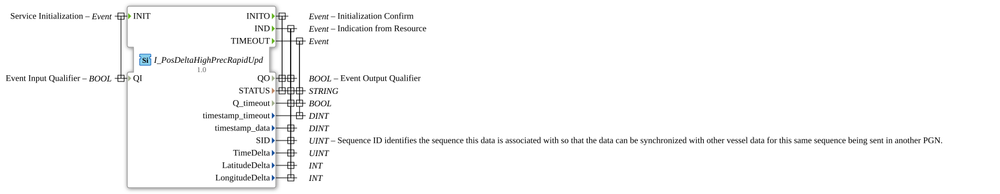

# I_PosDeltaHighPrecRapidUpd

* * * * * * * * * *
## Introduction
The function block `I_PosDeltaHighPrecRapidUpd` implements the processing of the NMEA 2000 Parameter Group Number (PGN) 129027 "Position Delta, High Precision Rapid Update". This block is designed for applications requiring very high precision and very fast update rates for position data. It can provide position changes (delta) with a resolution of up to 1 millimeter and a delta time interval with an accuracy of 5 milliseconds.

## Interface Structure

### **Event Inputs**

* **INIT**: Service initialization. Triggered together with the qualifier `QI` to initialize or deactivate the function block.

### **Event Outputs**

* **INITO**: Initialization confirmation. Triggered in response to the `INIT` event, it returns the current status (`STATUS`) and the qualifier `QO`.

* **IND**: Indication from the resource manager. Triggered when new position data is available. Transmits all relevant delta position data and status information.

* **TIMEOUT**: Triggered when a timeout occurs, for example, if no new data is received within an expected timeframe.

### **Data Inputs**

* **QI** (BOOL): Event Input Qualifier. Controls the initialization. The function block is activated on `TRUE` and deactivated on `FALSE`.

### **Data Outputs**

* **QO** (BOOL): Event Output Qualifier. Indicates the current operating state of the function block (e.g., active/inactive).

* **STATUS** (STRING): Contains status or error messages of the function block.

* **Q_timeout** (BOOL): Indicates whether the last received data is outdated due to a timeout.

* **timestamp_timeout** (DINT): Timestamp associated with the `TIMEOUT` event.

* **timestamp_data** (DINT): Timestamp of the last received valid position data.

* **SID** (UINT): Sequence ID. Identifies the sequence to which this data is assigned to enable synchronization with other vehicle data of the same sequence in another PGN.

* **TimeDelta** (UINT): The time difference in milliseconds over which the position change was measured.

* **LatitudeDelta** (INT): The change in latitude (delta) at high-precision resolution (1/1e-7 min ~= 1.85 mm).

* **LongitudeDelta** (INT): The change in longitude (delta) at high-precision resolution (1/1e-7 min ~= 1.85 mm).

### **Adapter**
This function block does not use any adapter interfaces.

## Operation
The function block is started or stopped via the `INIT` event with the corresponding `QI` value. After successful initialization, it confirms this with `INITO`. In the active state, the function block listens for incoming PGN 129027 messages from the NMEA 2000 network.

Upon receiving new, valid data, it triggers the `IND` event and makes all calculated delta values (time, latitude, longitude) available at its outputs, along with the sequence ID (`SID`) and a data timestamp. The `STATUS` output can provide additional information.

If no new message is received for a defined period, the function block can generate a `TIMEOUT` event. This indicates that the currently held data may be outdated (`Q_timeout` = TRUE).

## Technical Features
* **High Precision**: Processes positional deltas with millimeter resolution (1/1e-7 arcminutes).

* **Fast Update**: Supports very short update intervals, represented by `TimeDelta` (minimum 5 ms accuracy).

* **Sequencing**: `SID` (Sequence ID) enables the correct assignment and synchronization of position deltas with other time-critical data streams in the system.

* **Timeout Detection**: Integrated monitoring of data freshness to detect communication failures or delayed messages.

## State Overview
The function block essentially has two main states:

1. **Inactive / Initialized**: The block is initialized but not active (`QI` = FALSE). No data is processed.

2. **Active / Listening**: The module is activated (`QI` = TRUE) and is waiting for incoming PGN 129027 messages. Upon receipt, these are processed and output via `IND`. A missing signal can lead to a timeout state, which is indicated by the `TIMEOUT` event.

## Application Scenarios
* **Precision Agriculture**: For high-precision guidance systems and automatic steering systems that require real-time position corrections.

* **Dynamic Positioning**: In maritime applications for the precise attitude control of ships or offshore platforms.

* **Autonomous Vehicles**: For high-frequency odometry and path correction in real time.

* **Surveying and Mapping**: For the acquisition of terrain data with very high spatial and temporal resolution.

## ⚖️ Comparison with Similar Function Blocks
Compared to standard position function blocks (e.g., those that process PGN 129029 "Position, Rapid Update"), `I_PosDeltaHighPrecRapidUpd` offers:

* **Delta-based data**: Instead of absolute positions, changes (deltas) are transmitted, which can be more bandwidth-efficient at high update rates.

* **Higher precision**: Specified for applications requiring higher accuracy than typical rapid update PGNs.

* **Explicit time difference**: The `TimeDelta` field is an integral part of the message, enabling more precise velocity and acceleration calculations.

## Conclusion
The `I_PosDeltaHighPrecRapidUpd` function block is a specialized tool for demanding real-time position determination. Its ability to deliver and synchronize highly precise position changes at very high frequencies makes it ideal for precision-critical control tasks in agricultural, maritime, and autonomous systems. The integrated timeout detection further enhances the application's robustness.