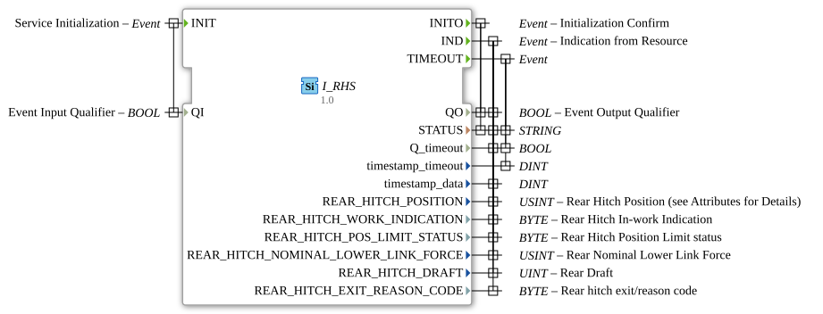

# I_RHS

* * * * * * * * * *

## Introduction
The **I_RHS** (Rear Hitch Status) is a standards-compliant function block for monitoring rear hitch parameters, developed under the EPL-2.0 license.

Version 1.0 implements the ISO 11783-7 specification (PGN 65093) for the precise acquisition of the position, force, and status of the rear hitch in agricultural machinery.

## Interface Structure

### **Event Inputs**

- `INIT`: Initialization Request (with qualifier `QI`)

### **Event Outputs**

- `INITO`: Initialization Confirmation (with status)

- `IND`: Indication Event with all coupling parameters

- `TIMEOUT`: Timeout Event

### **Data Inputs**

- `QI` (BOOL): Qualifier for Initialization

### **Data Outputs**

- `QO` (BOOL): Qualifier for Output Events

- `STATUS` (STRING): Operating status message

- `Q_timeout` (BOOL): Timeout indicator

- `timestamp_timeout` (DINT): Timeout timestamp

- `timestamp_data` (DINT): Coupling data timestamp

## Coupling parameters

| Parameter | Type | Description | SPN | Bit length | Scaling |

|-----------|------|--------------|-----|------------|------------|

| `REAR_HITCH_POSITION` | USINT | Coupling position | 1873 | 8 | 0.4 %/bit |

| `REAR_HITCH_WORK_INDICATION` | BYTE | Operating State | 1877 | 2 | 4 states/2 bits |

`REAR_HITCH_POS_LIMIT_STATUS` | BYTE | Position Limitation | 5151 | 3 | 8 states/3 bits |

`REAR_HITCH_NOMINAL_LOWER_LINK_FORCE` | USINT | Lower Link Force | 1881 | 8 | 0.8%/bit (-100% Offset) |

`REAR_HITCH_DRAFT` | UINT | Tensile Force | 1879 | 16 | 10 N/bit (-320kN Offset) |

`REAR_HITCH_EXIT_REASON_CODE` | BYTE | Fault Reason Code | 5819 | 6 | 64 states/6 bits |

## Functionality

1. **Initialization**:

- `INIT` with `QI`=TRUE starts system calibration

- `INITO` confirms operational readiness with `QO` and `STATUS`

2. **Data Provision**:

- `IND` provides all coupling parameters with timestamps

- Automatic updates upon state changes

3. **Error Handling**:

- `TIMEOUT` in case of communication problems

- Detailed error codes in `REAR_HITCH_EXIT_REASON_CODE`

## Technical Features

✔ **ISO 11783-7 compliant** (PGN 65093)

✔ **Bidirectional force measurement** (+/- 100% range)

✔ **Precise position detection** with 0.4% resolution

✔ **64-level fault diagnosis** with detailed codes

## Coupling characteristics

| Feature | Description |

|---------|--------------|

| Position range | 0-100% (0 = fully down) |

| Force measurement | ±100% of rated load |

| Tensile force range | -320kN to +350kN |

| Update rate | 100ms in normal operation |

## Return codes (REAR_HITCH_EXIT_REASON_CODE)

| Code range | Meaning |

|------------|-----------|

| 0-15 | System error |

| 16-31 | Position Error |

| 32-47 | Force Measurement Error |

| 48-63 | Reserved |

## Application Scenarios

- **Plow Control**: Automatic Depth Control
- **Load Management**: Traction Force Adjustment
- **Diagnostics**: Early Detection of Hydraulic Problems
- **Safety**: Coupling Position Monitoring

## ⚖️ Comparison with Similar Components

| Feature | I_RHS | Standard | Premium |

|---------|-------|----------|---------|

| Accuracy | ±0.4% | ±2% | ±0.2% |

| Force Measurement | Bidirectional | Traction Only | Triaxial |

| Diagnostic Codes | 64 | 8 | 128 |

| ISO Compliance | Full | Partial | Full |

## 🛠️ Related Exercises

* [Exercise_079](../../../../Uebungen/test_B/Uebungen_doc/Uebung_079.md)]

## Conclusion

The I_RHS module offers comprehensive monitoring for rear hitch systems:

- **Precise**: High-resolution position and force measurement
- **Reliable**: Robust fault detection
- **Flexible**: Suitable for various implements

Ideal for use with:

- Modern tractors
- Precision agriculture
- Heavy implements
- Automatic steering systems