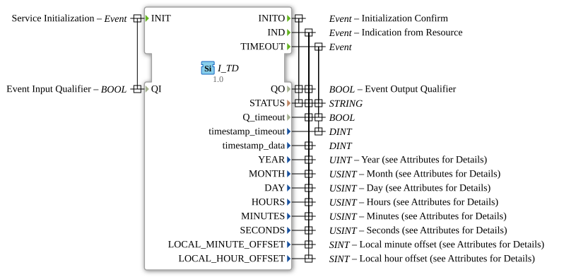

# I_TD

* * * * * * * * * *
## Introduction
The **I_TD** (Time/Date) function block is a special component for ISOBUS that enables the processing of time and date information according to the ISO 11783-7 standard (PGN 65254). It receives and processes the current time and date transmitted over the ISOBUS network. The output data corresponds to the defined SPNs (Suspect Parameter Numbers) of the protocol and is provided including the associated scaling and offsets.
## Interface Structure

### **Event Inputs**

| Event | With Variable | Description |

|----------|--------------|--------------|

| `INIT` | `QI` | Initialization of the function block. |

### **Event Outputs**

| Event | With variables | Description |

|------------|---------------|--------------|

| `INITO` | `QO`, `STATUS` | Confirmation of successful initialization. |

| `IND` | `QO`, `timestamp_data`, `STATUS`, `Q_timeout`, `SECONDS`, `MINUTES`, `HOURS`, `MONTH`, `DAY`, `YEAR`, `LOCAL_MINUTE_OFFSET`, `LOCAL_HOUR_OFFSET` | Display of a received time/date telegram. |

| `TIMEOUT` | `timestamp_timeout`, `STATUS`, `Q_timeout` | Timeout event if no valid telegram arrives within an expected timeframe. |

### **Data Inputs**

| Variable | Type | Description |

|----------|-------|--------------|

| `QI` | BOOL | Qualifier for initialization (TRUE = enable). |

### **Data Outputs**

| Variable | Type | Description (with ISOBUS attributes) |

|-----------------------|--------|--------------------------------------|

| `QO` | BOOL | Output qualifier (TRUE = Operational). |

| `STATUS` | STRING | Status message (e.g., error or success). |

| `Q_timeout` | BOOL | Indicates whether a timeout occurred. |

| `timestamp_timeout` | DINT | Timestamp of the timeout (if it occurred). |

| `timestamp_data` | DINT | Timestamp of the received data telegram. |

| `SECONDS` | USINT | Seconds (scale 0.25s/bit, offset 0). |

| `MINUTES` | USINT | Minutes (scale 1min/bit, offset 0). |

| `HOURS` | USINT | Hours (Scale 1h/bit, Offset 0). |

| `MONTH` | USINT | Month (Scale 1 month/bit, Offset 0). |

| `DAY` | USINT | Day (Scale 0.25d/bit, Offset 0). |

| `YEAR` | UINT | Year (Scale 1y/bit, Offset 1985, Initial value 0xFFFF = "not available"). |

| `LOCAL_MINUTE_OFFSET` | SINT | Local Minute Offset (Scale 1 min/bit, Offset -125). |

| `LOCAL_HOUR_OFFSET` | SINT | Local hour offset (scaling 1h/bit, offset -125). |

### **Adapter**

None.

## Functionality

The function block is initialized via the event input `INIT` with `QI` set. After successful initialization, the event `INITO` is triggered and the output `QO` is set to TRUE. The function block then waits for incoming ISOBUS telegrams (PGN 65254). When such a telegram arrives, the event `IND` is generated and all corresponding data outputs are updated with the decoded values. The scaling and offsets defined in the attributes are applied automatically.

``` If no valid telegram is received within an unspecified timeframe, the event `TIMEOUT` is triggered and the output `Q_timeout` is set to TRUE. The timeout timestamp is stored in `timestamp_timeout`.

## Technical Features
- **ISOBUS Compliance:** The FB implements exactly PGN 65254 of the ISO 11783-7 standard, part "Time/Date TD".
- **Initial Values:** Many data outputs are initialized with predefined "not available" values (e.g., YEAR = 0xFFFF), which allows for easy error detection.
- **Scaling & Offset:** All values are scaled and offset according to the ISOBUS specification. The raw values of the SPNs are converted into physical units.
- **Local Time Offset:** The outputs `LOCAL_MINUTE_OFFSET` and `LOCAL_HOUR_OFFSET` allow the specification of the deviation from UTC time in the range of -125 min to +130 min.
- **No State Machine:** The function block (FB) is event-driven; there is no explicit state machine in the XML. The internal logic is based on the IEC 61499 execution rules.

## State Overview

An explicit state machine is not defined in the XML. The FB operates as a reactive block:

1. **Idle State** – waits for INIT.

``` 2. **Initialization Phase** – After `INIT`, if TRUE `QI`, `INITO` is triggered.

3. **Operational Ready** – Receiving telegrams → `IND`; if no telegrams are received → `TIMEOUT`.

## Application Scenarios
- **Agricultural Machinery:** Receiving current time and date data from the ISOBUS on-board network, e.g., for loggers, controllers, or displays.
- **Time Stamping:** Using the `timestamp_data` outputs to synchronize events in various control units.
- **Time Zone Adjustment:** Evaluating local offsets to display local time in user interfaces.

## Comparison with Similar Function Blocks

Compared to general IEC 61499 time blocks (e.g., `E_CYCLE` or `E_TIME`), `I_TD` is specifically designed for ISOBUS communication. It does not decode an internal system time but receives external telegrams and delivers the data in ISOBUS-compliant formats. A universal function block, `I_DATE` (if available), would be suitable for proprietary systems but does not offer the ISOBUS SPN structure.

## Conclusion

The `I_TD` function block is an essential component for ISOBUS applications that rely on accurate time and date information from the network. Its complete mapping of SPNs and built-in timeout handling make it robust and standards-compliant. Thanks to automatic scaling and offsets, the physical values can be processed directly without manual conversion.
