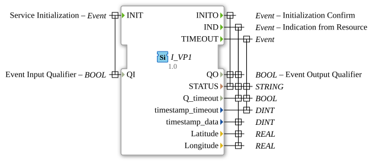

# I_VP1

* * * * * * * * * *
## Introduction
The function block `I_VP1` is used to process and provide vehicle position data according to the ISO 11783 standard (ISOBUS). It specifically implements the "Vehicle Position 1" function, which is defined by the parameter Group Number (PGN) 65267. The block receives position data from a resource (e.g., a GNSS receiver) and makes it available via standardized interfaces for downstream control and display functions in an agricultural or mobile machinery network.

## Interface Structure

### **Event Inputs**

* **`INIT`**: Initialization event. Triggered on `QI=TRUE` to start the function block. Deactivated on `QI=FALSE`.

### **Event Outputs**

* **`INITO`**: Confirms completion of initialization. Sent in response to the `INIT` event.

* **`IND`**: Indication event. Signals successful reception of new, valid position data from the connected resource.

* **`TIMEOUT`**: Timeout event. Triggered if no new position data is received within a configured time frame.

### **Data Inputs**

* **`QI` (BOOL)**: Qualifies the `INIT` event. Controls the activation state of the function block (`TRUE` = activate, `FALSE` = deactivate).

### **Data Outputs**

* **`QO` (BOOL)**: Qualifies the event outputs `INITO` and `IND`. Reflects the current operating state of the function block (`TRUE` = active and ready for operation).

* **`STATUS` (STRING)**: Provides status or error messages of the function block in a readable format.

* **`Q_timeout` (BOOL)**: Indicates whether a timeout has occurred (`TRUE` = timeout active, `FALSE` = no timeout).

* **`timestamp_timeout` (DINT)**: Timestamp (e.g., in milliseconds) associated with the `TIMEOUT` event.

* **`timestamp_data` (DINT)**: Timestamp of the last received position data output via `IND`.

* **`Latitude` (REAL)**: The geographical latitude of the vehicle's position in degrees. The value is scaled according to PGN 65267 (SPN 584) and includes an offset of -210°.

* **`Longitude` (REAL)**: The geographical longitude of the vehicle's position in degrees. The value is scaled according to PGN 65267 (SPN 585) and includes an offset of -210°.

### **Adapters**
This function block does not use any adapter interfaces.

## Operation

1. **Initialization**: Sending a `INIT` event with `QI=TRUE` activates the function block. It reports a successful start with the `INITO` output event, accompanied by `QO=TRUE` and a `STATUS` string.

2. **Data Reception and Processing**: In the active state, the function block monitors a connected resource (e.g., an ISOBUS data stream) for the arrival of position data according to PGN
65267. Upon receiving valid data, it is decoded, scaling and offset are applied, and the resulting `Latitude` and `Longitude` values are calculated.

3. **Data Output**: Upon successful processing, the function block triggers the `IND` event. Simultaneously, the calculated position data (`Latitude`, `Longitude`), a corresponding timestamp (`timestamp_data`), the active state (`QO=TRUE`), and a status are provided via the output variables. `Q_timeout` is set to `FALSE`.

4. **Timeout Monitoring**: The function block continuously monitors the data stream. If no new position data is received for a configured period, it triggers the `TIMEOUT` event. This sets `Q_timeout=TRUE`, a timestamp (`timestamp_timeout`), and a corresponding `STATUS`.

5. **Deactivation**: A `INIT` event with `QI=FALSE` resets the module to an inactive state, which is acknowledged by `INITO` with `QO=FALSE`.

## Technical Features
* **ISOBUS Compliance**: The module is specifically designed for use in ISO 11783 (ISOBUS) networks and processes data according to the official specification for PGN 65267.

* **Data Encoding**: The raw data for latitude (`Latitude`, SPN 584) and longitude (`Longitude`, SPN 585) are received as 4-byte values. The function block applies the scaling defined in the attributes and an offset of -210 degrees to calculate the final `REAL` values.

* **Attribute-based metadata**: The output variables for the position data are annotated with detailed attributes (SPN, name, length, offset, reference link). This simplifies configuration, documentation, and maintenance within an IEC 61499 development environment.

## State overview
The function block can transition to the following main states:

* **Inactive**: Initial state. `QO=FALSE`. No data processing.

* **Active (waiting for data)**: After successful initialization. `QO=TRUE`. The function block monitors the input data stream.

* **Data processing**: Upon receiving a new PGN 65267 data packet. Decoding, scaling, and calculation of position values.

* **Data Output**: Triggering the `IND` event and setting the output variables.

* **Timeout**: Triggering the `TIMEOUT` event if no data is received.

## Application Scenarios

* **Precision Farming / Sub-Area Management**: Providing precise vehicle positions for application maps, guidance systems, or documentation purposes.

* **Machine and Fleet Management**: Tracking agricultural or municipal vehicles within a company's premises.

* **Assistance Systems**: Basis for collision avoidance systems or automatic steering systems that require accurate and standardized position information.

## ⚖️ Comparison with Similar Blocks

* **Generic Input Blocks (e.g., `E_SR`, `E_RTRIG`)**: These offer basic read or trigger functions but are not designed to process a specific ISOBUS PGN. `I_VP1`, on the other hand, contains the complete logic for decoding, scaling, and error handling for PGN 65267.

* **General ISOBUS Input Blocks**: More general blocks that read various PGNs may exist. `I_VP1` is specialized and optimized for the efficient and reliable processing of vehicle position data, which simplifies configuration and reduces the potential for errors.

## Conclusion
The `I_VP1`The -Function Block is a specialized, standards-compliant tool for integrating vehicle position data into IEC 61499-based control systems for mobile machinery. Through the direct implementation of the ISOBUS specification (PGN 65267) and integrated features such as timeout monitoring, it offers a reliable and easy-to-use interface for applications in precision farming and automation. Its attribute-based documentation supports developers in correct implementation and maintenance.