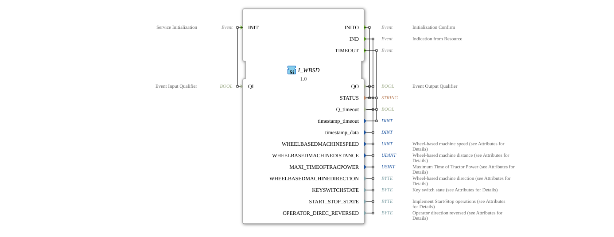

# I_WBSD

* * * * * * * * * *
## Introduction

The **I_WBSD** function block (Wheel-based Speed and Distance) is an ISO 11783-7 compliant system for acquiring wheel-based speed and distance data, developed under the EPL-2.0 license.
The block enables the precise monitoring of vehicle movements and operating conditions for agricultural and construction machinery.

## Interface Structure

### **Event Inputs**

- `INIT`: Initialization Request (with qualifier `QI`)

### **Event Outputs**

- `INITO`: Initialization Confirmation (with status)
- `IND`: Data Indication with Motion and State Parameters
- `TIMEOUT`: Timeout Event

### **Data Inputs**

- `QI` (BOOL): Qualifier for Initialization

### **Data Outputs**

| Parameter | Type | SPN | Bit | Scale | Range | Description |
| |-----------|-----|-----|-----|------------|----------|-------------|
| `QO` | BOOL | - | 1 | - | TRUE/FALSE | Event Qualifier |
| `STATUS` | STRING | - | - | - | - | System Status Message |
| `WHEELBASEDMACHINESPEED` | UINT | 1862 | 16 | 0.001 m/s/bit | 0-65.535 m/s | Wheel-Based Speed |
| `WHEELBASEDMACHINEDISTANCE` | UDINT | 1863 | 32 | 0.001 m/bit | 0-4,294,967 km | Distance traveled |
| `MAXI_TIMEOFTRACPOWER` | USINT | 1866 | 8 | 1 min/bit | 0-255 min | Maximum operating time |
| `WHEELBASEDMACHINEDIRECTION` | BYTE | 1864 | 2 | 4 states | 0-3 | Direction of travel |
| `KEYSWITCHSTATE` | BYTE | 1865 | 2 | 4 states | 0-3 | Ignition switch state |
| `START_STOP_STATE` | BYTE | 5203 | 2 | 4 states | 0-3 | Start/Stop status |
| `OPERATOR_DIREC_REVERSED` | BYTE | 5244 | 2 | 4 States | 0-3 | Reverse |

## Driving Direction States

| Code | State | Description |
|------|---------|--------------|
| 0 | Stationary | No movement |
| 1 | Forward | Forward travel |
| 2 | Reverse | Reverse travel |
| 3 | Undefined | Direction not determinable |

## Functionality

1. **Initialization**:
- `INIT` with `QI`=TRUE starts wheel sensor calibration
- `INITO` confirms operational readiness with system status
2. **Data Provision**:
- `IND` provides continuously updated motion data
- Automatic adjustment of the update rate (100 ms at >0.5 m/s)
3. **Error Handling**:
- `TIMEOUT` in case of signal loss from the wheel speed sensors
- Status messages in the `STATUS` field

## Technical Features

✔ **ISO 11783-7 compliant** (PGN 65096)
✔ **Precise speed measurement** with 1 mm/s Resolution
✔ **32-bit distance counter** for extended operating times
✔ **Integrated status monitoring** (ignition, start/stop)

## Application Scenarios

- **Tractors**: Speed control for field work
- **Harvesting machines**: Working distance calculation
- **Fleet management**: Operating hour recording
- **Safety systems**: Direction detection when reversing

## Status Codes

| Parameter | Code | Meaning |
|-----------|------|-----------|
| `KEYSWITCHSTATE` | 0 | Off |
| | 1 | On |
| | 2 | Start |
| | 3 | Undefined |
| `START_STOP_STATE` | 0 | Stop |
| | 1 | Start |
| | 2 | Pause |
| | 3 | Reserved |

## ⚖️ Comparison with similar systems

| Feature | I_WBSD | Standard | GPS-based |
|---------|--------|----------|-----------|
| Accuracy | ±0.5% | ±2% | ±5% |
| Low speed | Good | Excellent | Poor |
| Signal stability | High | Medium | Low |
| ISO compliance | Full | Partial | Full |

## 🛠️ Related exercises

* [Uebung_070](../../../../Uebungen/test_B/Uebungen_doc/Uebung_070.md)
* [Uebung_071](../../../../Uebungen/test_B/Uebungen_doc/Uebung_071.md)
* [Uebung_071a](../../../../Uebungen/test_B/Uebungen_doc/Uebung_071a.md)
* [Uebung_071b](../../../../Uebungen/test_B/Uebungen_doc/Uebung_071b.md)
* [Uebung_072](../../../../Uebungen/test_B/Uebungen_doc/Uebung_072.md)
* [Uebung_072b](../../../../Uebungen/test_B/Uebungen_doc/Uebung_072b.md)
* [Uebung_079](../../../../Uebungen/test_B/Uebungen_doc/Uebung_079.md)

## Conclusion

The I_WBSD module offers reliable movement data for mobile machines:

- **Robust**: Independent of GPS signal
- **Precise**: Millimeter-accurate distance measurement
- **Comprehensive**: Integrated Condition monitoring

Ideal for use in:

- Precision agriculture
- Automatic steering systems
- Machines with frequent changes of direction
- Applications with high accuracy requirements

*Designed for use in demanding environments*