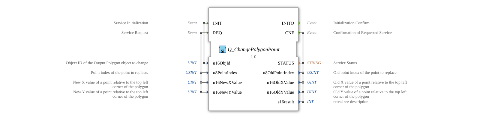

# Q_ChangePolygonPoint

* * * * * * * * * *
## Introduction

The **Q_ChangePolygonPoint** is a standards-compliant function block for modifying polygon points in virtual terminals, developed under the EPL-2.0 license. Version 1.0 implements the ISO 11783-6 (Part 6 - F.52) specification for agricultural tax systems.

## Interface Structure

### **Event Inputs**

- `INIT`: Initialization Request (with polygon object ID)
- `REQ`: Point Change Request (with index and coordinates)

### **Event Outputs**

- `INITO`: Initialization Confirmation
- `CNF`: Change Confirmation (with result data)

### **Data Inputs**

- `u16ObjId` (UINT): Polygon Object ID
- `u8PointIndex` (USINT): Point Index (0-based)
- `u16NewXValue` (UINT): New X-coordinate (relative)
- `u16NewYValue` (UINT): New Y-coordinate (relative)

### **Data Outputs**

- `STATUS` (STRING): Operational status message
- `u8OldPointIndex` (USINT): Previous point index
- `u16OldXValue` (UINT): Previous X-coordinate
- `u16OldYValue` (UINT): Previous Y-coordinate
- `s16result` (INT): ISO-compliant result code

## Functionality

1. **Initialization**:
- `INIT` with polygon object ID
- `INITO` confirms operational readiness
2. **Point Change**:
- `REQ` with index and new coordinates
- Coordinates relative to the upper left corner
- `CNF` returns result and old values
3. **Error Handling**:
- ISO-standardized error codes
- Detailed status messages

## Technical Features

✔ **ISO 11783-6 compliant** (F.52)
✔ **Precise coordinate control** (16-bit)
✔ **Index-based access** (0-255 points)
✔ **One point per command** (fixed 8-byte message, no Transport Protocol)
✔ **Real-time processing**

## Coordinate Range

| Parameter | Range | Description |
|-----------|------------|----------------------------|
| X-value | 0 - 65535 | Horizontal position (px) |
| Y-value | 0 - 65535 | Vertical Position (px) |

## Return Codes (s16result)

| Code | Constant | Meaning |
|------|-------------------------|------------------------------------|
| 0 | VT_E_NO_ERR | Success |
| -6 | VT_E_OVERFLOW | Invalid Point Index |
| -128 | VT_E_HANDLE_INVALID | Invalid Polygon ID |

## Application Scenarios

- **Machine Visualization**: Contour Adjustment
- **Map Display**: Dynamic Polygon Deformation
- **Diagnostic Displays**: Geometric Highlighting
- **Animated Elements**: Moving Polygon Shapes

## ⚖️ Comparison with Similar Building Blocks

| Feature | Q_ChangePolygonPoint | VtGeometryEditor | VtDynamicShape |
---------------|----------------------|------------------|----------------|
| ISO Standard | ✔ | ✖ | ✖ |
| Accuracy | 16-bit Coordinates | 8-bit | 16-bit |
| Point Count | Up to 255 | Unlimited | Limited |

## Conclusion

The Q_ChangePolygonPoint block provides the reference implementation for dynamic polygon changes:

- **Precise**: Millimeter-accurate position control
- **Powerful**: Real-time processing
- **Standard-compliant**: Full ISO 11783-6 compatibility

Essential for:

- Adaptive geometry representations
- Technical drawings
- Interactive mapping applications
