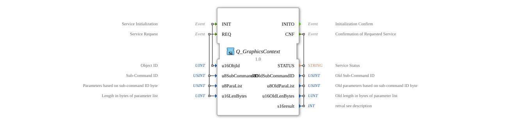

# Q_GraphicsContext

* * * * * * * * * *
## Introduction
The **Q_GraphicsContext** is a standards-compliant function block for controlling graphics context objects in virtual terminals, developed under the EPL-2.0 license. Version 1.0 implements the ISO 11783-6 (Part 6 - F.56) specification for VT systems from version 4 onwards.

## Interface Structure

### **Event Inputs**
- `INIT`: Initialization request (with object ID)
- `REQ`: Configuration request (with sub-command and parameters)

### **Event Outputs**
- `INITO`: Initialization acknowledgment
- `CNF`: Configuration acknowledgment (with status and previous values)

### **Data Inputs**
- `u16ObjId` (UINT): Graphics context object ID (16-bit)
- `u8SubCommandID` (USINT): Subcommand ID (8-bit)
- `u8ParaList` (USINT[5]): Parameter list (5-byte array)
- `u16LenBytes` (UINT): Parameter length in bytes

### **Data Outputs**
- `STATUS` (STRING): Operating status message
- `u8OldSubCommandID` (USINT): Previous subcommand ID
- `u8OldParaList` (USINT[5]): Previous parameter list
- `u16OldLenBytes` (UINT): Previous parameter length
- `s16result` (INT): ISO-compliant result code

## Functionality

1. **Initialization**:

- `INIT` with graphics context object ID
- `INITO` confirms operational readiness

2. **Configuration**:

- `REQ` with sub-command ID and parameter list
- Configures graphics context properties
- `CNF` returns result status and previous configuration

3. **Error Handling**:

- ISO-standardized error codes
- Buffer overflow check

## Technical Features

✔ **ISO 11783-6 compliant** (F.56)
✔ **Exclusive to VT Version 4+**
✔ **Flexible parameterization** (5-byte parameter array)
✔ **Traceability** (Previous configuration)

## Sub-Command Reference

| ID | Command | Parameter Description |
|-----|----------------------|---------------------------------|

| 0x01| Line Style | [0]=Weight, [1]=Type |

| 0x02| Fill Pattern | [0]=Pattern ID |

| 0x03| Transparency | [0]=Alpha Value (0-255) |

| 0x04| Clipping Range | [0-3]=X,Y,W,H Coordinates |

| 0x05| Transformation Matrix | [0-4]=Matrix Parameters |

## Return Codes (s16result)

| Code | Constant | Meaning |

|------|-------------------------|------------------------------------|

| 0 | VT_E_NO_ERR | Successful Execution |

| -6 | VT_E_OVERFLOW | Parameter Buffer Too Small |

| -8 | VT_E_NOACT | VT not ready |

-21 | VT_E_NO_INSTANCE | No VT client available |

-129 | VT_E_ISO_INSTANCE_INVALID | Invalid VT instance |

-130 | VT_E_NOT_ALIVE | VT not active |

## Application Scenarios
- **Graphics Rendering**: Line and Fill Styles
- **User Interfaces**: Transparency Effects
- **Charts**: Clipping Ranges for Excerpts
- **Animations**: Transformation Matrices

## Safety Notes

⚠ **Consider Buffer Size**:
Parameter lists must not exceed `ISO_VTC_CMD_STR_MAX_LENGTH`
⚠ **Sub-Command Validation**:

Unknown command IDs can lead to unexpected behavior

## Conclusion

The Q_GraphicsContext block offers powerful graphics control:

- **Precise Control**: Over all graphics attributes
- **Traceable**: Previous State Backup
- **High Performance**: Optimized command load

Essential for:

- High-quality graphics rendering
- Dynamic visualizations
- Complex user interfaces