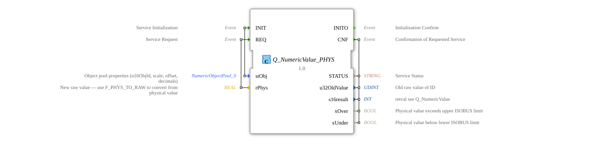

# Q_NumericValue_PHYS
## Introduction

The function block `Q_NumericValue_PHYS` is a composite function block according to the standard **ISO 11783-6 (ISOBUS)**. It is used to change the numeric value of an ISOBUS object by specifying a physical value. The conversion from physical to raw data values is performed automatically based on the scaling, offset, and decimal places defined in the object structure `NumericObjectPool_S`.
The function block encapsulates three sub-functions:

- **`F_MOVE`** – Intermediate storage of object parameters during initialization
- **`F_PHYS_TO_RAW`** – Conversion of physical values to raw integers (UDINT)
- **`Q_NumericValue`** – Actual ISOBUS write operation to the numeric object

## Interface Structure

### **Event Inputs**

| Name | Type | Comment |

|------|-----|-----------|

| `INIT` | EInit | Service Initialization – Loads the object parameters (`stObj`) into the function block |

| `REQ` | Event | Service Request – converts `rPhys` and writes the value to the ISOBUS object |

### **Event Outputs**

| Name | Type | Comment |

|------|-----|-----------|

| `INITO` | EInit | Initialization Confirmation |

| `CNF` | Event | Confirmation of Value Change – Contains Result Data |

### **Data Inputs**

| Name | Type | Comment |

|------|-----|-----------|

| `stObj` | `logiBUS::utils::conversion::phys::NumericObjectPool_S` | Structure with object ID, scale, offset, and decimal places (initial value: ID_NULL, 1.0, 0, 0) |

| `rPhys` | REAL | Physical value to be set (e.g., temperature, pressure) |

### **Data Outputs**

| Name | Type | Comment |

|------|-----|-----------|

| `STATUS` | STRING | Service status message (e.g., error or success message) |

| `u32OldValue` | UDINT | Original raw value of the ISOBUS object before the change |

| `s16result` | INT | Return value of the write operation (see `Q_NumericValue`) |

| `xOver` | BOOL | True if the physical value exceeds the upper limit of the ISOBUS value range |

| `xUnder` | BOOL | True if the physical value falls below the lower limit of the ISOBUS value range |

### **Adapters**

No adapters available.

## Functionality

Processing occurs in two separate steps:

1. **Initialization (event `INIT`):**

- The passed parameter `stObj` is temporarily stored via `F_MOVE`.
- Upon completion, `Q_NumericValue.INIT` is triggered, providing the object ID (`u16ObjId`) from `F_MOVE.OUT`.
- Initialization is acknowledged with `INITO`.

2. **Value Change (Event `REQ`):**

- The physical value `rPhys`, along with the stored structure `stObj`, is passed to `F_PHYS_TO_RAW`.
- `F_PHYS_TO_RAW` calculates the raw value (`u32NewValue`) as well as the limit flags `xOver` and `xUnder`.
- Subsequently, `Q_NumericValue.REQ` is triggered, which writes the calculated raw value to the ISOBUS object.
- The result data (`STATUS`, `u32OldValue`, `s16result`) are taken by `Q_NumericValue` and made available at the output.
- The event `CNF` signals completion.

```
## Technical Features

- **Standard Compliance:** This module implements the ISO 11783-6 specification (Part 6, Annex F.22) – developed for agricultural ISOBUS applications.
- **Limit Violation Calculation:** The flags `xOver` / `xUnder` are determined during the conversion stage (`F_PHYS_TO_RAW`) and output in parallel with the actual write operation. This allows the user to identify early on whether the requested physical value is outside the permissible ISOBUS value range.
- **Typing:** The object ID is provided as `UINT` (16-bit), and the raw value as `UDINT` – this corresponds to the common ISOBUS convention for numeric attributes.
- **Reuse of Internal Components:** The division into `F_PHYS_TO_RAW` and `Q_NumericValue` allows for modular testability and reusability of the conversion logic.

## State Overview

The function block does not have an explicit entry state machine, but implements its functionality as a data flow network. The process is strictly sequential:

- **Initialization Phase:**

`INIT` → `F_MOVE.REQ` → `F_MOVE.CNF` → `Q_NumericValue.INIT` → `Q_NumericValue.INITO` → `INITO`

- **Operational Phase (Write):**

`REQ` → `F_PHYS_TO_RAW.REQ` → `F_PHYS_TO_RAW.CNF` → `Q_NumericValue.REQ` → `Q_NumericValue.CNF` → `CNF`

During the execution of a run, the function block is not prepared for new events. The respective confirmation signal (`INITO` or `CNF`) must be awaited.

## Application Scenarios
- **Vehicle terminal with ISOBUS connection:** Setting target values (e.g., working height, application rate) via user input in physical units (m, kg/h, °C).
- **Remote control of agricultural equipment:** Sending physical values from a controller to an ISOBUS device (e.g., seed drill) without manual raw value conversion.
- **Automated calibration:** Adjusting parameters during operation, where the scaling and offset are derived from a configuration structure (`NumericObjectPool_S`).

## Comparison with similar modules

| Module | Function | Difference to `Q_NumericValue_PHYS` |

|----------|----------|--------------------------------------|

| `Q_NumericValue` (from `isobus::UT::Q`) | Write a raw (already converted) value | Expects `u32NewValue` directly – without physical conversion and without limit checking |

| `F_PHYS_TO_RAW` | Pure conversion physical → raw | Returns only `xOver`, `xUnder`, and the raw value – no ISOBUS communication |

| `Q_NumericValue_PHYS` | Combined conversion + write access | Provides a complete interface for physical values in one step |

This function block simplifies application, as the user does not need to program a separate conversion step. It is particularly suitable for controllers that process values in common units.

## Conclusion

`Q_NumericValue_PHYS` is a practical, standards-compliant function block for ISOBUS communication. It combines the conversion of physical values with write access to numerical objects, thus reducing development effort in agricultural automation. The clear separation of tasks (storage, conversion, bus access) ensures the function block remains maintainable and testable. Outputting limit violation flags enables robust error handling in the application code.
