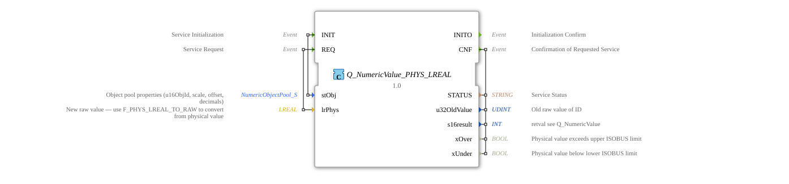

# Q_NumericValue_PHYS_LREAL

* * * * * * * * * *
## Introduction

The function block **Q_NumericValue_PHYS_LREAL** is used to set a numeric value as a physical quantity via ISOBUS (ISO 11783-6). It receives a physical value of type `LREAL`, automatically converts it into the required raw value, and sends the corresponding command to the connected device. This complies with the specification in Part 6, Annex F.22.
The function block encapsulates the necessary steps of the physical conversion and the actual command execution, allowing the user to work directly with physical units.
## Interface Structure

### **Event Inputs**

| Event | Description |
|----------|--------------|
| `INIT` | Initializes the function block with the object pool properties (`stObj`). |
| `REQ` | Starts processing: the physical value (`lrPhys`) is sent to the target object. |

### **Event Outputs**

| Event | Description |
|----------|---------------|
| `INITO` | Acknowledges successful initialization. |
| `CNF` | Acknowledges command execution; the output data is valid. |

### **Data Inputs**

| Name | Type | Description |
|--------|-----|---------------|
| `stObj` | `logiBUS::utils::conversion::phys::NumericObjectPool_S` | Object pool properties (object ID, scale, offset, decimal places). Default value: `(u16ObjId := ID_NULL, r32Scale := 1.0, i32Offset := 0, u8Decimals := 0)`. |
| `lrPhys` | `LREAL` | The physical value (e.g., pressure, temperature) to be sent. Note: Before transmission, the value should be converted using `F_PHYS_LREAL_TO_RAW` if necessary; the function block performs this conversion automatically internally. |

### **Data Outputs**

| Name | Type | Description |
|------|-----|--------------|
| `STATUS` | `STRING` | Status message of the service performed. |
| `u32OldValue` | `UDINT` | Original raw value of the object before the change. |
| `s16result` | `INT` | Return value (see `Q_NumericValue`). |
| `xOver` | `BOOL` | `TRUE` if the physical value exceeds the upper ISOBUS limit. |
| xUnder` | `BOOL` | `TRUE` if the physical value falls below the lower ISOBUS limit. |

### **Adapter**

None.

## Valid Object IDs

`stObj.u16ObjId` is valid for the same object types as the internally used `Q_NumericValue` (Annex F.22, objects with numeric value attribute): Input Boolean Field (7000–7999), Input Number Field (9000–9999), Input List Field (10000–10999), Output Number Field (12000–12999), Meter (17000–17999), Linear Bar Graph (18000–18999), Arched Bar Graph (19000–19999), Number Variable (21000–21999), Object Pointer (27000–27999), Output List Object (37000–37999), External Object Pointer (43000–43999), Animation Object (44000–44999), Scaled Graphic Object (48000–48999).

ID_NULL (65535) is not a command target but deactivates the FB when used with `INIT`.

## Functionality

The function block works internally with three subordinate function blocks:

1. **F_MOVE** – On a `INIT` event, the passed structure `stObj` (object ID, scale, offset, decimal places) is copied to the internal `Q_NumericValue`.
2. **F_PHYS_LREAL_TO_RAW** – On a `REQ` event, the physical value `lrPhys` is converted into an ISOBUS raw value using the parameters stored in `stObj`.
3. **Q_NumericValue** – The generated raw value, along with the object ID, is then passed to the actual command block, which executes the command on the bus.

The outputs `STATUS`, `u32OldValue`, and `s16result` originate directly from `Q_NumericValue`. The overflow/underflow messages (`xOver`, `xUnder`) are provided by the conversion function.

## Technical Features

- **Automatic Conversion**: The user does not need to manually convert physical values into raw values; this is done transparently within the function block.
- **Default Values**: If no specific object pool properties are passed, the function block uses sensible defaults (scaling 1.0, offset 0, no decimal places). The object ID is then `ID_NULL`.
- **Limit Check**: The outputs `xOver` and `xUnder` signal whether the passed physical value is outside the range permitted for ISOBUS. This allows applications to react early.
- **Cache Storage**: The initialization (`INIT`) copies the object properties only once and stores them for later `REQ` calls.

## State Overview

The function block does not have an explicit state machine in the sense of an ECC, but operates event-driven according to the following logic:

| State / Sequence | Description |
|------------------|--------------|
| **Initialization** | After a `INIT` event, the object properties are stored internally. Then, `INITO` is sent. |
| **Send Command** | After a `REQ` event, the physical value is converted, the command is issued, and upon completion, `CNF` is sent with the result data. |
| **Error Handling** | If an overflow/underflow occurs during the conversion, `xOver` or `xUnder`, respectively, are set before the command is issued. An erroneous command is signaled by `s16result` and the status message. |

## Application Scenarios

- **Control of ISOBUS Devices**: Setting setpoints for actuators (e.g., valves, drives) in physical units such as pressure (bar, kPa), temperature (°C), or fill level.

**Error Handling** - **Agricultural Machinery**: Change operating parameters (e.g., application rate, speed) directly from a control application.

- **Test and Simulation Environments**: Easily send physical values without having to worry about raw value conversion.

## Comparison with Similar Blocks

- **`Q_NumericValue` (without PHYS)**: Expects the raw value (UDINT) directly. The user must perform the conversion manually. `Q_NumericValue_PHYS_LREAL` encapsulates this step and improves the readability and maintainability of applications that work with physical quantities.
- **`Q_NumericValue_PHYS_REAL`** (analogous for REAL type): Functions identically, but with single-precision accuracy. For applications requiring higher accuracy (LREAL), this block is the right choice.

## Conclusion

Q_NumericValue_PHYS_LREAL` is a practical and standards-compliant function block that simplifies integration with the ISOBUS system. The integration of physical conversion eliminates manual conversion logic, reducing the potential for errors and increasing reusability. This module is particularly suitable for control applications where physical values must be transmitted with high accuracy.
