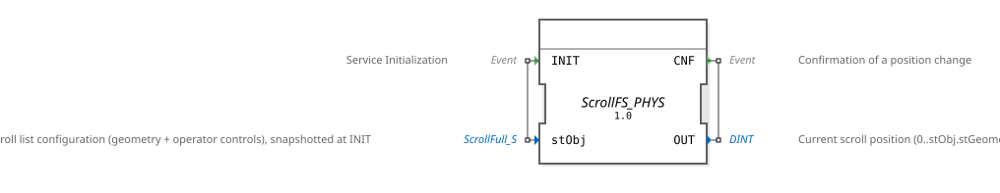

# ScrollFS_PHYS

* * * * * * * * * *
## Introduction

`ScrollFS_PHYS` is the finished, drop-in block for a scrollable VT list operated via softkeys:
feed it a `ScrollFull_S` constant (as generated by `GcfScript.py` from the ISO-Designer pool) and
it wires up the 6 physical softkeys, the direct-entry field, and the internal position engine
[ScrollFS](ScrollFS.md) itself — including automatic hiding of the scroll buttons at each list
limit. Two lists on one mask = two instances, each with its own `ScrollFull_S` constant. See
`Workspace_Scroll/SCROLL_KONZEPT.md` (project `4diac_training1`) for the full derivation.

## Interface Structure

### **Event Inputs**

- `INIT`: Snapshots the complete configuration (`stObj`).

### **Event Outputs**

- `CNF`: Confirms a position change, delivers `OUT`.

### **Data Inputs**

- `stObj` (`isobus::utils::scroll::ScrollFull_S`): complete configuration (geometry + control
  IDs), snapshotted at `INIT`.

### **Data Outputs**

- `OUT` (DINT): Current scroll position (0…`stObj.stGeometry.i32PosMax`, in rows).

### **Adapters**

No adapters available.

## Functionality

1. **`Snap`** (`F_MOVE`, `DataType = ScrollFull_S`): snapshots `stObj` at `INIT`, after which
   geometry and all control IDs are available as `Snap.OUT.stGeometry`/
   `Snap.OUT.stControls.<field>`.
2. **6× `Softkey_IE`** (`BtnFirst`, `BtnPageUp`, `BtnLineUp`, `BtnLineDown`, `BtnPageDown`,
   `BtnLast`), each listening for `SK_PRESSED`, `u16ObjId` taken from the corresponding
   `Snap.OUT.stControls.u16Btn*Id` — their `IND` event directly fires the matching
   [ScrollFS](ScrollFS.md) navigation event on `Inner`.
3. **`GotoInput`** (`NumericValue_ID`) + **`GotoConv`** (`F_DWORD_TO_DINT`): reads the
   direct-entry field (`u16GotoInputId`) and feeds the value as `SET_POS` into `Inner.GOTO`.
4. **`Inner`** (`ScrollFS`): the actual position engine, see [ScrollFS](ScrollFS.md). `Inner.OUT`
   is passed through directly as `OUT`.
5. **Limit hiding** - one chain of `F_SEL` + `Q_NumericValue` per direction (up side:
   `BtnPageUp`+`BtnLineUp`, down side: `BtnPageDown`+`BtnLineDown`), triggered on every position
   change (`Inner.CNF`):
   - `F_SEL.G := Inner.qAtFirst` (up side) or `Inner.qAtLast` (down side)
   - `F_SEL.IN0 :=` the real SoftKey ID (`Snap.OUT.stControls.u16Btn*Id`) - value when **not**
     at the limit
   - `F_SEL.IN1 := ID_NULL` - value once the limit is reached (`F_SEL.OUT := G ? IN1 : IN0`)
   - `Q_NumericValue.u16ObjId :=` the matching ObjectPointer ID
     (`Snap.OUT.stControls.u16Btn*PtrId`), `.u32NewValue := F_SEL.OUT`
   - Result: the SoftKeyMask's ObjectPointer points at `ID_NULL` at the limit (button
     disappears), otherwise at the real `SoftKey` (button visible).

## Technical Details

- **`F_SEL` direction is not symmetric**: `F_SEL.OUT := G ? IN1 : IN0` - if `IN0`/`IN1` are
  swapped, the button shows exactly when it should disappear (and vice versa). This ordering
  (`IN0` = visible value, `IN1` = `ID_NULL`) was swapped in an earlier version and had to be
  corrected.
- **`Q_NumericValue` on the ObjectPointer instead of "Hide/Show Object"**: Object Pointers are
  not hidden/shown via the ISO 11783-6 "Hide/Show Object" command (Annex F.2, valid for
  Container only), but via "Change Numeric Value" (Annex F.22) applied directly to the
  ObjectPointer's own ID - that changes what the pointer targets (`ID_NULL` = points at nothing =
  invisible). Reference pattern: `Uebung_015` (project `4diac_training1`).
- **Don't confuse the ObjectPointer ID with the Key ID**: `Snap.OUT.stControls.u16Btn*Id` is the
  **real** `SoftKey` object ID (target for `Softkey_IE.u16ObjId` **and** for `F_SEL.IN0`),
  `Snap.OUT.stControls.u16Btn*PtrId` is the ID of the **ObjectPointer** that points at that
  SoftKey inside the SoftKeyMask tree (target for `Q_NumericValue.u16ObjId`) - both are resolved
  automatically from the pool by `GcfScript.py` (the SoftKeyMask child is the ObjectPointer,
  whose target is the real SoftKey via a `CProxy` indirection).
- **Serial init chain**: `Snap.CNF → BtnFirst.INIT → … → BtnLast.INIT → GotoInput.INIT →
  PtrPageUp.INIT → PtrUp.INIT → PtrDown.INIT → PtrPageDown.INIT → Inner.INIT` - each block only
  initializes once the previous one is done (`INITO` chain), matching the pattern used in
  [ScrollFS](ScrollFS.md).

## State Overview

No state of its own beyond what `Inner` (`ScrollFS`/`RampLimitFS`) holds. Limit hiding is purely
event-driven — every position change recomputes the visibility state of all four buttons, not
just on the actual limit transition.

## Application Scenarios

- Any scrollable VT list operated via physical softkeys (e.g. long selection lists,
  diagnostic/status overviews) - see `Workspace_Scroll` in project `4diac_training1` for a real,
  tested example.

## ⚖️ Comparison with Similar Blocks

- **Versus `ScrollFS`**: `ScrollFS_PHYS` is the practical wrapper - `ScrollFS` itself knows
  nothing about physical controls, only abstract navigation events.
- **Versus `ScrollFS_PHYS_Button`**: identical structure and limit hiding, but reads the 6
  controls as on-screen `Button` objects (`BT_PRESSED_LATCHED`) instead of `SoftKey` objects -
  for masks without a softkey column, or touch operation. See
  [ScrollFS_PHYS_Button](ScrollFS_PHYS_Button.md).

## 🛠️ Related Exercises

- No standalone exercise example — see `Workspace_Scroll/SCROLL_KONZEPT.md` (project
  `4diac_training1`).

## Conclusion

`ScrollFS_PHYS` is the complete, production-ready scroll block for softkey-operated lists -
including automatic hiding of the navigation buttons at the limits, without the control
application having to check limits or redirect Object Pointers itself.
