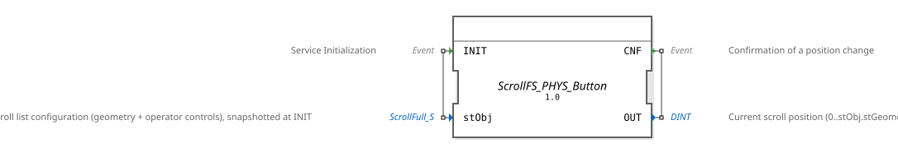

# ScrollFS_PHYS_Button

* * * * * * * * * *

## Introduction

`ScrollFS_PHYS_Button` is structurally identical to [ScrollFS_PHYS](ScrollFS_PHYS.md) — the same
finished, drop-in scroll block, the same `ScrollFull_S` constant, the same limit hiding — but
reads the 6 controls as on-screen `Button` objects (`Button_IE`, listening for
`BT_PRESSED_LATCHED`) instead of physical `SoftKey` objects. Intended for masks that need
scrolling without a softkey column available (e.g. touch operation). The 6 IDs in
`ScrollControls_S` then point at `Button` instead of `SoftKey` objects; otherwise
`ScrollFull_S`/`ScrollControls_S` are unchanged. See `Workspace_Scroll/SCROLL_KONZEPT.md`
(project `4diac_training1`) for the full derivation.

## Interface Structure

### **Event Inputs**

- `INIT`: Snapshots the complete configuration (`stObj`).

### **Event Outputs**

- `CNF`: Confirms a position change, delivers `OUT`.

### **Data Inputs**

- `stObj` (`isobus::utils::scroll::ScrollFull_S`): complete configuration (geometry + control
  IDs), snapshotted at `INIT`.

### **Data Outputs**

- `OUT` (DINT): Current scroll position (0…`stObj.stGeometry.i32PosMax`, in rows).

### **Adapters**

No adapters available.

## Functionality

Identical to [ScrollFS_PHYS](ScrollFS_PHYS.md), with one difference: the 6 controls are
`Button_IE` instances (`BtnFirst`, `BtnPageUp`, `BtnLineUp`, `BtnLineDown`, `BtnPageDown`,
`BtnLast`) listening for `BT_PRESSED_LATCHED` instead of `SK_PRESSED`. Everything else - direct
entry via `NumericValue_ID`+`F_DWORD_TO_DINT`, the internal [ScrollFS](ScrollFS.md) position
engine, limit hiding via `F_SEL`+`Q_NumericValue` on the 4 ObjectPointer IDs - is identical to
`ScrollFS_PHYS`.

## Technical Details

See [ScrollFS_PHYS](ScrollFS_PHYS.md), "Technical Details" section - everything described there
(F_SEL direction, ObjectPointer vs. Key ID, serial init chain) applies unchanged. The only
difference is the control type (`Button_IE` instead of `Softkey_IE`).

## State Overview

Same as [ScrollFS_PHYS](ScrollFS_PHYS.md) - no state of its own beyond what `Inner`
(`ScrollFS`/`RampLimitFS`) holds.

## Application Scenarios

- Scrollable lists on masks without a softkey column, especially on touch-capable terminals
  where on-screen buttons are preferred over physical softkeys.

## ⚖️ Comparison with Similar Blocks

- **Versus `ScrollFS_PHYS`**: identical except for the control type (`Button_IE`/
  `BT_PRESSED_LATCHED` instead of `Softkey_IE`/`SK_PRESSED`). See
  [ScrollFS_PHYS](ScrollFS_PHYS.md) for the full description.
- **Versus `ScrollFS`**: `ScrollFS_PHYS_Button` is the practical wrapper - `ScrollFS` itself
  knows nothing about physical controls, only abstract navigation events.

## 🛠️ Related Exercises

- No standalone exercise example — see `Workspace_Scroll/SCROLL_KONZEPT.md` (project
  `4diac_training1`).

## Conclusion

`ScrollFS_PHYS_Button` offers the same finished scroll functionality as `ScrollFS_PHYS`, just for
on-screen buttons instead of softkeys - which variant fits depends solely on which object type
the controls are built as in the pool.
