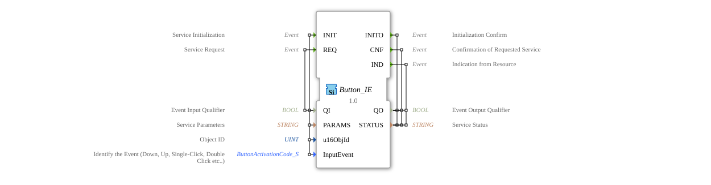

# Button_IE

* * * * * * * * * *
## Introduction

The Button_IE function block is an input service interface function block for event input data. It serves as an interface for button events in control systems and enables the processing of various button activities such as pressing, releasing, or multiple clicks.

## Interface Structure

### **Event Inputs**

- **INIT**: Service Initialization
- **REQ**: Service Request

### **Event Outputs**

- **INITO**: Initialization Acknowledgement
- **CNF**: Acknowledgement of Requested Service Request
- **IND**: Resource Indication

### **Data Inputs**

- **QI** (BOOL): Event Input Qualifier
- **PARAMS** (STRING): Service Parameters
- **u16ObjId** (UINT): Object ID (Initial Value: ID_NULL)
- **InputEvent** (ButtonActivationCode_S): Identifies the event (Down, Up, Single-Click, Double-Click, etc.) with the initial value "Invalid"

### **Data Outputs**

- **QO** (BOOL): Event Output Qualifier
- **STATUS** (STRING): Service Status

### **Adapter**

No adapter interfaces available.

## Functionality

The Button_IE function block processes button events via the ISOBUS-UT protocol. During initialization (INIT), the service parameters and object ID are configured. The block can detect and process various button activities such as single click, double click, press, and release. Incoming events from the hardware resource are reported via the IND output.

## Technical Features

- Uses ISOBUS-UT-specific data types for button activation codes
- Supports initialization with specific object IDs
- Provides comprehensive status feedback via the STATUS output
- Implements qualified event processing via QI/QO signals

## State Overview

The function block has an initialization state (INIT/INITO) and operational states for service requests (REQ/CNF), as well as asynchronous event indications (IND). The exact state machine depends on the implementation.

## Application Scenarios

- Agricultural control systems with ISOBUS compatibility
- Operator panels with push-button inputs
- Machine controls with event-based inputs
- Systems that need to distinguish between different push-button activities

## ⚖️ Comparison with similar building blocks

Compared to simple digital input blocks, Button_IE offers advanced functionality for push-button-specific events such as multiple clicks and distinguishes between different activation states. Its ISOBUS integration makes it particularly suitable for agricultural applications.

## 🛠️ Related exercises

- [Uebung_010b7](../../../../../../Uebungen/test_B/Uebungen_doc/Uebung_010b7.md)
- [Uebung_010b7_AX](../../../../../../Uebungen/test_AX/Uebungen_doc/Uebung_010b7_AX.md)
- [Uebung_010b8](../../../../../../Uebungen/test_B/Uebungen_doc/Uebung_010b8.md)
- [Uebung_010b8_AX](../../../../../../Uebungen/test_AX/Uebungen_doc/Uebung_010b8_AX.md)
- [Uebung_010b9](../../../../../../Uebungen/test_B/Uebungen_doc/Uebung_010b9.md)
- [Uebung_010b9_AX](../../../../../../Uebungen/test_AX/Uebungen_doc/Uebung_010b9_AX.md)
- [Uebung_010bA](../../../../../../Uebungen/test_B/Uebungen_doc/Uebung_010bA.md)
- [Uebung_010bA_AX](../../../../../../Uebungen/test_AX/Uebungen_doc/Uebung_010bA_AX.md)

## Conclusion

Button_IE is a specialized function block for The processing of button events in ISOBUS environments. Its ability to distinguish between different button activities and provide comprehensive status information makes it particularly suitable for demanding control applications in agricultural engineering and related fields.
