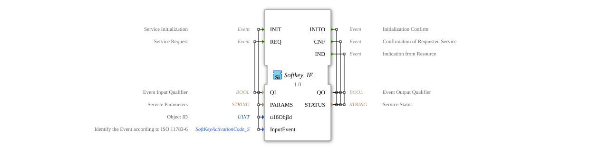

# Softkey_IE

## 🎧 Podcast

* [ISO 11783-6: Understanding Softkeys and the Virtual Terminal – Your Key to Agricultural Machinery Mechatronics](https://podcasters.spotify.com/pod/show/isobus-vt-objects/episodes/ISO-11783-6-Softkeys-und-das-Virtual-Terminal-verstehen--Dein-Schlssel-zur-Landmaschinen-Mechatronik-e36a8b0)
## Introduction

The Softkey_IE function block is an input service interface function block for event input data, specifically designed for processing softkey events according to ISO 11783-6. It serves as an interface between the application logic and the physical softkey input devices in agricultural and mobile machinery.

## Interface Structure

### **Event Inputs**

- **INIT**: Service initialization with parameters QI, PARAMS, u16ObjId, and InputEvent
- **REQ**: Service request with parameter QI

### **Event Outputs**

- **INITO**: Initialization acknowledgment with parameters QO and STATUS
- **CNF**: Acknowledgement of the requested service request with parameters QO and STATUS
- **IND**: Indication from the resource with parameters QO and STATUS

### **Data Inputs**

- **QI** (BOOL): Event input qualifier
- **PARAMS** (STRING): Service parameter
- **u16ObjId** (UINT): Object ID with initial value ID_NULL
- **InputEvent** (SoftKeyActivationCode_S): Identifies the event according to ISO 11783-6 with initial value "Invalid"

### **Data Outputs**

- **QO** (BOOL): Event output qualifier
- **STATUS** (STRING): Service status

### **Adapters**

No adapter interfaces available.

## Functionality

The Softkey_IE function block manages communication with softkey input devices according to the ISO bus standard 11783-6. During initialization (INIT), the service parameters and object ID are configured. Service requests (REQ) trigger the corresponding functionality, while indications (IND) signal incoming events from the physical softkeys.

## Technical Features

- Supports ISO 11783-6 standard for agricultural vehicles
- Uses a specific SoftKeyActivationCode structure for event identification
- Integrates object ID management for device identification
- Provides comprehensive status feedback via STRING parameters

## State Overview

The function block has an initialized state and an operating state. After successful INIT initialization, the block switches to the operating state, in which REQ requests can be processed and IND events can be received.

## Application Scenarios

- Control of operator panels in agricultural machinery
- Implementation of softkey functionalities in mobile work equipment
- ISOBUS-compliant input processing in vehicles
- User interfaces for complex machine controls

## ⚖️ Comparison with Similar Blocks

Compared to generic input blocks, Softkey_IE offers specific ISO 11783-6 compliance and is optimized for the requirements of agricultural and mobile work equipment. The integration of SoftKeyActivationCode enables standardized event handling.

## 🛠️ Related exercises

* [Uebung_010b2](../../../../../../Uebungen/test_B/Uebungen_doc/Uebung_010b2.md)
* [Uebung_010b2_AX](../../../../../../Uebungen/test_AX/Uebungen_doc/Uebung_010b2_AX.md)
* [Uebung_010b6](../../../../../../Uebungen/test_B/Uebungen_doc/Uebung_010b6.md)
* [Uebung_010b6_AX](../../../../../../Uebungen/test_AX/Uebungen_doc/Uebung_010b6_AX.md)
* [Uebung_013](../../../../../../Uebungen/test_B/Uebungen_doc/Uebung_013.md)
* [Uebung_013_AX](../../../../../../Uebungen/test_AX/Uebungen_doc/Uebung_013_AX.md)
* [Uebung_014](../../../../../../Uebungen/test_B/Uebungen_doc/Uebung_014.md)
* [Uebung_015](../../../../../../Uebungen/test_B/Uebungen_doc/Uebung_015.md)
* [Uebung_015a](../../../../../../Uebungen/test_B/Uebungen_doc/Uebung_015a.md)
* [Uebung_016](../../../../../../Uebungen/test_B/Uebungen_doc/Uebung_016.md)
* [Uebung_016a](../../../../../../Uebungen/test_B/Uebungen_doc/Uebung_016a.md)
* [Uebung_017](../../../../../../Uebungen/test_B/Uebungen_doc/Uebung_017.md)
* [Uebung_018](../../../../../../Uebungen/test_B/Uebungen_doc/Uebung_018.md)
* [Uebung_018a](../../../../../../Uebungen/test_B/Uebungen_doc/Uebung_018a.md)
* [Uebung_019a](../../../../../../Uebungen/test_B/Uebungen_doc/Uebung_019a.md)
* [Uebung_019b](../../../../../../Uebungen/test_B/Uebungen_doc/Uebung_019b.md)
* [Uebung_021](../../../../../../Uebungen/test_B/Uebungen_doc/Uebung_021.md)
* [Uebung_022](../../../../../../Uebungen/test_B/Uebungen_doc/Uebung_022.md)
* [Exercise_023](../../../../../../Uebungen/test_B/Uebungen_doc/Uebung_023.md)
* [Exercise_024](../../../../../../Uebungen/test_B/Uebungen_doc/Uebung_024.md)
* [Exercise_025](../../../../../../Uebungen/test_B/Uebungen_doc/Uebung_025.md)
* [Exercise_026](../../../../../../Uebungen/test_B/Uebungen_doc/Uebung_026.md)
* [Exercise_039](../../../../../../Uebungen/test_B/Uebungen_doc/Uebung_039.md)
* [Exercise_039a](../../../../../../Uebungen/test_B/Uebungen_doc/Uebung_039a.md)
* [Exercise_039a_sub_Outputs](../../../../../../Uebungen/test_B/Uebungen_doc/Uebung_039a_sub_Outputs.md)

## Conclusion

The Softkey_IE function block represents a specialized solution for softkey event processing in ISO 11783-6 compliant systems. Its standardized interface and comprehensive status feedback make it ideally suited for use in complex mobile machine control systems.
