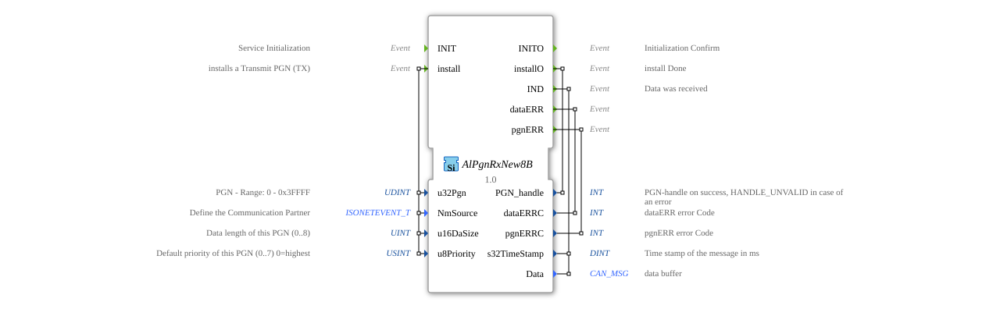

# AlPgnRxNew8B

* * * * * * * * * *
## Introduction

The function block `AlPgnRxNew8B` is used to receive data via a CAN network according to the ISOBUS standard (ISO 11783). Its main purpose is the installation and management of Parameter Group Numbers (PGNs) for receiving messages and the provision of received data to the application. It is part of a specialized library for ISOBUS communication.

## Interface Structure

### **Event Inputs**

- **`INIT`**: Starts the initialization of the function block. Acknowledgement is provided via `INITO`.

 * **`install`**: Triggers the installation of a new PGN to be received (Transmit PGN, TX). It expects the associated parameters `u32Pgn`, `NmSource`, `u16DaSize`, and `u8Priority`. Confirmation or the result is reported via `installO`.

### **Event Outputs**

- **`INITO`**: Confirms the completion of initialization (`INIT`).
- **`installO`**: Reports the completion of an installation request. Returns the `PGN_handle` (positive on success, `HANDLE_UNVALID` in case of error).
- **`IND`**: Triggered when new data is received for an installed PGN. Returns the received `Data` and a timestamp `s32TimeStamp`.
- **`dataERR`**: Triggered in case of an error during data reception. Returns an error code `dataERRC`.
- **`pgnERR`**: Triggered in case of an error related to PGN management (e.g., installation). Returns an error code `pgnERRC`.

### **Data Inputs**

- **`u32Pgn`** (UDINT): The Parameter Group Number (PGN) to be installed or monitored. Valid range: 0 to 0x3FFFF.
- **`NmSource`** (isobus::pgn::ISONETEVENT_T): Defines the communication partner (e.g., a specific node address or a broadcast).
- **`u16DaSize`** (UINT): The expected data length of the PGN in bytes (0-8).
- **`u8Priority`** (USINT): The default priority of this PGN (0-7), where 0 represents the highest priority. The initial value is 7 (lowest priority).
-

### **Data Outputs**

- **`PGN_handle`** (INT): A handle (reference number) for the successfully installed PGN. In case of an error, it contains the value `HANDLE_UNVALID`.
- **`dataERRC`** (INT): Error code set when the `dataERR` event is triggered.
- **`pgnERRC`** (INT): Error code set when the `pgnERR` event is triggered.
- **`s32TimeStamp`** (DINT): Timestamp of the received message in milliseconds. Initial value is -1.
- - **`Data`** (isobus::pgn::CAN_MSG): The buffer containing the received CAN message data.

### **Adapter**

This function block does not use any adapter interfaces.

## Operation

1. **Initialization**: The `INIT` event makes the function block operational. Upon completion, `INITO` is triggered.
2. **PGN Installation**: One or more PGNs can be registered for reception via the `install` event. The block configures internal filters in the CAN stack based on the passed parameters (PGN, source, length, priority). The result (handle or error) is reported back via `installO`.
3. **Data Reception**: As soon as a message arrives for an installed PGN, the `IND` event is triggered. The received data (`Data`) and a timestamp (`s32TimeStamp`) are then available at the outputs.
4. **Error Handling**: If errors occur during reception (`dataERR`) or PGN management (`pgnERR`), the corresponding events are triggered with an error code.

## Technical Specifications

- This block is designed to receive PGNs with a data length of up to 8 bytes (hence "8B" in the name).
- It uses specific ISOBUS data types (`isobus::pgn::CAN_MSG`, `isobus::pgn::ISONETEVENT_T`) that require integration into an ISOBUS-specific software stack.
- Error handling is divided into two separate channels: `dataERR` for runtime errors during reception and `pgnERR` for configuration errors.

## State Overview

The block has implicit states:

- **Not Initialized**: Before the first `INIT` event.
- **Ready**: After successful initialization (`INITO`). Can receive `install` requests.
- **Active/Receiving**: After successful installation of at least one PGN. Can trigger `IND` events for received data.
- **Error**: When an error occurs (`pgnERR` or `dataERR`). Depending on the implementation, the block may remain in the error state or become functional again after the cause is resolved.

## Application Scenarios

- **Agricultural Machinery Control**: Receiving implement data (e.g., seed drills, fertilizer spreaders) in a tractor's ISOBUS network.
- **Trailer Communication**: Receiving status information (brake pressure, lights, door contacts) from a smart trailer.
- **Implement Monitoring**: Receiving real-time data from sensors on an implement (e.g., seed flow, working width).

## ⚖️ Comparison with Similar Blocks

- **Generic CAN Receive Blocks**: Unlike generic `CAN_RX` blocks, which process raw CAN IDs and data, `AlPgnRxNew8B` abstracts ISOBUS-specific PGN addressing and management.
- **`E_SR` (Service Interface Function Block)**: While `E_SR` provides a generic server request pattern for services, `AlPgnRxNew8B` is specifically designed for the cyclic or event-driven reception of ISOBUS messages.
- **Blocks for Other Protocols**: Similar blocks exist for other higher-level protocols (e.g., J1939), but they differ in their specific addressing and message formats.
- **`E_SR` (Service Interface Function Block)**: While `E_SR` provides a generic server request pattern for services, `AlPgnRxNew8B` is specifically designed for the cyclic or event-driven reception of ISOBUS messages.
- **Blocks for Other Protocols**: Similar blocks exist for other higher-level protocols (e.g., J1939), but they differ in their specific addressing and message formats.
-

## 🛠️ Related Exercises

- [Exercise_130](../../../../../Uebungen/test_B/Uebungen_doc/Uebung_130.md)
- [Exercise_134](../../../../../Uebungen/test_B/Uebungen_doc/Uebung_134.md)

## Conclusion

The `AlPgnRxNew8B` is an essential building block for developing ISOBUS-compatible receiver applications in the 4diac IDE. It encapsulates the complexity of PGN filtering and management and provides the application with a clean, event-driven interface for receiving CAN messages according to the ISO 11783 standard. Its clear separation of configuration (`install`), data transfer (`IND`), and error handling makes it robust and easy to integrate into higher-level control logic.

### 🌐 Related topic subpages on ms-muc-docs.de

- [🌐 Eclipse 4diac IDE & Color Reference on ms-muc-docs.de](https://www.ms-muc-docs.de/iec-61499/eclipse-4diac/)

]
