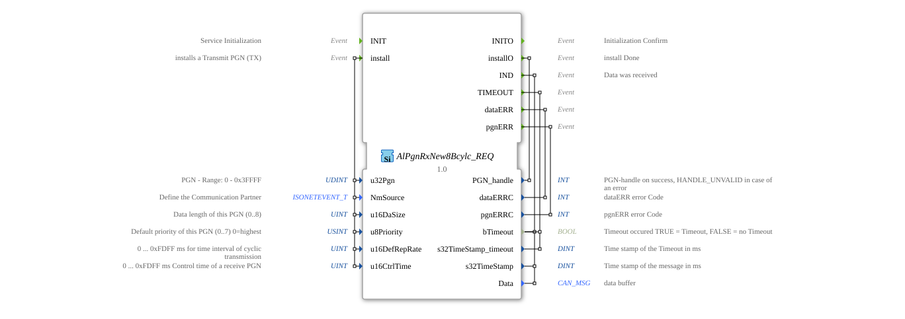

# AlPgnRxNew8Bcylc_REQ


* * * * * * * * * *
## Introduction
The function block `AlPgnRxNew8Bcylc_REQ` is used for the cyclical request of data via a CAN network according to the ISOBUS standard (ISO 11783). Its main purpose is the installation and management of receive parameters for specific Parameter Group Numbers (PGNs). The block enables the configuration of cyclical receive and monitors the data flow by triggering corresponding events upon successful receive, timeouts, or errors.



## Interface Structure

### **Event Inputs**

* **INIT**: Initializes the function block.

* **install**: Triggers the installation of a receive PGN (RX) with the associated configuration parameters. The data carried are: `u32Pgn`, `NmSource`, `u16DaSize`, `u8Priority`, `u16DefRepRate`, `u16CtrlTime`.

### **Event Outputs**

* **INITO**: Confirms successful initialization.

* **installO**: Signals completion of the installation process. Includes `PGN_handle` as a result.

* **IND**: Triggered when new data is received. Includes `bTimeout`, `s32TimeStamp`, and `Data`. * **TIMEOUT**: Triggered on a control time timeout. Includes `bTimeout` and `s32TimeStamp_timeout`.

* **dataERR**: Indicates an error in the received data. Includes the error code `dataERRC`.

* **pgnERR**: Indicates an error in PGN processing. Includes the error code `pgnERRC`.

### **Data Inputs**

* **u32Pgn** (UDINT): The parameter group number (PGN) to be received. Valid range: 0 to 0x3FFFF.

* **NmSource** (isobus::pgn::ISONETEVENT_T): Defines the communication partner (e.g., a specific node address).

* **u16DaSize** (UINT): The expected data size of the PGN in bytes (0..8).

* **u8Priority** (USINT): The default priority for this PGN (0..7, where 0 is the highest priority). Initial value: 7.

* **u16DefRepRate** (UINT): The expected cyclic transmission interval of the source PGN in milliseconds (0 ... 0xFDFF ms).

* **u16CtrlTime** (UINT): The control time in milliseconds (0 ... 0xFDFF ms), after which a `TIMEOUT` event is generated if no data is received.

### **Data Outputs**

* **PGN_handle** (INT): A handle (identifier) for the successfully installed PGN. In case of an error, an invalid handle (HANDLE_UNVALID) is returned.

* **dataERRC** (INT): Error code returned for a `dataERR` event.

* **pgnERRC** (INT): Error code returned for a `pgnERR` event.

* **bTimeout** (BOOL): Status flag for a timeout. `TRUE` = timeout occurred, `FALSE` = no timeout. Initial value: `FALSE`.

* **s32TimeStamp_timeout** (DINT): Timestamp in milliseconds at which the timeout was detected.

* **s32TimeStamp** (DINT): Timestamp in milliseconds of the last received valid data record. Initial value: -1.

* **Data** (isobus::pgn::CAN_MSG): Buffer containing the received CAN message data.

### **Adapter**
This function block does not use any adapter interfaces.

## Operation

1. **Initialization**: The `INIT` event puts the block into a ready-to-use state, which is acknowledged by `INITO`.

2. **PGN Installation**: The `install` event configures a new receiving PGN. All necessary parameters (PGN, source, data length, etc.) are passed. Upon successful configuration, the block responds with `installO` and delivers a valid `PGN_handle`. Errors trigger either `pgnERR` or `dataERR`.

3. **Cyclic Reception**: After successful installation, the module monitors the CAN bus for messages of the configured PGN and source.

4. **Data Indication**: Upon receiving a valid message, the `IND` event is triggered. The data (`Data`), a timestamp (`s32TimeStamp`), and the timeout status (`bTimeout=FALSE`) are output.

5. **Timeout Monitoring**: If the time since the last received packet exceeds the configured `u16CtrlTime`, the `TIMEOUT` event is triggered. `bTimeout` is set to `TRUE`, and a timestamp (`s32TimeStamp_timeout`) is provided.

6. **Error Handling**: If protocol or data errors occur, the events `pgnERR` and `dataERR`, respectively, are generated with the corresponding error codes.

## Technical Features

* This function block is specifically designed for use in ISOBUS environments (agricultural machinery) and utilizes type-safe data types from the `isobus::pgn` library (`CAN_MSG`, `ISONETEVENT_T`).

* Timeout monitoring (`u16CtrlTime`) is independent of the expected transmission interval (`u16DefRepRate`) and serves to enhance robustness by detecting failed communication partners.

* `PGN_handle` enables the unique identification and subsequent management (e.g., uninstallation) of a configured PGN instance within an application.

## State Transition Overview

1. **Not Initialized**: After startup. Waiting for `INIT`.

2. **Ready**: After `INITO`. Can receive `install` requests.

3. **Installed**: After successful `installO`. Actively monitors the CAN bus for the configured PGN.

* On reception: Transitions to the "Data Available" state (triggers `IND`), then returns to "Installed".

* On timeout: Triggers `TIMEOUT`, remains in the "Installed" state (continues monitoring).

* On error: Triggers `pgnERR`/`dataERR`, remains in the "Installed" state.

## Application Scenarios

* **ISOBUS Implementations**: Receiving cyclic data (e.g., engine speed, pressure, position) from an electronic control unit (ECU) of an implement on the tractor.

* **Monitoring Functions**: Continuously checks whether a critical component (e.g., motor control) is still functioning and sending data (using `CtrlTime`).

* **Data Logger**: Cyclically collects process data from the CAN network for analysis or storage purposes.

## ⚖️ Comparison with Similar Blocks

* **E_CTU vs. AlPgnRxNew8Bcylc_REQ**: A simple counter (`E_CTU`) lacks network functionality. This block is a specialized, application-oriented communication block for a specific protocol (ISOBUS).

* **Generic CAN RX Blocks**: Unlike blocks that receive raw CAN IDs and data, this block operates at the higher, standardized PGN level of ISOBUS and handles protocol-specific decoding and parameter management.


## 🛠️ Related exercises

* [Uebung_133](../../../../../Uebungen/test_B/Uebungen_doc/Uebung_133.md)

## Conclusion
The `AlPgnRxNew8Bcylc_REQ`is an essential component for implementing ISOBUS-compliant receiver functionalities in 4diac. It abstracts the complexity of CAN communication and provides a clean, event-driven interface for reliable, cyclical data acquisition with integrated error and timeout detection. Its use increases the reusability and robustness of control applications in agricultural technology.


```

---

### 🌐 Related topic subpages on ms-muc-docs.de

* [🌐 E_CTU Event Counter module on ms-muc-docs.de](https://www.ms-muc-docs.de/iec-61499/event-function-blocks/e_ctu/)

* [🌐 Eclipse 4diac IDE & Color Reference on ms-muc-docs.de](https://www.ms-muc-docs.de/iec-61499/eclipse-4diac/)

]