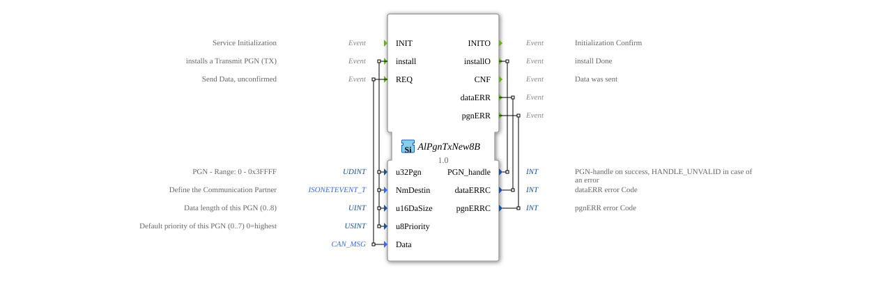

# AlPgnTxNew8B

* * * * * * * * * *
## Introduction
The function block `AlPgnTxNew8B` is used to send data over a CAN network according to the ISOBUS standard (ISO 11783). Its main purpose is to install and manage Parameter Group Numbers (PGNs) for transmission (TX) and subsequently send data packets as soon as a local transmit event (`REQ`) occurs. It is designed for applications that require unconfirmed data transmission.

## Interface Structure

### **Event Inputs**

* **`INIT`**: Starts the initialization of the function block.

* **`install`**: Triggers the installation of a new Transmit PGN (TX-PGN). The installation is configured using the data inputs linked via `With` (`u32Pgn`, `NmDestin`, `u16DaSize`, `u8Priority`).

* **`REQ`**: Triggers the transmission process for the previously installed PGN. The data to be transmitted is provided via the data input `Data`, which is linked to `With`.

### **Event Outputs**

* **`INITO`**: Confirms successful completion of initialization (`INIT`).

* **`installO`**: Confirms completion of PGN installation. Returns a handle for the installed PGN or an error value via `PGN_handle`.

* **`CNF`**: Confirms that the data was sent successfully (response to `REQ`).

* **`dataERR`**: Indicates an error related to the data being sent (`Data`). Returns an error code via `dataERRC`.

* **`pgnERR`**: Indicates an error related to the PGN installation or usage. Returns an error code via `pgnERRC`.

### **Data Inputs**

* **`u32Pgn`** (UDINT): The Parameter Group Number (PGN) to be installed. Valid range: 0 to 0x3FFFF (decimal 262143).

* **`NmDestin`** (isobus::pgn::ISONETEVENT_T): Defines the communication partner (e.g., broadcast, specific address).

* **`u16DaSize`** (UINT): The data length of the PGN in bytes. Valid range: 0 to 8.

* **`u8Priority`** (USINT): The priority of the message on the CAN bus. Range: 0 (highest) to 7 (lowest). Default value: 7.

* **`Data`** (isobus::pgn::CAN_MSG): The data to be sent, structured as a CAN message.

### **Data Outputs**

* **`PGN_handle`** (INT): A handle (identifier) for the successfully installed PGN. In case of an error, the value `HANDLE_UNVALID` is output.

* **`dataERRC`** (INT): Numeric error code that is set when the `dataERR` event is triggered.

* **`pgnERRC`** (INT): Numeric error code set when the `pgnERR` event is triggered.

### **Adapter**
This function block does not use any adapter interfaces.

## Operation

1. **Initialization**: The `INIT` event puts the function block into an operational state. Confirmation is provided by `INITO`.

2. **PGN Installation**: The `install` event configures a specific PGN for data transmission. This sets the PGN number, destination address, data length, and priority. Upon success, `PGN_handle` is returned via `installO`. In case of an error (e.g., invalid parameters), the event `pgnERR` is triggered.

3. **Data Transmission**: As soon as a `REQ` event occurs, the block attempts to send the CAN message provided at the `Data` input using the previously installed PGN configuration. If successful, the `CNF` event is triggered. If an error occurs during transmission (e.g., invalid data), `dataERR` is triggered.

## Technical Specifications

* The block is designed for transmitting data packets with a maximum length of 8 bytes (typical for classic CAN frames).

* It implements unacknowledged sending: A `CNF` error simply means that the message has been passed to the lower protocol layer for transmission, not necessarily that it has reached the receiver.

* Error handling is divided into two categories: PGN-related errors (`pgnERR`) and data-related errors (`dataERR`), which simplifies error diagnosis.

* The block uses specific ISOBUS data types (`isobus::pgn::CAN_MSG`, `isobus::pgn::ISONETEVENT_T`).

## State Overview
The block implicitly goes through the following main states:

1. **Not Initialized**: After startup. Only the `INIT` input is active.

2. **Initialized / Ready**: After `INITO`. The block can now install PGNs (`install`).

3. **PGN Installed**: After successful `installO`. The block is ready to send data (`REQ`).

4. **Send Active**: During the processing of `REQ`. Transition to state 3 after `CNF` or to an error state after `dataERR`/`pgnERR`.

## Application Scenarios
* **Agricultural Machinery Control (ISOBUS)**: Sending machine data (e.g., working speed, PTO speed) to a terminal or other control units in the tractor.

* **Commercial Vehicle Communication**: Transmission of vehicle data (e.g., torque, fuel consumption) within a truck bus system. * **Industrial Automation**: Sending control commands or status information via CAN networks in machines.

## ⚖️ Comparison with similar blocks

* **`E_SEND` (Standard 61499)**: A generic transmit block. `AlPgnTxNew8B` is specialized for ISOBUS/CAN with PGN management, prioritization, and destination addressing, while `E_SEND` is protocol-agnostic and requires an adapter connection.

* **Acknowledged Transmit Blocks**: `AlPgnTxNew8B` transmits unacknowledged (`CNF`). For acknowledged communication (request/response), other, more specific TX PGN blocks or protocol stacks would be required.

## 🛠️ Related Exercises

* [Exercise_124](../../../../../Uebungen/test_B/Uebungen_doc/Uebung_124.md)]

* [Exercise_128](../../../../../Uebungen/test_B/Uebungen_doc/Uebung_128.md)]

## Conclusion
The `AlPgnTxNew8B` is a specialized function block for reliable, configurable, and unacknowledged data transmission in ISOBUS environments. Its clear separation of configuration (`install`) and operation (`REQ`), as well as its differentiated error feedback, makes it easily maintainable and simple to integrate into higher-level application logic. It is the first choice when CAN messages need to be sent according to the ISOBUS standard with a fixed PGN.