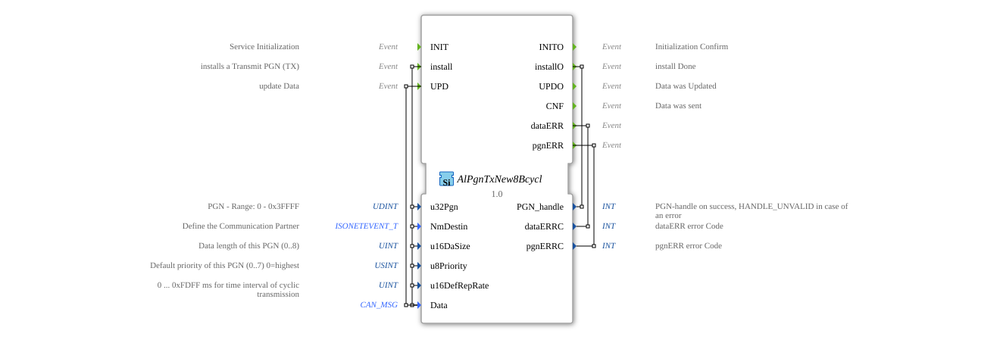

# AlPgnTxNew8Bcycl

* * * * * * * * * *
## Introduction
The function block `AlPgnTxNew8Bcycl` is used for the cyclic transmission of data over a CAN network according to the ISOBUS standard (ISO 11783). Its main purpose is the installation, configuration, and regular transmission of Parameter Group Numbers (PGNs). It allows the definition of communication properties such as destination address, priority, and transmission interval, and ensures that data is transmitted reliably and at the configured frequency.

## Interface Structure

### **Event Inputs**

* **INIT**: Initializes the function block.

* **install**: Installs a new PGN (TX) to be transmitted, along with its associated configuration data. Triggers the processing of the included data inputs (`u32Pgn`, `NmDestin`, `u16DaSize`, `u8Priority`, `u16DefRepRate`, `Data`).

* **UPD**: Updates the payload (`Data`) for the previously installed PGN to use it in the next cyclic transmission.

### **Event Outputs**

* **INITO**: Confirms completion of initialization.

* **installO**: Signals that the installation process is complete. Includes `PGN_handle` as an output value.

* **UPDO**: Confirms that the payload update (`UPD`) was processed successfully.

* **CNF**: Confirms that a data record was sent successfully.

* **dataERR**: Indicates an error related to the payload (`Data`). It carries the error code `dataERRC`.

* **pgnERR**: Indicates an error related to the PGN configuration or management. It carries the error code `pgnERRC`.

### **Data Inputs**

* **u32Pgn** (UDINT): The parameter group number (PGN) to be sent. Valid range: 0 to 0x3FFFF.

* **NmDestin** (isobus::pgn::ISONETEVENT_T): Defines the communication partner (destination address) for the message.

* **u16DaSize** (UINT): The length of the data to be sent in bytes. Valid range: 0 to 8.

* **u8Priority** (USINT): The priority of the message on the CAN bus (0 = highest, 7 = lowest). Default value: 7.

* **u16DefRepRate** (UINT): The cyclic transmission interval in milliseconds (0 ... 0xFDFF ms). A value of 0 disables cyclic transmission. Default value: 0.

* **Data** (isobus::pgn::CAN_MSG): The payload to be sent as a PGN.

### **Data Outputs**

* **PGN_handle** (INT): A handle (identifier) for the successfully installed PGN. In case of an error, an invalid handle value (`HANDLE_UNVALID`) is returned.

* **dataERRC** (INT): An error code providing detailed information about a `dataERR` event.

* **pgnERRC** (INT): An error code providing detailed information about a `pgnERR` event.

### **Adapter**
This function block does not use any adapter interfaces.

## Operation

1. **Initialization**: After the `INIT` event arrives, the block is made operational. Acknowledgement is provided via `INITO`.

2. **Installation**: The `install` event triggers the configuration of a new cyclic PGN transfer. All associated parameters (`u32Pgn`, `NmDestin`, etc.) are evaluated and stored internally. If successful, a `PGN_handle` is generated and returned with the `installO` event. Errors (e.g., invalid parameters) trigger the `pgnERR` event.

3. **Cyclic Transmission**: If the PGN is installed and `u16DefRepRate` > 0, the block automatically begins sending the payload data stored in `Data` at the defined interval. Each successful transmission is acknowledged by the `CNF` event.

4. **Data Update**: The `UPD` event allows you to change the payload data (`Data`) for the active PGN transmission. The new data will be used in the next cyclic transmission. Receipt of the new data is confirmed with `UPDO`. Incorrect data triggers `dataERR`.

## Technical Features
* This block is designed for use in ISOBUS environments (agricultural machinery) and uses specific ISOBUS data types (`ISONETEVENT_T`, `CAN_MSG`).

* Cyclical transmission can be deactivated by setting `u16DefRepRate` to 0, enabling on-demand operation.

* * Error handling is structured via dedicated events (`dataERR`, `pgnERR`), enabling robust integration into higher-level controllers.

* Returning a `PGN_handle` event allows the management of multiple installed PGNs within a single system.

## State Overview

1. **Not Initialized**: The block is in a sleep state after startup.

2. **Initialized / Ready**: After `INIT`/`INITO`. The block is waiting for configuration or control events.

3. **PGN Installed**: After successful `install`/`installO`. The PGN is configured, and the internal state for (cyclic) transmission is active.

4. **Send Active**: If `u16DefRepRate` > 0, the block sends data cyclically and fires `CNF` on each successful transmission.

5. **Error State**: When an error occurs (`pgnERR` or `dataERR`). Depending on the error type, the block may be in a waiting state or attempt to re-execute the operation (if implemented in the algorithm).

## Application Scenarios
* **ISOBUS-compliant Machine Control**: Cyclic transmission of machine data (e.g., speed, pressure, position) from an electronic control unit (ECU) to a terminal or other network participants.

* **Diagnostic and Monitoring Systems**: Regular transmission of status and operating parameters for monitoring purposes.

* **Implementation of ISOBUS "Fast Packet" protocols**: For PGNs that carry more than 8 bytes of data and therefore need to be transmitted in multiple CAN messages (supported by the `CAN_MSG` data type).

## ⚖️ Comparison with similar blocks

* **Compared to simple `E_CYC` blocks**: `AlPgnTxNew8Bcycl` is specialized for ISOBUS PGNs and offers integrated handling of priority, target addressing, and error management, while a generic cyclic event generator (`E_CYC`) only provides timing.

* **Compared to generic CAN transmit blocks**: This block abstracts the low-level CAN details (identifier calculation, data frames) and operates directly at the more logical PGN level according to the ISOBUS standard.

## 🛠️ Related Exercises

* [Exercise_127](../../../../../Uebungen/test_B/Uebungen_doc/Uebung_127.md)

## Conclusion
The `AlPgnTxNew8Bcycl`is a specialized and powerful function block for cyclic data communication in ISOBUS networks. Its clear interface, comprehensive configurability, and integrated error feedback make it ideally suited for the reliable implementation of transmission services in complex, distributed control systems for agricultural machinery.