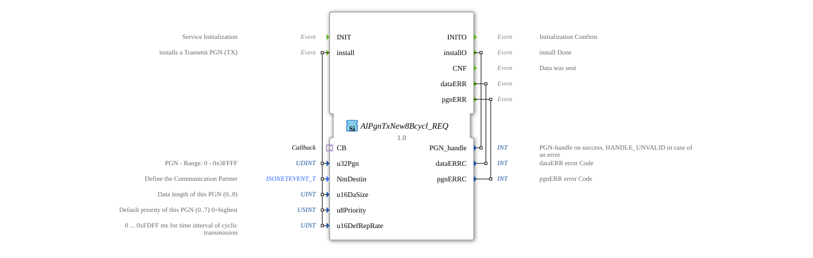

# AlPgnTxNew8Bcycl_REQ

* * * * * * * * * *
## Introduction
The function block `AlPgnTxNew8Bcycl_REQ` is used for the cyclic transmission of data over an ISOBUS network. Its main purpose is the installation and management of a Parameter Group Number (PGN) transmit object (TX) that sends data at a defined time interval. A key feature is the integration of a callback adapter, which enables flexible data provisioning.

## Interface Structure

### **Event Inputs**
* **INIT**: Initializes the function block.
* **install**: Starts the installation process for a new cyclic transmit PGN. Triggers the configuration with the incoming data.

### **Event Outputs**
* **INITO**: Confirms successful completion of initialization.
* **installO**: Confirms completion of PGN installation. Returns the generated `PGN_handle`.
* **CNF**: Triggered when data has been successfully sent.
* **dataERR**: Indicates an error related to the data being sent. Returns an error code.
* **pgnERR**: Indicates an error related to PGN configuration or management. Returns an error code.

### **Data Inputs**
* **u32Pgn** (UDINT): The parameter Group Number (PGN) to be used. Valid range: 0 to 0x3FFFF.
* **NmDestin** (isobus::pgn::ISONETEVENT_T): Defines the communication partner (destination address) for the transmission.
* **u16DaSize** (UINT): The length of the payload to be transmitted in bytes. Maximum 8 bytes (0..8).
* **u8Priority** (USINT): The priority of the message on the bus (0..7), where 0 is the highest priority. Default value: 7 (lowest).
* **u16DefRepRate** (UINT): The cyclic transmission interval in milliseconds (0 ... 0xFDFF ms). A value of 0 disables cyclic transmission. Default value: 0.

### **Data Outputs**
* **PGN_handle** (INT): A unique handle that identifies the installed PGN instance. In case of an error, it contains the value `HANDLE_UNVALID`.
* **dataERRC** (INT): Error code that is set when the `dataERR` event is triggered.
* **pgnERRC** (INT): Error code set when the `pgnERR` event is triggered.

### **Adapter**
* **CB** (Type: `isobus::pgn::tx::Callback`): A socket adapter that provides a callback interface. The function block uses this adapter to request the current payload from the higher-level control algorithm during each cyclic transmission.

## Functionality

1. **Initialization**: The `INIT` event prepares the function block for operation. Upon completion, `INITO` is triggered.

2. **PGN Installation**: The `install` event triggers the configuration of a new cyclic transmission PGN. The values present at the data inputs (`u32Pgn`, `NmDestin`, etc.) are used to register the PGN in the ISOBUS stack.

3. **Handle Return**: Upon successful installation, the `installO` event is triggered, and the generated `PGN_handle` is made available at the data output. This handle must be saved for later operations (e.g., uninstallation, modification).

4. **Cyclic Send Operation**: If `u16DefRepRate` > 0, the function block begins sending data at the defined interval.

* Before each send operation, the block requests the current payload data via the `CB` adapter.
* After successful transmission, the `CNF` event is triggered.

5. **Error Handling**: If an error occurs (e.g., invalid configuration, communication problem), either `dataERR` or `pgnERR` is triggered and the corresponding error code is set.

## Technical Features
* **Data Length**: Supports the transmission of a maximum of 8 bytes of user data per PGN, which corresponds to a typical ISOBUS data length.
* **Callback Mechanism**: The user data is not stored internally but is dynamically requested via the adapter as needed. This enables efficient and up-to-date data provision.
* **Error Handling**: Separate error events for data-related (`dataERR`) and PGN-related (`pgnERR`) problems allow for differentiated error diagnosis.
* **Initial Value**: The priority (`u8Priority`) and the transmission interval (`u16DefRepRate`) have defined initial values (7 and 0, respectively).

## State Overview
The function block implicitly goes through the following main states:

1. **Not Initialized**: The block is inactive after startup.

2. **Initialized (Ready)**: After successful execution of `INIT`/`INITO`, the block waits for an installation request.

3. **PGN Installed (Active)**: After successful execution of `install`/`installO`, the PGN is configured. If `u16DefRepRate` > 0, the block sends data cyclically, triggering `CNF`. It also responds to error conditions.

## Application Scenarios
* **Cyclic Status Messages**: Regular transmission of machine status data (e.g., speed, temperature, operating hours) to a display or a higher-level management system.
* **Implementation of ISOBUS "Fast Packet" Protocols**: For PGNs that contain more than 8 bytes of data and are distributed across multiple CAN telegrams, this block can control the cyclic transmission of individual packets.
* **Data Logging**: Cyclic transmission of process data to a data logger or gateway.

## ⚖️ Comparison with Similar Blocks
* **Vs. One-time transmit blocks (e.g., `AlPgnTx_REQ`): This block is designed for repeated, periodic transmitting, whereas simple TX blocks typically perform a single transmit per trigger event.

Vs. Blocks with Internal Data Storage: The use of a callback adapter distinguishes this block from those where the data is directly provided at an input. This makes it more flexible when the data changes frequently or originates from complex sources.

* ## 🛠️ Related Exercises
* [Exercise_126](../../../../../Uebungen/test_B/Uebungen_doc/Uebung_126.md)]
* [Exercise_126b](../../../../../Uebungen/test_B/Uebungen_doc/Uebung_126b.md)]
* [Exercise_126b2](../../../../../Uebungen/test_B/Uebungen_doc/Uebung_126b2.md)]

## Conclusion
The `AlPgnTxNew8Bcycl_REQ` is a specialized function block for reliable, cyclical data communication in ISOBUS environments. Its strengths lie in the clear separation of configuration (`install`), dynamic data acquisition (callback adapter), and robust error feedback. It is ideally suited for applications that require regular status updates or process data streams.