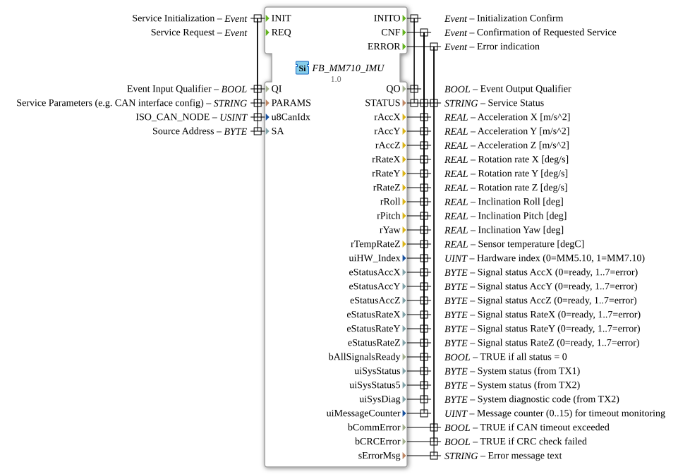

# FB_MM710_IMU

* * * * * * * * * *
## Introduction

The function block **FB_MM710_IMU** is a service-oriented module (SIFB) for connecting the Bosch MM7.10 IMU sensor via CAN/J1939. It enables the reading of acceleration, yaw rate, and tilt values, as well as the monitoring of system and error states. The FB encapsulates all CAN communication and signal processing and provides the data in a standardized format via event and data outputs.
## Interface Structure

### **Event Inputs**

| Event | Type | Description |
|----------|-----|--------------|
| INIT | EInit | Initialization of the module. This event sets the CAN parameters (index, source address) and the activation qualifier QI. |
| REQ | Event | Triggers a new measurement query. After successful initialization, sensor data can be requested cyclically or event-driven. |

### **Event Outputs**

| Event | Type | Description |
|----------|-----|--------------|
| INITO | EInit | Confirmation of successful initialization (QO = TRUE) or error message. |
| CNF | Event | Confirmation of a measurement request. Provides the current sensor data and status information. |
| ERROR | Event | Occurs in case of communication or CRC errors. Contains detailed error information. |

### **Data Inputs**

| Variable | Type | Description |
|----------|-----|--------------|
| QI | BOOL | Activation Qualifier: Initialization (INIT) is only performed if QI = TRUE. |
| PARAMS | STRING | Service parameter, e.g., CAN interface configuration (optional). |
| u8CanIdx | USINT | CAN node index (default initial value: `INVALID`). |
| SA | BYTE | Source address for J1939 communication (initial value: `16#DA`). |

### **Data Outputs**

| Variable | Type | Description |
| |----------|-----|--------------|
| QO | BOOL | Initialization confirmation (TRUE = successful). |
| STATUS | STRING | Status message (e.g., "Initialized," "Error"). |
| rAccX, rAccY, rAccZ | REAL | Acceleration values in the X, Y, and Z directions [m/s²]. |
| rRateX, rRateY, rRateZ | REAL | Rotation rates around the respective axis [deg/s]. |
| rRoll, rPitch, rYaw | REAL | Tilt angle (roll, pitch, yaw) [deg]. |
| rTempRateZ | REAL | Sensor temperature [°C]. |
| uiHW_Index | UINT | Hardware Index (0 = MM5.10, 1 = MM7.10). |
| eStatusAccX … eStatusAccZ | BYTE | Acceleration signal quality (0 = ready, 1..7 = error). |
| eStatusRateX … eStatusRateZ | BYTE | Rotation rate signal quality (0 = ready, 1..7 = error). |
| bAllSignalsReady | BOOL | TRUE if all signal statuses are 0. |
| uiSysStatus | BYTE | System status from TX message 1. |
| uiSysStatus5 | BYTE | System status from TX message 2. |
| uiSysDiag | BYTE | System diagnostic code (from TX2). |
| uiMessageCounter | UINT | Message counter (0..15) for timeout monitoring. |
| bCommError | BOOL | TRUE on CAN timeout. |
bCRCError | BOOL | TRUE on failed CRC check. |
sErrorMsg | STRING | Error text (e.g., "CAN timeout"). |

### **Adapter**

No adapters defined.

## Functionality

Upon receiving **INIT** with QI = TRUE, the FB_MM710_IMU initializes the CAN communication and the internal receive buffer. After successful initialization, **INITO** is set with QO = TRUE. Each **REQ pulse** triggers a measurement query – the function block then waits for the CAN response from the sensor. If valid data is received, **CNF** is output and all data outputs are updated. If a communication or CRC error occurs, or if the message counter exceeds a timeout, **ERROR** is set instead. The module can be triggered cyclically multiple times in succession using REQ.

The signal statuses (eStatus*) enable individual fault analysis for each axis. The hardware index distinguishes between older MM5.10 and current MM7.10 sensors.

## Technical Features

- **CAN/J1939 Protocol** – Uses a fixed source address (default: `16#DA`).
- **Timeout Monitoring** – The `uiMessageCounter` (0-15) is incremented with each valid message; if it fails to increment, a communication error is reported after 16 missing messages.
- **Signal Status Bits** – Provide more granular information than simple "ready/error" flags.
- **CRC Check** – Faulty CAN frames are detected and reported via `bCRCError` and **ERROR**.
- **Hardware Differentiation** – `uiHW_Index` enables adaptive behavior for different sensor versions.

## State Overview

The module goes through the following states (not explicitly as ECC, but inferable from its behavior):

1. **Inactive** – After startup, waiting for INIT.
2. **Initializing** – After an INIT event; establishing CAN communication.
3. **Ready** – After successful INITO; waiting for REQ.
4. **Request Sent** – After REQ; waiting for a response (CAN message).
5. **Data Received** – After a successful CAN response; CNF is sent.
6. **Error** – In case of timeout or CRC error; ERROR is sent (fallback to Ready after error handling).

## Application Scenarios

- **Mobile Machinery** – Tilt and acceleration monitoring of excavators, cranes, or forklifts.
- **Vehicle Dynamics** – Acquisition of roll, pitch, and yaw angles for stability control.
- **Industrial Robots** – Monitoring of vibrations and unexpected movements.
- **IoT Sensor Nodes** – Integration into higher-level controllers via CAN bus.

## Comparison with Similar Function Blocks

Compared to simple IMU drivers (e.g., via SPI/I²C), this function block offers direct integration into J1939 networks. The signal status bits enable diagnostics that are often lacking in standard function blocks. The integrated hardware index (MM5.10 / MM7.10) allows for easy migration. Other CAN IMU modules may use proprietary message formats, while this module is based on the open J1939 standard.

## Conclusion

The FB_MM710_IMU is a powerful module for the reliable acquisition of IMU data in CAN-based automation systems. Its comprehensive status and error information supports complete diagnostics, and its simple parameterization via INIT and REQ makes it highly versatile. It is an ideal choice, especially in safety-critical applications using J1939.
