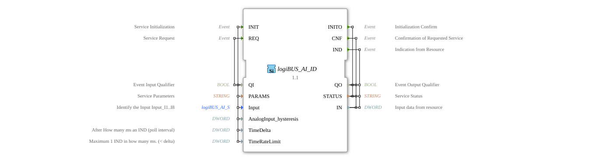

# logiBUS_AI_ID


* * * * * * * * * *

## Introduction
The logiBUS_AI_ID is a Service Interface Function Block for processing double-word input data. This block serves as an interface for analog inputs and provides functions for initializing, querying, and indicating input data.


``` 

## Interface Structure

### **Event Inputs**
- **INIT**: Service Initialization Event
- **REQ**: Service Request Event

### **Event Outputs**
- **INITO**: Initialization Acknowledgement
- **CNF**: Acknowledgement of Requested Service Operation
- **IND**: Resource Indication

### **Data Inputs**
- **QI** (BOOL): Event Input Qualifier - Enables/Disables the Service

- **PARAMS** (STRING): Service Parameter for Configuration
- **Input** (logiBUS_AI_S): Identifies the input (I1..I8) with the initial value "Invalid"

- **AnalogInput_hysteresis** (DWORD): Hysteresis Value for Analog Inputs

### **Data Outputs**

- **QO** (BOOL): Event Output Qualifier - Status of the Service Output

- **STATUS** (STRING): Service status information

- **IN** (DWORD): Input data from the resource

### **Adapter**
No adapter interfaces available.

## Functionality
The Function Block enables communication with analog input devices via the logiBUS system. During INIT initialization, the service parameters are configured and the input is identified. Data can be queried via REQ, while IND processes asynchronous data announcements from the resource. The hysteresis function assists in filtering signal noise.


## Technical Features
- Uses special data types from the logiBUS::io::AI package
- Supports hysteresis functionality for analog signals
- Offers both synchronous (CNF) and asynchronous (IND) operating modes

- Initializes inputs with a defined "Invalid" state

## State Overview
The function block has the following operating states:

- Not initialized (before INIT)
- Initialized and ready (after INITO)
- Data query active (with REQ/CNF)
- Indication mode (with IND)

## Application Scenarios
- Industrial automation systems with analog sensors
- Process control systems with hysteresis requirements
- Embedded systems with logiBUS communication
- Systems with multiple analog inputs (I1-I8)

## ⚖️ Comparison with Similar Function Blocks
Compared to simple analog input function blocks, logiBUS_AI_ID offers extended functions such as Hysteresis control, detailed status feedback, and a structured initialization procedure. Integration into the logiBUS system enables standardized communication.

## 🛠️ Related Exercises

* [Exercise_028](../../../../../Uebungen/test_B/Uebungen_doc/Uebung_028.md)]

* [Exercise_034](../../../../../Uebungen/test_B/Uebungen_doc/Uebung_034.md)]

## Conclusion
The logiBUS_AI_ID Function Block provides a robust and flexible solution for connecting analog input devices in industrial control systems. Its extensive parameterization options and integrated hysteresis functionality make it particularly suitable for demanding automation applications.