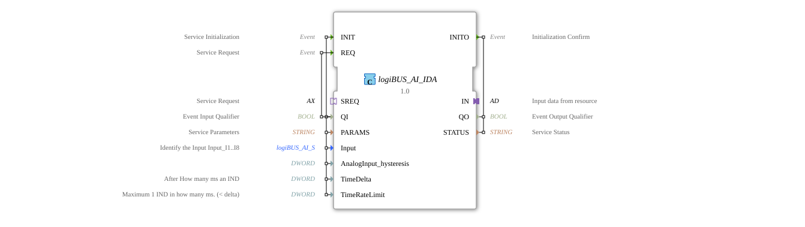

# logiBUS_AI_IDA

* * * * * * * * * *
## Introduction
The function block `logiBUS_AI_IDA` is a composite function block (FB) for processing analog double-word input data. It serves as an interface between a logiBUS resource and the application by providing uniform analog input values via an adapter and returning status information (QO, STATUS) to the calling instance. The function block supports both initialization-driven and event-driven processing.
## Interface Structure

### **Event Inputs**

| Event | Type | With | Description |

|----------|--------|-------|--------------|

| INIT | EInit | QI, PARAMS, Input, AnalogInput_hysteresis, TimeDelta, TimeRateLimit | Service Initialization: Configuration of the analog input and start of data provisioning. |

| REQ | Event | QI | Service Request: Triggers immediate processing or a status update. |

### **Event Outputs**

| Event | Type | With | Description |

|----------|--------|-------|--------------|

| INITO | EInit | QO, STATUS | Confirmation of initialization with quality and status information. |

### **Data Inputs**

| Name | Type | Initial Value | Description |

|-----------------------|--------|-------------|--------------|

| QI | BOOL | – | Qualifier for events (e.g., enabling processing). |

| PARAMS | STRING | – | Service parameters (e.g., configuration strings). |

| Input | logiBUS::io::AI::logiBUS_AI_S | Invalid | Selection of the analog input (e.g., Input_I1…I8). |

| AnalogInput_hysteresis| DWORD | – | Hysteresis for change detection. A value of 0 requires TimeDelta to be non-zero. |

| TimeDelta | DWORD | 250 | Cycle time in ms for cyclic processing (16#FFFFFFFF = only on change). |

| TimeRateLimit | DWORD | 100 | Minimum interval in ms between two events (IND) (< TimeDelta). |

### **Daten-Ausgänge**

| Name   | Typ    | Beschreibung |
|--------|--------|--------------|
| QO     | BOOL   | Ausgangsqualifier (z. B. gültiger Zustand nach INIT). |
| STATUS | STRING | Statusmeldung (z. B. Initialisierungsfehler oder OK). |

### **Adapter**

| Richtung | Name | Typ | Beschreibung |
|----------|------|-----|--------------|
| Plug     | IN   | adapter::types::unidirectional::AD | Empfängt die analogen Eingangsdaten von der Ressource. |
| Socket   | SREQ | adapter::types::unidirectional::AX | Ermöglicht die externe Anforderung eines Dienstes (Service-Request). |

## Funktionsweise

Der Baustein kapselt den internen FB `logiBUS_AI_ID`, der die eigentliche Logik zur analogen Eingangsverarbeitung enthält. Das interne Netzwerk verbindet:

- **INIT** → **AI.INIT** startet die Ressourcenkonfiguration.
- **AI.INITO** → **INITO** gibt die Initialisierungsbestätigung zurück.
- **REQ** → **AI.REQ** löst eine sofortige Verarbeitung aus.
- **SREQ.E1** (externes Service-Request-Ereignis) wird über den **E_R_TRIG** (Flankenerkennung) auf **AI.REQ** geleitet – dadurch kann auch ein externer Adapter eine Verarbeitung anstoßen.
- **AI.IND** und **AI.CNF** – beide verbinden auf **IN.E1** (den Plug-Ausgang) und signalisieren nach außen, dass neue Daten am Adapter `IN` anliegen.
- Die Daten‑Eingänge (QI, PARAMS, Input, Hysterese, TimeDelta, TimeRateLimit) werden direkt an den internen Baustein weitergeleitet.
- Die Ausgänge QO und STATUS kommen vom internen Baustein.

Die zyklische Verarbeitung erfolgt gemäß `TimeDelta`. Wenn `TimeDelta = 16#FFFFFFFF` gesetzt ist, wird nur bei einer Änderung des analogen Werts (unter Berücksichtigung der Hysterese) ein Ereignis erzeugt.

## Technische Besonderheiten
- **Hysterese (`AnalogInput_hysteresis`)**: Ist der Wert 0, muss die Zykluszeit (`TimeDelta`) zwingend ungleich 0 sein, da sonst keine Ereignisse ausgelöst werden können.
- **Zeitsteuerung**: Mit `TimeDelta` und `TimeRateLimit` kann das Verhalten feinabgestimmt werden – z. B. zyklische Abfrage (TimeDelta > 0) or pure change notification (TimeDelta = 0xFFFFFFFF).
- **External Service Request**: Another component (e.g., a higher-level control block) can request an update via socket `SREQ`.
- **Composite Architecture**: The block is implemented as a composite, which allows reuse of the proven `logiBUS_AI_ID` and simultaneously extends the interface.

## State Overview

The block itself does not have an explicit state machine, as its behavior is determined by the internal FB `logiBUS_AI_ID`. The following basic processes can be identified:

1. **Initialization Phase**

- Event `INIT` → Internal function block is configured → Confirmation `INITO` with QO/STATUS.

2. **Data Provisioning (Cyclical / Change-Based)**

- After INIT, the internal function block regularly sends events via `IND` (or `CNF`) to the plug `IN`, or upon value change.

3. **Manual Request**

- The current processing is triggered by `REQ` or `SREQ`; results are also output via `IN`.

## Application Scenarios
- **Analog Sensor Acquisition**: Logging in analog sensors (e.g., temperature, pressure, level) with configurable hysteresis and sampling rate.
- **Monitoring with Minimal Bus Load**: By setting `TimeDelta = 0xFFFFFFFF`, events are only sent when relevant changes occur.
- **Safety-Critical Applications**: Combination of cyclic polling (e.g., 250 ms) with a fast change alarm (`TimeRateLimit` limits the event frequency).
- **Control Bus Connection**: This function block is suitable as a generic interface for logiBUS-compatible analog input modules with a uniform adapter protocol.

## Comparison with Similar Function Blocks
- **logiBUS_AI_ID** (internal FB): Provides the core logic but does not have an additional socket for external service requests. `logiBUS_AI_IDA` extends this functionality with `SREQ` and indirect triggering via `E_R_TRIG`.
- **logiBUS_AI_S** (data structure): Serves as a pure data type for identifying the analog channel; `logiBUS_AI_IDA` uses it as an input parameter.
- **Other composite function blocks for digital inputs**: Unlike digital function blocks, the focus is on analog conversion, hysteresis, and time-controlled change detection.

## Conclusion

The `logiBUS_AI_IDA` offers a flexible and extended interface for processing analog inputs in logiBUS-based automation systems. Its configuration options (hysteresis, time parameters, external service requests) make it suitable for a wide range of applications – from simple cyclic acquisition to efficient change-based communication. The composite structure allows for a clear separation of core logic and event handling customizations.