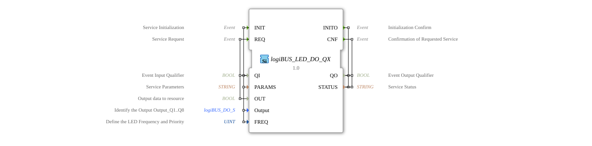

# logiBUS_LED_DO_QX

* * * * * * * * * *

## Introduction
The logiBUS_LED_DO_QX function block is an output service interface function block for Boolean output data. It is used to control LED outputs via the logiBUS system and offers special functions for frequency control of the LEDs.

## Interface Structure

### **Event Inputs**

- **INIT**: Service initialization with the associated variables QI, PARAMS, Output, and FREQ

- **REQ**: Service request with the associated variables QI and OUT

### **Event Outputs**

- **INITO**: Initialization acknowledgment with the associated variables QO and STATUS

- **CNF**: Acknowledgement of requested service execution with the associated variables QO and STATUS

### **Data Inputs**

- **QI**: Event input qualifier (BOOL)

- **PARAMS**: Service parameters (STRING)

- **OUT**: Output data to the resource (BOOL)

- **Output**: Identifies the output Output_Q1..Q8 (logiBUS::io::DQ::logiBUS_DO_S) - Initial value: Invalid

- **FREQ**: Defines the LED frequency and priority (UINT) - Initial value: LED_FREQ::LED_OFF

### **Data Outputs**

- **QO**: Event output qualifier (BOOL)

- **STATUS**: Service status (STRING)

### **Adapter**
No adapter interfaces available.

## Functionality
This function block allows the control of LED outputs with configurable frequency settings. The INIT event input initializes the service, allowing configuration of the specific output (Output_Q1 to Q8) and the LED frequency. The REQ event input triggers the actual output operation, sending the Boolean value to the configured output.

## Technical Features
- Supports frequency control for LED operation (blinking)
- Initialization with invalid value for the output

- Predefined frequency constants (LED_FREQ::LED_OFF as default)
- Specific output identification via the output parameter

## State Overview
The function block cycles through typical service interface states:

1. Uninitialized state
2. Initialization phase after an INIT event
3. Ready for operation after successful initialization
4. Active operating state during REQ processing

## Application Scenarios

- Control of status LEDs in automation systems
- Visualization of process states with blinking signals
- Integration into logiBUS-based control systems
- Priority-controlled LED displays

## ⚖️ Comparison with similar function blocks
Compared to simple digital output blocks, logiBUS_LED_DO_QX offers advanced frequency control functions and specific LED optimizations. While standard DO blocks only offer simple on/off control, this block enables more complex blinking patterns and priority control.

## 🛠️ Related Exercises

* [Exercise_029](../../../../../Uebungen/test_B/Uebungen_doc/Uebung_029.md)

## Conclusion
The logiBUS_LED_DO_QX function block represents a specialized solution for LED output control in logiBUS systems. Thanks to its integrated frequency control and flexible output configuration, it is particularly suitable for applications requiring advanced visualization functions.