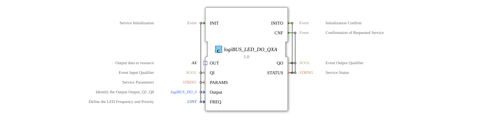

# logiBUS_LED_DO_QXA

* * * * * * * * * *
## Introduction
The **logiBUS_LED_DO_QXA** is a composite function block (FB) that simplifies the control of a single LED via the logiBUS system. It receives a Boolean value (e.g., from a control logic) and configures the desired LED output (Q1–Q8) with an adjustable frequency and priority. The FB encapsulates the communication with the underlying hardware driver and provides a standardized interface.

## Interface Structure
### **Event Inputs**

- **INIT** (EInit): Initializes the entire function logic.

Wired data: `QI`, `PARAMS`, `Output`, `FREQ`

### **Event Outputs**

- **INITO** (EInit): Confirmation of successful initialization.

Wired data: `QO`, `STATUS`

- **CNF** (Event): Acknowledgement of a completed service order (e.g., after a value change).

Wired data: `QO`, `STATUS`

### **Data Inputs**

- *QI* (BOOL): Event qualifier – enables processing of the input event.

- *PARAMS* (STRING): Service parameter, typically address or configuration data for the logiBUS node.

- *Output* (logiBUS::io::DQ::logiBUS_DO_S): Identification of the physical output (e.g., Q1…Q8). Initial value: `Invalid`.

- *FREQ* (UINT): Defines the desired LED frequency and priority. Initial value: `LED_FREQ::LED_OFF`.

### **Data Outputs**

- *QO* (BOOL): Output qualifier – indicates the state of the last processing.

- *STATUS* (STRING): Message about the current service status (e.g., error code or "OK").

### **Adapter**

- **OUT** (adapter::types::unidirectional::AX): Unidirectional adapter for passing the Boolean value to the resource.

- *E1* (Event): Signals a new data request.

- *D1* (BOOL): The value to be transmitted (LED on/off).

## Functionality

1. **Initialization**

The FB is started by an INIT event. The supplied data (`QI`, `PARAMS`, `Output`, `FREQ`) are forwarded to the inner FB `logiBUS_LED_DO_QX`, which performs the actual logiBUS communication. If successful, `INITO` is sent with the output data `QO` and `STATUS`.

2. **Operation**

After initialization, the function block waits for the event `OUT.E1`. This event is triggered by the connected resource as soon as a new Boolean value (`OUT.D1`) is present. The event is passed on to the internal function block as `REQ`. This block then updates the LED output according to the configured `Output` identification and the specified `FREQ`.

3. **Confirmation**

After successful processing, the internal function block sends a `CNF` event, which is output externally as `CNF`. The outputs `QO` and `STATUS` indicate the current state.

## Technical Features

- **Composite Function Block** – This function block simplifies the use of the complex driver function block `logiBUS_LED_DO_QX` by using a reduced interface.

- **Adapter Design** – The adapter `OUT` enables loose coupling between the control logic and the output channel. The Boolean value is passed in response to an event.

- **LED Frequency** – The parameter `FREQ` uses a predefined enumeration (`LED_FREQ`) to define blinking patterns or priorities (e.g., `LED_OFF`, `LED_ON`, `BLINK_1HZ`, ...).

- **Error Handling** – The output `STATUS` returns detailed messages (e.g., from `logiBUS::io::DQ::logiBUS_DO::Invalid`).

## State Overview
The function block (FB) does not have explicit state machines in the XML network. The state logic is implemented through the interaction of INIT and the event/data connections:

- **Idle State** – After successful initialization, the FB waits for events from the adapter.

- **Processing** – A `OUT.E1` event triggers an update of the LED output.

- **Error State** – In case of failed initialization or communication errors, `STATUS` is set accordingly.

## Application Scenarios

- **Agricultural and Agricultural Technology** – Control of indicator lights on machines, display of operating states via logiBUS.

- **Automation** – Simple on/off signals to distributed I/O modules, e.g., control cabinet LEDs.

- **Wireless Connection** – Use of the logiBUS protocol to bridge larger distances between the controller and the actuator.

## Comparison with Similar Function Blocks

Compared to the direct driver function block `logiBUS_LED_DO_QX`, `logiBUS_LED_DO_QXA` offers a leaner interface and integrates initialization in a single step. Other composite function blocks in the `logiBUS_DO` family focus on digital-binary outputs, while this function block is specifically designed for LED applications (with frequency support).

## Conclusion
The `logiBUS_LED_DO_QXA` is a convenient composite function block for LED output via logiBUS. It reduces implementation complexity to just a few parameters and an event adapter. Its clear structure makes it particularly suitable for recurring switching tasks in distributed control systems.