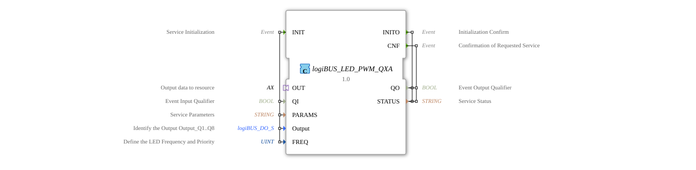

# logiBUS_LED_PWM_QXA

* * * * * * * * * *
## Introduction
The function block `logiBUS_LED_PWM_QXA` is a composite block for controlling a PWM-controlled LED via the logiBUS. It combines the configuration and output of an LED PWM signal and provides a uniform interface for initialization, parameterization, and operation.
## Interface Structure
### **Event Inputs**

| Event | Type | With Variables | Description |
|----------|-----|----------------|--------------|
| `INIT` | EInit | `QI`, `PARAMS`, `Output`, `FREQ` | Service Initialization; starts the function block with the specified parameters |

### **Event Outputs**

| Event | Type | With Variables | Description |
|----------|-----|---------------|--------------|
| `INITO` | Initialization | `QO`, `STATUS` | Confirmation of successful initialization |
| `CNF` | Event | `QO`, `STATUS` | Acknowledgement of a requested service (e.g., after a data request via the adapter) |

### **Data Inputs**

| Variable | Type | Initial Value | Description |
|------------|--------------|--------------|
| `QI` | BOOL | – | Qualifier for the event input (activation) |
| `PARAMS` | STRING | – | Service parameter for bus configuration |
| `Output` | `logiBUS::io::DQ::logiBUS_DO_S` | `Invalid` | Selection of physical output Q1..Q8 |
| `FREQ` | UINT | `LED_OFF` | Frequency and priority of the LED PWM (e.g., from enumeration `LED_FREQ`) |

### **Data Outputs**

| Variable | Type | Description |
|------------|--------|--------------|
| `QO` | BOOL | Qualifier for the event output (activation acknowledgement) |
| `STATUS` | STRING | Service status (error/success message) |

### **Adapter**

| Adapter | Type | Description |
|---------|-----|---------------|
| `OUT` | `adapter::types::unidirectional::AX` | Output adapter for data transmission to the logiBUS resource (via event `E1` and data `D1`) |

## Functionality
The function block is implemented as a composition and internally contains the sub-FB `logiBUS_LED_PWM_QX`, which implements the actual PWM control.

1. **Initialization (INIT):**

The FB is started by the event `INIT`. The parameters `QI`, `PARAMS`, `Output`, and `FREQ` are forwarded to the sub-function block. After successful initialization, the sub-function block returns `INITO` and the output data `QO` and `STATUS`.

2. **Operation:**

The adapter `OUT` receives an event from the resource at `E1`. This event is then passed through to the sub-function block as `REQ`. The sub-FB processes the request and sends the output data (the current PWM value and the status signal) to the resource via the adapter data channel `OUT.D1`. The sub-FB's acknowledgment `CNF` is output as `CNF` by the composite FB.

3. **Error Handling:**

If errors occur during initialization or operation, the status is reported via the variable `STATUS`. Output validation is performed via `QO`.

## Technical Features
- **Composite Block**: The FB encapsulates the complexity of the PWM output and provides a simple interface for the user.
- **Typed Output Selection**: The input `Output` of type `logiBUS_DO_S` allows explicit assignment to a logiBUS digital output Q1..Q8. The initial value `Invalid` forces a valid selection before first use.
- **Frequency Setting**: The PWM frequency and priority can be defined via `FREQ` (type UINT). The initial value `LED_OFF` switches the LED off by default.
- **Adapter-Based Communication**: The unidirectional adapter `AX` transmits events and data between the FB and the higher-level logiBUS resource. The FB itself waits for external requests (`E1`) and returns data.

**Adapter-Based Communication**:** The unidirectional adapter `AX` transmits events and data between the FB and the higher-level logiBUS resource. The FB itself waits for external requests (`E1`) and returns data.

**
## State Overview
Since this is a composite function block, it does not have explicit states of its own. However, the internal sub-FB `logiBUS_LED_PWM_QX` can pass through states such as "Initialization," "Ready," or "Error." These are reflected indirectly via the event outputs and the status variable:

- **After INIT**: The FB is in the initialized state (provided `QO = TRUE` and `STATUS = „OK“` are present).
- **After CNF**: A requested action (e.g., a call via an adapter) has been confirmed. The FB remains operational.
- **Error State**: If `STATUS` contains an error message, the FB must be reinitialized. Repeating the `INIT` event resets all parameters.

## Application Scenarios
- **PWM-Controlled Lighting**: Use in agricultural machinery or automation systems to adjust the brightness of LED work lights.
- **Light Signaling Systems**: Control of multiple LED outputs with different frequencies (e.g., flashing light, continuous light).
- **Dimming via logiBUS**: Integration into a logiBUS network where the PWM values are calculated centrally or decentrally.

## Comparison with Similar Components
- **logiBUS_DO_S** (direct digital output): This component only switches binary outputs (on/off) without PWM. In contrast, `logiBUS_LED_PWM_QXA` offers a PWM function for dimmed LEDs.
- **logiBUS_LED_PWM_QX**: This is the internal sub-component that executes the pure PWM logic. The `QXA` composite function block extends it with an adapter connection and standard interface definition, simplifying integration into higher-end controllers.
- **Generic PWM Function Blocks**: Compared to platform-independent PWM blocks, this function block is specifically tailored to logiBUS hardware and offers the parameters and types commonly found there.

## Conclusion
The `logiBUS_LED_PWM_QXA` function block encapsulates the PWM control of an LED via logiBUS in a compact composite block. Its clearly defined interface with initialization, adapter communication, and status feedback makes it easy to integrate into automation projects. The combination of output selection, frequency setting, and error handling makes it a robust component for dimmable lighting applications in industrial environments.

### 🌐 Related topic subpages on ms-muc-docs.de
* [🌐 The PWM signal & infographic on ms-muc-docs.de](https://www.ms-muc-docs.de/automatisierung/das-pwm-signal-die-kunst-spannung-zu-zerhacken/das-pwm-signal-die-kunst-spannung-zu-zerhacken-website/)
