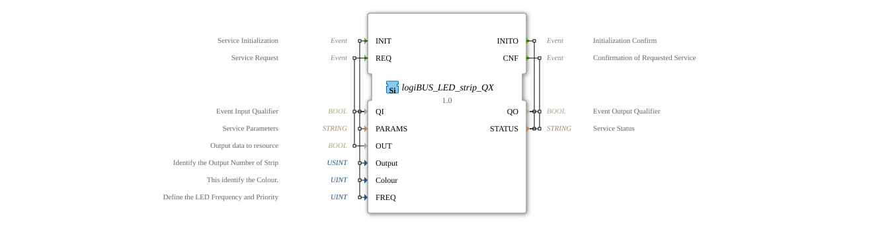

# logiBUS_LED_strip_QX

* * * * * * * * * *
## Introduction

The logiBUS_LED_strip_QX function block is an output service interface function block for Boolean output data, specifically designed for controlling LED strips. It offers extensive configuration options for various LED parameters such as color, frequency, and output number.

## Interface Structure

### **Event Inputs**

- **INIT**: Service Initialization Event
- **REQ**: Service Request Event

### **Event Outputs**

- **INITO**: Initialization Acknowledgement
- **CNF**: Acknowledgement of Requested Service Operation

### **Data Inputs**

- **QI** (BOOL): Event Input Qualifier
- **PARAMS** (STRING): Service Parameters
- **OUT** (BOOL): Output Data to the Resource
- **Output** (USINT): Identifies the strip's output number (initial value: LED_strip::Output_strip)
- **Colour** (UINT): Identifies the color (initial value: LED_COLOURS::LED_GREEN)
- **FREQ** (UINT): Defines the LED frequency and priority (Initial value: LED_FREQ::LED_OFF)

### **Data Outputs**

- **QO** (BOOL): Event output qualifier
- **STATUS** (STRING): Service status

### **Adapters**

No adapter interfaces available.

## Functionality

This function block enables the control of LED strips via a standardized interface. During initialization (INIT), configuration parameters such as output number, color, and frequency are set. Output data (OUT) can be sent to the LED strip via the REQ event. The block acknowledges each operation via the corresponding output events INITO and CNF.

## Technical Features

- Support for various LED colors via the Colour parameter
- Configurable frequency settings for blinking functions
- Multiple outputs supported via the Output parameter
- Predefined initial values for quick commissioning
- Status feedback via the STRING parameter

## State Overview

The function block has two main states:

1. **Initialization State**: Activated by the INIT event
2. **Operating State**: Processes REQ requests after successful initialization

## Application Scenarios

- Industrial lighting control
- Status indicators in automation systems
- Warning and signal light control
- Visualization of process states
- Building automation with LED lighting

## ⚖️ Comparison with Similar Function Blocks

Compared to simple digital output blocks, logiBUS_LED_strip_QX offers extended functionality for LED-specific applications, particularly through integrated color and frequency control and the ability to address multiple LED strips independently.

## 🛠️ Related Exercises

* [Exercise_032](../../../../../Uebungen/test_B/Uebungen_doc/Uebung_032.md)
* [Exercise_033_sub](../../../../../Uebungen/test_B/Uebungen_doc/Uebung_033_sub.md)

## Conclusion

The logiBUS_LED_strip_QX is a powerful function block for professional LED strip control in industrial automation solutions. Its flexible parameterization and reliable status feedback make it ideal for demanding lighting applications.