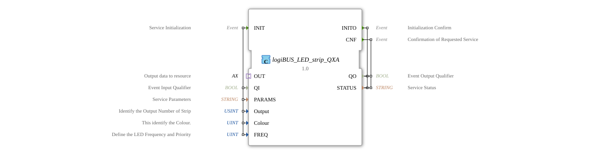

# logiBUS_LED_strip_QXA

* * * * * * * * * *
## Introduction
The function block **logiBUS_LED_strip_QXA** is a composite function block for controlling an LED strip via the logiBUS protocol. It encapsulates the communication with the hardware and enables color- and frequency-dependent control of individual outputs. This block is particularly suitable for use in agricultural technology, where flexible LED signaling is required.
## Interface Structure

### **Event Inputs**

| Event | Description | With |

|----------|--------------|-----|

| INIT | Service Initialization | QI, PARAMS, Output, Color, FREQ |

### **Event Outputs**

| Event | Description | With |
|----------|--------------|-----|

| INITO | Initialization Confirmation | QO, STATUS |

| CNF | Confirmation of Executed Request | QO, STATUS |

### **Data Inputs**

| Name | Type | Description | Initial Value |

|--------|--------|--------------|-------------|

| QI | BOOL | Processing Enable (Event Qualifier) | - |

| PARAMS | STRING | Service Parameter (e.g., Bus Configuration) | - |

| Output | USINT | Output Identification (Strip Number) | `LED_strip::Output_strip` |

| Colour | UINT | LED Color Code | `LED_COLOURS::LED_GREEN` |

FREQ | UINT | Frequency/Priority of the LED Display | `LED_FREQ::LED_OFF` |

### **Data Outputs**

| Name | Type | Description |

|--------|--------|--------------|

QO | BOOL | Output Qualifier (Processing Status) |

STATUS | STRING | Status Message (e.g., Error Code) |

### **Adapters**

| Adapter | Type | Description |

|---------|-----|--------------|

OUT | `adapter::types::unidirectional::AX` | Unidirectional adapter interface for data transfer to the resource (output data to logiBUS) |

## Functionality

The function block operates as a composite FB, internally using the sub-block **logiBUS_LED_strip_QX**. After an **INIT** event, the parameters (QI, PARAMS, Output, Colour, FREQ) are passed to the internal FB. Initialization is acknowledged via **INITO**.

As soon as an event (E1) arrives via the **OUT* adapter, a **REQ** request is triggered in the internal FB. The current data (Colour, FREQ) is sent to the logiBUS LED strip. After successful execution, the internal FB acknowledges with **CNF**, which appears at the external output **CNF**.

Data flows:

- **Out.D1** → internal FB.QX.OUT (output data of the adapter)
- **Qi**, **PARAMS**, **Output**, **Colour**, **FREQ** → forwarded to QX accordingly.

The outputs **QO** and **STATUS** reflect the internal state of the sub-block.

## Technical Features
- Composite FB: facilitates the reuse and encapsulation of the hardware control.
- Use of an adapter (OUT) for unidirectional data transfer to the logiBUS resource.
- Initial parameter values are predefined as constants (e.g., `LED_strip::Output_strip`, `LED_COLOURS::LED_GREEN`) but can be overwritten at runtime.
- The internal FB `logiBUS_LED_strip_QX` is responsible for the actual bus communication; this block only provides a simplified interface.
- Copyright and developer: HR Agrartechnik GmbH (Version 1.0, 2026-02-23).

## State Overview

The function block has no explicitly modeled states; its behavior is determined by the sequence control of the composite network:

1. **Initialization State**: After **INIT**, the internal function block is configured and the bus connection is established.

2. **Ready State**: After successful initialization, the function block can be addressed via the adapter (OUT.E1).

3. **Execution State**: The request is sent to the LED strip until acknowledgment (**CNF**) is received.

4. **Error State**: If QO = FALSE or STATUS contains an error, communication is disrupted.

## Application Scenarios
- **Agricultural Machinery**: Color-coded status indicators (e.g., green for ready, red for alarm) on LED strips.
- **Field Edge Lighting**: Control of multiple LED strip outputs with different colors and flashing frequencies.
- **Custom Signaling**: Integration into higher-level control systems for visualizing operating states.
- **Development and Testing**: Use as a simple building block for simulating and commissioning logiBUS components.

## Comparison with Similar Building Blocks
- **logiBUS_LED_strip_QX** (direct FB): Offers a more detailed interface with multiple events (REQ) and data. The composite FB **QXA** described here simplifies its use through an adapter interface and a clear separation of initialization and execution.
- **logiBUS_DO_Bit**: Controls individual digital outputs; no color/frequency control.
- **Composite FBs in General**: The QXA is specifically designed for LED strip applications and reduces wiring effort in the higher-level network.

## Conclusion

The **logiBUS_LED_strip_QXA** offers a convenient and standardized way to control LED strips via logiBUS in terms of color and flashing frequency. Thanks to its adapter-based interface, it can be easily integrated into larger systems without requiring knowledge of the bus communication details. The composite approach ensures clarity and reusability.