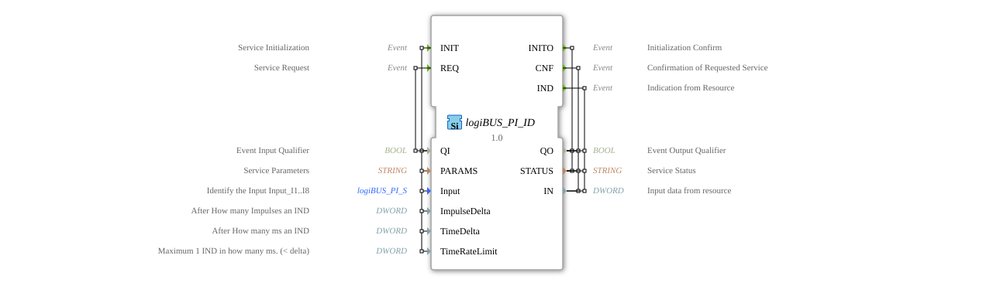

# logiBUS_PI_ID

* * * * * * * * * *
## Introduction

The function block `logiBUS_PI_ID` is an input service interface module for 32-bit DWORD input data. It serves as an interface to a physical input module (presumably part of the logiBUS system) and enables the initialization, cyclic polling, and event-driven (interrupt) output of digital input values. The module can be configured to report status changes either after a specific number of pulses or after a defined time interval.

## Interface Structure

### **Event Inputs**

* **`INIT`**: Initializes the service. Accompanied by the data `QI`, `PARAMS`, `Input`, `ImpulseDelta`, and `TimeDelta`.
* **`REQ`**: Triggers a cyclic poll of the input value. Accompanied by the data `QI`.

### **Event Outputs**

* **`INITO`**: Confirms initialization. Returns the data `QO` and qzmsdocs000013 ... * **`CNF`**: Acknowledges a requested query (`REQ`). Returns the data `QO`, `STATUS`, and the current input value `IN`.
* **`IND`**: Indicates an event-driven status change (interrupt). Returns the data `QO`, `STATUS`, and the new input value `IN`.

### **Data Inputs**

* **`QI` (BOOL)**: Qualifies the associated event input. The service is activated/executed at `TRUE` and deactivated at `FALSE`.
* **`PARAMS` (STRING)**: Contains service-specific parameters for initialization (e.g., hardware address, channel configuration).
* **`Input` (logiBUS_PI_S)**: Identifies the specific physical input (e.g., I1..I8). The initial value is `logiBUS_PI::Invalid`.
* **`ImpulseDelta` (DWORD)**: Defines after how many consecutive state changes (pulses) a `IND` event should be generated.
* * **`TimeDelta` (DWORD)**: Defines the time interval in milliseconds after which a `IND` event should be generated if the value has changed.

### **Data Outputs**

* **`QO` (BOOL)**: Displays the service execution status. `TRUE` indicates success, `FALSE` signals an error.
* **`STATUS` (STRING)**: Provides a detailed status or error message from the service.
* **`IN` (DWORD)**: Contains the current 32-bit value read from the physical input.

### **Adapters**

This function block has no adapter interfaces.

## Functionality

The function block operates in two basic modes, controlled by the events `REQ` and `IND`:

1. **Polling Mode**: A `REQ` event queries the current input value, and the result is returned with a `CNF` event.
2. **Interrupt Mode**: After successful initialization (`INIT`/`INITO`), the function block continuously monitors the input. Upon a state change, the parameters `ImpulseDelta` and `TimeDelta` are evaluated. If one of the criteria is met (e.g., the defined number of pulses is reached or the time interval is exceeded *and* the value has changed), a `IND` event with the new value is automatically triggered.

Initialization (`INIT`) is a prerequisite for both operating modes. During initialization, the hardware resource is configured via `PARAMS` and the specific input via `Input`.

## Technical Features

* **Data Type**: Processes 32-bit input data (`DWORD`).
* **Structured Input**: The input is not identified by a simple index, but by a structured data type (`logiBUS_PI_S`), which enables type-safe and unambiguous addressing.
* **Flexible Event Triggering**: The conditions for automatic event generation (`IND`) can be configured on both an impulse and time basis.
* **Service Interface**: Follows the typical pattern of a 4diac service interface function block (FB) with variables `QI`/`QO` and `STATUS` for consistent error handling.

## Status Overview

1. **Inactive**: After startup or upon `QI=FALSE`.
2. **Initialization**: Upon receiving `INIT` with `QI=TRUE`. Configures the hardware interface. Ends with `INITO` (`QO` indicates success/failure).
3. **Ready (Polling)**: After successful initialization. The system responds to `REQ` events with `CNF` and the current value.
4. **Ready (Monitoring)**: After successful initialization. Continuously monitors the input and triggers `IND` events according to the configured `ImpulseDelta` and `TimeDelta` parameters.

## Application Scenarios

* **Reading Counter Signals**: Acquiring pulses from a rotary encoder or rotary switch, using `ImpulseDelta` for preprocessing (e.g., reporting every 10th revolution).
* **Monitoring Status Groups**: Reading a 32-bit status word from a connected device, where changes only need to be reported at specific intervals (`TimeDelta`) to reduce CPU load.
* **Cyclic Polling of Switch Banks**: Polling multiple digital inputs grouped into a DWORD via regular `REQ` events.
*
## ⚖️ Comparison with similar function blocks

* **Compared to `E_DEMUX` or `E_SELECT`**: These function blocks forward events or select data. `logiBUS_PI_ID` is specific to hardware communication and includes driver logic and initialization.
* **Compared to generic I/O function blocks (e.g., `WAGO_750_5xx_DI`)**: Similar function, but manufacturer-specific (here, logiBUS). Configuration is done via the structured parameters `Input` and `PARAMS` instead of fixed channel numbers.
* * **Compared to simpler input blocks**: Offers advanced features such as filtering event generation (`IND`) via `ImpulseDelta`/`TimeDelta`, which are typically not available in simple "Read" blocks.

## 🛠️ Related exercises

* [Uebung_150](../../../../../Uebungen/test_B/Uebungen_doc/Uebung_150.md)
* [Uebung_150_AX](../../../../../Uebungen/test_AX/Uebungen_doc/Uebung_150_AX.md)
* [Uebung_151](../../../../../Uebungen/test_B/Uebungen_doc/Uebung_151.md)
* [Uebung_151_AX](../../../../../Uebungen/test_AX/Uebungen_doc/Uebung_151_AX.md)
* [Uebung_152](../../../../../Uebungen/test_B/Uebungen_doc/Uebung_152.md)
* [Uebung_153](../../../../../Uebungen/test_B/Uebungen_doc/Uebung_153.md)

## Conclusion

The `logiBUS_PI_ID` function block is a powerful and flexible interface for 32-bit digital inputs within the logiBUS ecosystem. By combining polling (`REQ`/`CNF`) and event-driven querying (`IND`)With configurable trigger criteria, it is suitable for a wide range of applications, from simple status queries to complex pulse evaluation. The strict separation of initialization and operating logic, along with comprehensive status reporting, makes it a robust component for industrial control applications.

---

### 🌐 Related topic subpages on ms-muc-docs.de

* [🌐 Eclipse 4diac IDE & Color Reference on ms-muc-docs.de](https://www.ms-muc-docs.de/iec-61499/eclipse-4diac/)

]
