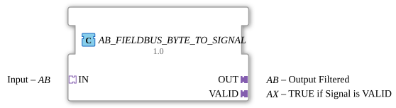

# AB_FIELDBUS_BYTE_TO_SIGNAL

* * * * * * * * * *
## Introduction

The function block **AB_FIELDBUS_BYTE_TO_SIGNAL** mirrors an incoming byte signal (via the adapter *IN*) to the output (*OUT*) if the signal is recognized as valid. Validity is indicated by a separate output (*VALID*). The block encapsulates the processing of a fieldbus byte signal and ensures that only valid data is passed on to the subsequent logic. It is based on an internal `FIELDBUS_BYTE_TO_SIGNAL` block, supplemented by a D flip-flop for stable output of the validity signal.
## Interface Structure

The function block has **no** direct event or data inputs/outputs at the top level. All communication takes place via three **adapter interfaces**:

| Adapter | Direction | Type | Description |
|---------|----------|-----|--------------|
| `IN` | Socket | `adapter::types::unidirectional::AB` | Input adapter for the byte signal and its associated event. |
| `OUT` | Plug | `adapter::types::unidirectional::AB` | Output adapter for the mirrored byte signal. |
| `VALID` | Plug | `adapter::types::unidirectional::AX` | Output adapter indicating the signal's validity status. |

The adapters are of the **unidirectional** type, meaning they transmit data and events in one direction. The types `AB` and `AX` each contain one event input/output (E1) and one data input/output (D1, of type `ANY` and `BOOL`, respectively).

### **Event Inputs**

None (events are received via the socket adapter `IN`).

### **Event Outputs**

None (events are sent via the plug adapters `OUT` and `VALID`).

### **Data Inputs**

None (data is received via the socket adapter `IN`).

### **Data Outputs**

None (data is sent via the plug adapters `OUT` and `VALID`).

### **Adapters**

**IN (Socket)**

- **E1**: Event input – triggers the processing of a new byte value.
- **D1**: Data input – the byte to be processed (e.g., a fieldbus datagram).

**OUT (Plug)**

- **E1**: Event output – activated after successful mirroring of a valid signal.
- **D1**: Data output – the mirrored byte signal (only if the value is valid).

**VALID (Plug)**

- **E1**: Event output – activated with every processing cycle, regardless of validity.
- **D1**: Data output (BOOL) – `TRUE` if the currently processed signal is valid; otherwise, `FALSE`.

## Functionality

1. An incoming event at adapter `IN.E1` triggers the internal block `FIELDBUS_BYTE_TO_SIGNAL`, which processes the byte at `IN.D1`.
2. The internal block outputs `OUT` (the mirrored byte) and `VALID` (the validity information) at its outputs.
3. The output signal is immediately forwarded to adapter `OUT`, triggering an event (`OUT.E1`).
4. Simultaneously, the validity signal of the internal function block is applied to the D input of the D flip-flop (`E_D_FF`). The same event (`CNF` of the internal function block) clocks the flip-flop.
5. The flip-flop stores the validity value and outputs it stably to `VALID.D1`. An event is sent to `VALID.E1`.

Thus, the byte is always passed to `OUT` when it is valid. The validity state is retained until the next processing iteration.

## Technical Features

- **Adapter-based communication**: The function block uses only adapter interfaces, which enables a modular and typed connection in the 4diac IDE.
- **D flip-flop for debouncing**: The validity signal is clocked by a flip-flop to ensure stability and prevent DIN rail effects.
- **License**: This component is released under the **Eclipse Public License 2.0** (Copyright HR Agrartechnik GmbH).
- **Compiler package**: `logiBUS::signalprocessing::fieldbus` – specifically for fieldbus applications.

## State overview

The component does not have an explicit state machine at the top level; the states result from the interaction of the internal components:

| State | Description |
|---------|---------------|
| **Idle** | Waiting for an event at `IN.E1`. |
| **Processing** | Internal `FIELDBUS_BYTE_TO_SIGNAL` processes the byte; `OUT` and `VALID` are updated. |
**Valid stable** | After the flip-flop has been clocked, `VALID.D1` remains stable until the next event. |

The state is cycled through in each cycle.

## Application Scenarios

- **Fieldbus Integration**: Receiving a byte value from a fieldbus (e.g., CAN, Profibus) and forwarding it to a control logic, whereby only valid telegrams are passed through.
- **Signal Conditioning**: Converting a raw byte stream into a clocked, validation-checked signal for downstream function blocks.
- **Error Detection**: The function block can be combined with an external validation checker connected to the `IN` adapter.

## Comparison with Similar Function Blocks

Simpler **Mirror** function blocks forward a signal without validation. This function block adds explicit validation and outputs the validity signal separately. Unlike a purely flip-flop-based hold function block, it processes a byte and not just Boolean values. The internal `FIELDBUS_BYTE_TO_SIGNAL` handles the specific fieldbus interpretation.

## Conclusion

The `AB_FIELDBUS_BYTE_TO_SIGNAL` is a specialized function block for the safe transmission of fieldbus byte signals. The combination of mirroring and validation makes it ideal for real-time applications where only valid data may be processed. The adapter-based interface allows for easy integration into existing 4diac projects.

---

### 🌐 Related topic subpages on ms-muc-docs.de

* [🌐 Eclipse 4diac IDE & Color Reference on ms-muc-docs.de](https://www.ms-muc-docs.de/iec-61499/eclipse-4diac/)

]
