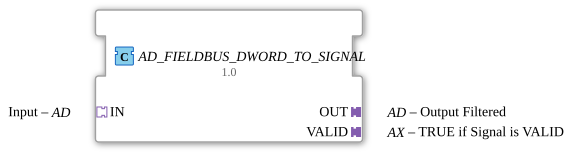

# AD_FIELDBUS_DWORD_TO_SIGNAL

* * * * * * * * * *
## Introduction
The function block `AD_FIELDBUS_DWORD_TO_SIGNAL` is used to forward an incoming data word (DWORD) to the output – but only if the signal is classified as valid. It combines a specialized fieldbus function block with an edge-triggered D flip-flop to implement reliable, data-driven validation and forwarding.
## Interface Structure

The function block has only adapter interfaces; there are no separate event or data ports at the top level. The following adapters define the inputs and outputs:

| Adapter | Type | Direction | Description |

|---------|-----|-----------|--------------|

| `IN` | `adapter::types::unidirectional::AD` | Socket (Input) | Input data word and associated event |

| `OUT` | `adapter::types::unidirectional::AD` | Plug (Output) | Filtered output data word (DWORD) |

| `VALID` | `adapter::types::unidirectional::AX` | Plug (Output) | Validation signal (BOOL) of the current data word |

### **Event Inputs** (via adapter `IN`)

| Port | Description |

|------|--------------|

| `E1` | Event to start processing a new data word |

### **Event Outputs** (via adapters `OUT` and `VALID`)

| Adapter | Port | Description |

|---------|------|--------------|

| `OUT` | `E1` | Signals that the filtered data word is present at the output |

| `VALID` | `E1` | Signals that the validity status (TRUE/FALSE) has been updated |

### **Data Inputs** (via adapter `IN`)

| Port | Type (assumed) | Description |

|------|------------------|--------------|

| `D1` | `DWORD` | The data word to be processed |

### **Data Outputs** (via adapters `OUT` and `VALID`)

| Adapter | Port | Type (assumed) | Description |

|---------|------|------------------|--------------|

| `OUT` | `D1` | `DWORD` | The filtered – possibly identical – data word |

| `VALID` | `D1` | `BOOL` | `TRUE` if the attached data word is considered valid, otherwise `FALSE` |

### **Adapters**

The adapters are of type `unidirectional`, meaning they each transmit one event and one piece of data in one direction. The function block (FB) uses two different adapter types:

- **AD**: Transmits an event and a data word (DWORD)
- **AX**: Transmits an event and a Boolean signal

## Functionality

The interaction of the internal function blocks can be described in the following steps:

1. An event at `IN.E1` triggers the internal FB `FIELDBUS_DWORD_TO_SIGNAL` via its `REQ` input.

2. The internal FB processes the incoming data word (`IN.D1`) and outputs two results:

- The (possibly identical) data word at `OUT`
- A Boolean signal `VALID` indicating whether the data word is valid.

3. After processing is complete, the internal function block (FB) signals with `CNF`:

- The event is forwarded to `OUT.E1` → the output adapter releases the new data word.
- Simultaneously, the event clocks the edge-triggered D flip-flop `E_D_FF` via its `CLK`.

4. The flip-flop receives the current validity status (`VALID` signal) from `FIELDBUS_DWORD_TO_SIGNAL` at its `D` input and outputs it at its `Q` output.

The flip-flop receives the current validity status (`VALID` signal) from `FIELDBUS_DWORD_TO_SIGNAL` at its `D` input and outputs it at its `Q` output. 5. The `EO` output of the flip-flop generates an event that is sent to `VALID.E1` – thus updating the validity status in sync with the data word.

In other words: The function block *mirrors* the input DWORD to the output, provided the fieldbus function block's internal validation mechanism classifies it as valid. Validity is stabilized by a flip-flop and output as a separate signal.

## Technical Features
- **Composite Function Block**: The function block is implemented as a network of two subordinate function blocks (`FIELDBUS_DWORD_TO_SIGNAL` and `E_D_FF`).
- **License**: The function block is subject to the Eclipse Public License 2.0 (EPL-2.0).
- **Packet Structure**: Integrated into the namespace `logiBUS::signalprocessing::fieldbus`.
- **Edge-Triggered Validation Memory**: The use of a D flip-flop ensures that the `VALID` signal is only updated with the next clock edge (the `CNF` event) – this prevents asynchronous state transitions.
- **No Dedicated Event/Data Ports**: All communication takes place exclusively via standardized adapters.

## State Overview

The function block (FB) does not have an explicit state machine, but operates purely on data flow. The internal flip-flop `E_D_FF` has two internal states:

| State | Description |

|---------|---------------|

| `Q = FALSE` | The currently transmitted `VALID` signal is `FALSE` (data word is considered invalid) |

| `Q = TRUE` | The currently transmitted `VALID` signal is `TRUE` (data word is considered valid) |

The state changes only on a rising edge at `CLK` (corresponds to the `CNF` event of the internal fieldbus module).

## Application Scenarios
- **Fieldbus Data Filtering**: Used in PLC controllers where only valid telegrams from a bus system (e.g., CANopen, PROFIBUS) should be passed on to the application logic.
- **Quality Marking**: A sensor provides a measured value and a validation bit – the function block cleanly separates both pieces of information and keeps them synchronized.
- **Secure Data Transmission**: In safety-critical environments, the function block can be used to only allow verified data words into subsequent calculations.

## Comparison with Similar Function Blocks
- **Simple Buffer Blocks (e.g., `MOVE`)**: These pass data without evaluation. `AD_FIELDBUS_DWORD_TO_SIGNAL` adds validation logic and separates the validity signal.
- **Typical quality function blocks (e.g., `QHandler`)**: These often process multiple quality bits; this function block focuses on a single Boolean signal, `VALID`, and works with DWORD data.
- **Adapter-based function blocks**: The pure adapter interfaces promote loose coupling and reusability in various runtime environments.

## Conclusion

`AD_FIELDBUS_DWORD_TO_SIGNAL` offers a compact and standardized solution for forwarding fieldbus data words to the application only when validity has been established. The combination of a specific fieldbus function block and a flip-flop ensures a timely and stable output of the validation status. Due to its adapter-based interface, the function block can be flexibly integrated into existing IEC 61499 systems.
