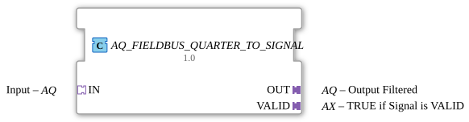

# AQ_FIELDBUS_QUARTER_TO_SIGNAL

* * * * * * * * * *
## Introduction
The function block **AQ_FIELDBUS_QUARTER_TO_SIGNAL** is used to mirror a signal (of type `AQ`) received via a fieldbus adapter to an output adapter – but only if the signal is marked as valid. It combines a fieldbus-specific processing block with an edge-triggered D flip-flop to buffer the validity status and provide it as a separate output signal.
## Interface Structure

### **Event Inputs**

The function block does not have direct event inputs at the top level. Instead, events are provided via the **socket adapter `IN`** (type `AQ`). The event output `IN.E1` initiates the processing of the incoming signal.

### **Event Outputs**

Event outputs are also exclusively handled via the **plug adapters `OUT`** and `VALID`:

- **`OUT.E1`**: Triggered after successful signal mirroring. (The result is available at the data output `OUT.D1`.)
- **`VALID.E1`**: Triggered as soon as the signal's validity status is updated (rising edge of the internal D flip-flop).

### **Data Inputs**

Data is also received via the **socket adapter `IN`**:

- **`IN.D1`**: Receives the analog or digital input signal (adapter type `AQ`).

### **Data Outputs**
- **`OUT.D1`**: Outputs the mirrored input signal – but only if it has been recognized as valid. (If the signal is invalid, a defined value or the last valid value can be output; this depends on the internal implementation of `FIELDBUS_QUARTER_TO_SIGNAL`.)
- **`VALID.D1`**: Outputs the current validity status (`TRUE` = valid, `FALSE` = invalid). This value is the output signal `Q` of the D flip-flop.

### **Adapter**

| Name | Type | Direction | Description |

|------|-----|----------|--------------|

| `IN` | `adapter::types::unidirectional::AQ` | **Socket** (Input) | Fieldbus signal (event and data) |

| `OUT` | `adapter::types::unidirectional::AQ` | **Plug** (output) | Filtered/mirrored output signal |

| `VALID` | `adapter::types::unidirectional::AX` | **Plug** (output) | Signal validity status |

Note: Adapter types `AQ` and `AX` are unidirectional protocols that typically combine an event and a data field.

``` ## Functionality

The function block operates as follows:

1. An incoming event on `IN.E1` triggers the internal function block **`FIELDBUS_QUARTER_TO_SIGNAL`** (called via `REQ`).

2. This internal function block processes the data value (`IN.D1`) and generates two outputs:

- **`OUT`** – the processed signal (e.g., mirrored, normalized, filtered).
- **`VALID`** – a Boolean value (`TRUE` if the signal is valid).

3. The processed signal is forwarded directly to the output adapter `OUT` (via `OUT.D1`) and simultaneously triggers the event `OUT.E1`.

4. The validity state (`VALID`) is fed to the D input of an edge-triggered D flip-flop (`E_D_FF`). The clock edge is generated by the same event (`CNF`) that also triggers `OUT.E1`. Thus, the validity state is updated in the flip-flop with each cycle.

5. The flip-flop output `Q` is output via the adapter `VALID.D1`. The corresponding event `VALID.E1` is triggered by the flip-flop output `EO`.

The function block ensures that the output signal is always synchronized with the currently processed validity status.

## Technical Features
- The function block is implemented as a **composition** of two internal function blocks: `FIELDBUS_QUARTER_TO_SIGNAL` and `E_D_FF`. This offers high reusability and a clear separation of processing logic and state storage.
- The use of a **D flip-flop** buffers the validity status between event cycles. This ensures that the status is retained even if the input signal fails temporarily.
- The adapter interfaces follow the **unidirectional** pattern typical of fieldbus protocols. An event carries both a data value and an execution edge.
- The internal processing (`FIELDBUS_QUARTER_TO_SIGNAL`) can be adapted depending on the application (e.g., scaling, formatting, or plausibility checks) without changing the external interface.

## State Overview

The component does not have its own visible state machine. The internal state is primarily determined by the **D flip-flop**:

- **State 0**: Flip-flop output `Q = FALSE` → Signal is considered **invalid**.
- **State 1**: Flip-flop output `Q = TRUE` → Signal is considered **valid**.

The state change occurs on the clock edge during each processing cycle (event on `IN.E1`). The current state can be read via the adapter `VALID.D1`.

## Application Scenarios
- **Fieldbus Connection in Agricultural Engineering**: Receiving an analog sensor signal (e.g., torque, pressure) from a fieldbus, which is only passed on if communication is valid.
- **Signal Quality Filtering**: Integration into a chain of processing modules where only values marked as valid are used in the control or visualization.
- **Redundancy Check**: Combination with a second signal path, where the validity status serves as the switching criterion.

## Comparison with Similar Modules
- **`AQ_FIELDBUS_SIGNAL_TO_QUARTER`** (hypothetical): Would represent the reverse process – conversion of a general signal into a fieldbus format.
- **`AQ_BUFFER`**: A simple buffer without validity checks; this module extends this functionality with validation and state storage.
- **`AQ_SELECT`**: Selects between two inputs; in this function block, the validity of a single signal is evaluated instead.

## Conclusion

**AQ_FIELDBUS_QUARTER_TO_SIGNAL** is a compact, adapter-based function block for the reliable mirroring of fieldbus signals while taking signal validity into account. The combination of processing logic and edge-triggered state memory makes it particularly suitable for safety-critical or quality-controlled applications in industrial environments. The clear separation of the internal components facilitates maintenance and customization.