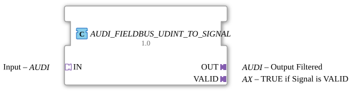

# AUDI_FIELDBUS_UDINT_TO_SIGNAL

* * * * * * * * * *
## Introduction

The function block `AUDI_FIELDBUS_UDINT_TO_SIGNAL` mirrors an incoming `UDINT` value (via the `IN` adapter) to the `OUT` adapter, provided the incoming signal is recognized as valid. Additionally, the validity signal is output via the `VALID` adapter. This function block acts as a filter, allowing only valid data packets to pass through and providing their status synchronously.
## Interface Structure

This function block has no direct input/output events or data, but operates exclusively via adapters that transport both events and data.

### **Event Inputs**

- **`IN.E1`** (via the `IN` adapter) – Starts processing of the incoming signal.

### **Event Outputs**

- **`OUT.E1`** (via the `OUT` adapter) – Triggered after the `IN` value has been processed and passed to `OUT.D1`.
- **`VALID.E1`** (via the `VALID` adapter) – Triggered as soon as the signal's validity has been updated (see Functionality).

### **Data Inputs**

- **`IN.D1`** (via the `IN` adapter) – The incoming `UDINT` value (e.g., from a fieldbus).

### **Data Outputs**

- **`OUT.D1`** (via the `OUT` adapter) – The filtered `UDINT` value (identical to `IN.D1`, if valid).
- **`VALID.D1`** (via the `VALID` adapter) – Boolean value that signals `TRUE` if the incoming signal is valid.

### **Adapter**

| Adapter | Type | Direction | Description |
|---------|-----|----------|--------------|
| `IN` | `adapter::types::unidirectional::AUDI` | Socket | Signal input (reads data and events) |
| `OUT` | `adapter::types::unidirectional::AUDI` | Plug | Filtered signal output |
| `VALID` | `adapter::types::unidirectional::AX` | Plug | Validation Indicator (Output for Boolean & Event) |

## Functionality

The function block contains two internal function blocks:

1. **`FIELDBUS_UDINT_TO_SIGNAL`** – Converts the incoming `UDINT` value into a signal and determines its validity.
2. **`E_D_FF`** – An edge-triggered D flip-flop that synchronizes the validity signal.

Process:

- An event on `IN.E1` triggers the processing block `FIELDBUS_UDINT_TO_SIGNAL` (input `REQ`).
- This block reads `IN.D1` and outputs an event to `CNF` upon completion.
- The event `CNF` is forwarded to three locations:
- To `OUT.E1` → the output value (`FIELDBUS_UDINT_TO_SIGNAL.OUT`) is assigned to `OUT.D1`.
- To the clock input `CLK` of the flip-flop (`E_D_FF`).
- Simultaneously, the validity status (`FIELDBUS_UDINT_TO_SIGNAL.VALID`) is set to the data input `D` of the flip-flop.

- On the rising edge of `CLK`, the flip-flop inherits the value from `D` to `Q` and outputs an event on `EO`.

- The flip-flop output `Q` feeds `VALID.D1`, and the event `EO` triggers `VALID.E1`.

Thus, the validity signal is only updated and output after the signal processing is complete.

## Technical Features

- **Validity Synchronization:** The D flip-flop ensures that the validity status is only available in the next clock cycle after data processing – this prevents inconsistent states.
- **Adapter-based interface:** All data and events are exchanged via standardized unidirectional adapters, which facilitates reuse in hierarchical projects.
- **License notice:** This function block is subject to the **Eclipse Public License 2.0** and contains a copyright notice (HR Agrartechnik GmbH).

## State overview

The function block does not have its own state machine; its behavior is determined by the internal D flip-flop. This flip-flop has two states:

| State | Q (Output) | Meaning |
|---------|-------------|-----------|
| 0 | `FALSE` | Signal currently invalid |
| 1 | `TRUE` | Signal valid |

The state changes on each rising clock edge (`CLK`) to the current value of `D`. A reset is not provided – if the signal is invalid, Q remains at the last known valid value until a new clock signal (`D = FALSE`) arrives.

## Application Scenarios

- **Fieldbus Signal Conditioning:** A sensor delivers a `UDINT` value along with a validity flag via a fieldbus (e.g., CANopen, PROFIBUS). This function block filters out invalid values and provides only valid data to the controller.
- **Data Validation in Safety-Critical Environments:** If a higher-level application should only receive processed, valid measured values, this function block can be placed between the bus and the logic.
- **Synchronization of multiple parallel signals:** The separate validity signal can be used to clock downstream function blocks or trigger alarms.

## Comparison with similar function blocks

| Function block | Feature |
|----------|---------|
| `FIELDBUS_UDINT_TO_SIGNAL` alone | Passes the invalid signal on immediately – without validity synchronization. |
| `AUDI_FIELDBUS_UDINT_TO_SIGNAL` (this function block) | **Additional synchronization** of the validity signal via a D flip-flop, so that `VALID` is only updated with the next clock cycle. |
| Other validation function blocks | Often without dynamic synchronization; this function block is particularly suitable for cyclic bus systems where data and validity may arrive with a time delay. |

## Conclusion

AUDI_FIELDBUS_UDINT_TO_SIGNAL` is a specialized filter module for fieldbus signals that only forwards valid incoming `UDINT` values to the output and outputs the status via a synchronized path. The use of an internal flip-flop prevents inconsistent states and makes it ideal for use in time-critical automation environments. Its adapter-based interface allows for easy integration into larger 4diac projects.

--

### 🌐 Related topic subpages on ms-muc-docs.de

* [🌐 Eclipse 4diac IDE & color reference on ms-muc-docs.de ](https://www.ms-muc-docs.de/iec-61499/eclipse-4diac/)

]
