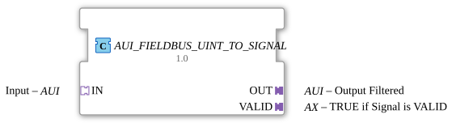

# AUI_FIELDBUS_UINT_TO_SIGNAL

* * * * * * * * * *
## Introduction
The function block **AUI_FIELDBUS_UINT_TO_SIGNAL** forwards a fieldbus signal encoded as `UINT` to a downstream AUI adapter, provided the signal is recognized as valid. It also provides a separate validity indicator (`VALID`). The block encapsulates a data converter and an edge-triggered D flip-flop, which buffers the validity signal until the next event.
## Interface Structure

### **Event Inputs**

The function block does not have separate event inputs. All event-driven processes are handled via the **adapter socket `IN`**.

### **Event Outputs**

The function block does not have separate event outputs. Events are output via the **adapter plugs `OUT` and `VALID`**.

### **Data Inputs**

The function block does not have separate data inputs. The input value is provided as a data signal `D1` via the **adapter socket `IN`**.

### **Data Outputs**

The function block does not have separate data outputs. Output data is transmitted via the **adapter plugs `OUT` and `VALID`** as data signals `D1`.

### **Adapter**

| Name | Type | Direction | Description |

|-------------|-------------------------|----------|----------------------------------------------------------------------------|

| `IN` | AUI (unidirectional) | Socket | Receives the raw fieldbus signal as `UINT`. Provides event `E1` and data `D1`. |

| `OUT` | AUI (unidirectional) | Plug | Outputs the filtered signal as `UINT`. Event `E1` signals incoming data. |

| `VALID` | AX (unidirectional) | Plug | Provides a validity signal (`TRUE`/`FALSE`) via `D1`; event `E1` indicates an update. |

## Functionality

1. An external event on the **socket `IN`** (via its event input `E1`) triggers the process.

2. The incoming data value (`IN.D1`) is processed by the internal function block `FIELDBUS_UINT_TO_SIGNAL`. This generates an output value (`OUT`) and a validity flag (`VALID`).

3. The processed value is immediately passed to the **plug `OUT`** (data signal `D1`) and an event is triggered at `OUT.E1`.

4. Simultaneously, the validity flag of the internal function block is transferred to the **D flip-flop `E_D_FF`** (clocked by the same event).

5. The output of the flip-flop (`Q`) is connected to the **plug `VALID`** (data signal `D1`); simultaneously, an event is sent to `VALID.E1`.

6. The state of the validity signal is retained until the next processing cycle.

## Technical Features
- The function block is implemented as a **composite FB**; its functionality consists of two internal FBs:
- `FIELDBUS_UINT_TO_SIGNAL` (data converter)
- `E_D_FF` (edge-triggered D flip-flop)
- The validity indicator is **event-triggered** and is buffered via a flip-flop. This ensures stability even if the input signal is absent for several cycles.
- The signal and validity outputs are **quasi-parallel** (both via the same event of the internal FB).
- The interfaces are defined exclusively as **adapters**, which facilitates modular integration into fieldbus systems.

## State Overview

The FB itself does not have an explicit state machine. However, its behavior can be described by its internal logic:

| State | Description |

|------------------------|-----------------------------------------------------------------------------|

| **Idle** | No input event; the outputs `OUT` and `VALID` retain their last values. |

| **Processing** | An event at `IN.E1` starts processing. |

| **Output** | Upon completion, `OUT.D1` and `VALID.D1` are updated, and the events are sent to `OUT.E1` and `VALID.E1`. |

| **Hold** | The validation value is held in the flip-flop until the next event arrives. |

## Application Scenarios
- **Fieldbus Interface**: A `UINT` value originating from a fieldbus is to be converted into a standardized AUI signal and only passed on if data integrity is maintained.
- **Validation-Checked Forwarding**: Applications where the output signal is only considered valid after successful internal validation (e.g., CRC check).
- **Single-Channel Signal Conditioning**: This function block can be used in safety-related chains to separately signal the result of a plausibility check.

## Comparison with Similar Function Blocks

| Function Block | Difference / Similarity |

|--------------------------------|-----------------------------------------------------------------------------|

| `FIELDBUS_UINT_TO_SIGNAL` | Contains only the pure data conversion without a validity buffer. |

| `AUI_SIGNAL_FILTER` | Filters signals but does not offer an explicit validity indicator. |

| `E_D_FF` | Pure flip-flop without data conversion – used here as an auxiliary function block. |

This function block combines the conversion with **event-driven validity control**, making it particularly suitable for sequential fieldbus protocols.

## Conclusion

The `AUI_FIELDBUS_UINT_TO_SIGNAL` function block is a compact, adapter-based module for tested signal forwarding in fieldbus systems. Through the internal coupling of data conversion and edge-triggered validity indication, it offers a robust and traceable interface for industrial automation. The use of adapters enables easy integration into existing 4diac networks.

---

### 🌐 Related topic subpages on ms-muc-docs.de
* [🌐 Eclipse 4diac IDE & color reference on ms-muc-docs.de ](https://www.ms-muc-docs.de/iec-61499/eclipse-4diac/)

]
