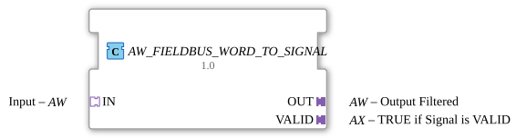

# AW_FIELDBUS_WORD_TO_SIGNAL

* * * * * * * * * *
## Introduction
The function block **AW_FIELDBUS_WORD_TO_SIGNAL** acts as a filter for fieldbus words. It mirrors the incoming signal (via the **IN** adapter) to the output (**OUT** adapter) if the signal is recognized as valid. Validity is indicated via a separate output adapter (**VALID**). This block is typically used in fieldbus environments to ensure that only valid data values are forwarded to subsequent components.
## Interface Structure

### **Event Inputs**
*No separate event inputs are available.*
Event control is handled implicitly via the adapters used (see section **Adapters**).

### **Event Outputs**
*No separate event outputs available.*
Event output is implicit via the adapters.

### **Data Inputs**
*No separate data inputs available.*
Data is transferred via the connected adapters.

### **Data Outputs**
*No separate data outputs available.*
Data output is via the connected adapters.

### **Adapters**

| Name | Type | Description |

|------|-----|--------------|

| **IN** | `adapter::types::unidirectional::AW` (Socket) | Input of the word to be filtered. |

| **OUT** | `adapter::types::unidirectional::AW` (Plug) | Output of the filtered word (only with a valid signal). |

| **VALID** | `adapter::types::unidirectional::AX` (Plug) | Outputs the validity status of the output signal (`TRUE` = valid). |

## Functionality

The function block consists internally of two sub-function blocks: `FIELDBUS_WORD_TO_SIGNAL` and `E_D_FF` (D flip-flop).

- An incoming event on `IN.E1` triggers the processing of the current word via `FIELDBUS_WORD_TO_SIGNAL.REQ`.
- The sub-block `FIELDBUS_WORD_TO_SIGNAL` checks the validity of the word and outputs a `CNF` event upon completion.
- This `CNF` event causes:
- The filtered word is passed to the output adapter via `OUT.D1` and output via `OUT.E1`.
- Simultaneously, the D flip-flop (`E_D_FF`) is clocked: The current validity status (`VALID` signal from `FIELDBUS_WORD_TO_SIGNAL`) is adopted.
- The output of the flip-flop (`Q`) is passed to the **VALID** adapter via `VALID.D1` and the event `VALID.E1` (triggered by `E_D_FF.EO`).

`` Thus, a valid word is only output if the internal check of the incoming signal is successful. The validity status is retained until the next processing cycle.

## Technical Features
- The function block is based entirely on adapters and does not have a separate top-level event/data interface.
- The internal implementation uses a standardized fieldbus processing block (`FIELDBUS_WORD_TO_SIGNAL`) and a D flip-flop, which allows for a clear separation of the data path and status logic.
- The implementation is licensed under the **Eclipse Public License 2.0**.

## State Overview
The function block itself does not have an explicit state machine. The internal state is represented by the D flip-flop:

| State | Meaning |

|---------|-----------|

| `VALID = FALSE` | The output value is invalid (old data or initial state). |

VALID = TRUE` | The output value is valid and was recognized as valid during the last processing cycle. |

## Application Scenarios
- **Fieldbus Data Filtering**: In automation systems where only valid measured values or control commands should be passed on to subsequent logic.
- **Signal Validation**: Used in safety-critical paths where invalid data (e.g., due to transmission errors) must not be passed on without verification.
- **Adapter-Based Interfaces**: Suitable for modular systems that communicate via standardized adapters (e.g., logiBUS environment).

## Comparison with Similar Components
- Simple **Word-to-Signal** components without validation pass the input signal directly, regardless of its validity.
- In contrast, the **AW_FIELDBUS_WORD_TO_SIGNAL** provides explicit validity feedback and suppresses invalid values.
- Other filter blocks might include additional configuration options (e.g., thresholds, time windows), while this block is reduced to a simple "valid/invalid" decision.

## Conclusion

The AW_FIELDBUS_WORD_TO_SIGNAL is a specialized filter block for fieldbus word data. It combines simple passthrough with a validity check and provides the result via separate adapters. By using standard sub-blocks and flip-flop logic, it is robust, traceable, and easily integrated into adapter-based architectures.
