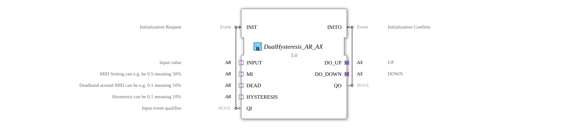

# DualHysteresis_AR_AX

* * * * * * * * * *
## Introduction
The function block **DualHysteresis_AR_AX** performs a two-way analog-to-digital conversion with adjustable hysteresis.
Two binary output signals (`DO_UP`, `DO_DOWN`) are generated from an analog input value. These signals are switched depending on the position of the input signal relative to three parameters:
- **MI** – Average (setpoint center)
- **DEAD** – Deadband (absolute value)
- **HYSTERESIS** – Hysteresis (absolute value)

The switching points are calculated as follows:

- **Turn on UP**: `INPUT.D1 >= MI.D1 + ABS(DEAD.D1) + ABS(HYSTERESIS.D1)`
- **Turn off UP**: `INPUT.D1 < MI.D1 + ABS(DEAD.D1)`
- **Turn on DOWN**: `INPUT.D1 <= MI.D1 - ABS(DEAD.D1) - ABS(HYSTERESIS.D1)`
- **Turn off DOWN**: `INPUT.D1 > MI.D1 - ABS(DEAD.D1)`

This ensures reliable switching behavior with a reduced switching frequency, typical for control loops. with switching threshold and feedback hysteresis.

## Interface Structure
### **Event Inputs**

| Event | Type | Description |

|----------|-----|--------------|

| `INIT` | EInit | Initialization request, accompanied by data input `QI` |

### **Event Outputs**

| Event | Type | Description |

|----------|-----|--------------|

| `INITO` | EInit | Initialization confirmation, accompanied by data output `QO` |

### **Data Inputs**

| Data | Type | Description |

|-------|-----|--------------|

| `QI` | BOOL | Input qualifier – controls the activation of the function block. At `TRUE`, the hysteresis logic is executed; at `FALSE`, outputs are reset. |

### **Data Outputs**

| Data | Type | Description |

|-------|-----|---------------|

| `QO` | BOOL | Output qualifier – is set to the value of `QI`, reflects the operating state. |

### **Adapters**
**Sockets (Input Adapters):**

| Adapter | Type | Description |

|---------|-----|--------------|

| `INPUT` | adapter::types::unidirectional::AR | Analog input value (e.g., 0…1 or other range) |

| `MI` | adapter::types::unidirectional::AR | Center point (e.g., 0.5 for 50%) |

| `DEAD` | adapter::types::unidirectional::AR | Deadband (absolute value) – determines the turn-off points |

| `HYSTERESIS` | adapter::types::unidirectional::AR | Hysteresis (absolute value) – extends the switch-off points to the switch-on points |

**Plugs (Output Adapters):**

| Adapter | Type | Description |

|---------|-----|---------------|

| `DO_UP` | adapter::types::unidirectional::AX | Binary output for the **UP** state (switches on when the upper threshold is exceeded) |

| `DO_DOWN` | adapter::types::unidirectional::AX | Binary output for the **DOWN** state (switches on when the lower threshold is not reached) |

## Functionality
After successful initialization (`INIT` with `QI = TRUE`), the function block switches to the **Neutral** state. In this state, both outputs (`DO_UP`, `DO_DOWN`) are set to `FALSE`.

As soon as a new value arrives via the adapter `INPUT` (event `E1`), the hysteresis logic is evaluated:

1. **Turn on UP**: When `INPUT.D1 >= MI.D1 + ABS(DEAD.D1) + ABS(HYSTERESIS.D1)`, the **UP** state becomes active. Then, the following applies: `DO_UP = TRUE`, `DO_DOWN = FALSE`.

2. **Turn on DOWN**: When `INPUT.D1 <= MI.D1 - ABS(DEAD.D1) - ABS(HYSTERESIS.D1)`, the **DOWN** state becomes active. Then the following applies: `DO_UP = FALSE`, `DO_DOWN = TRUE`.

3. **Return to Neutral**:

- From **UP**, the return occurs at `INPUT.D1 < MI.D1 + ABS(DEAD.D1)` (strict condition).
- From **DOWN**, the return occurs at `INPUT.D1 > MI.D1 - ABS(DEAD.D1)` (strict condition).

If `QI = FALSE` occurs during a `INIT` event, the function block is deinitialized and both outputs are set to `FALSE`. A subsequent `INIT` event with `QI = TRUE` restarts the process.

## Technical Features
- **Use of Absolute Values**: The parameters `DEAD` and `HYSTERESIS` are internally treated as `ABS()`, so negative values do not lead to undesirable behavior.
- **Symmetrical Switching Points**: The thresholds are symmetrically positioned around the mean value `MI`.
- **Qualifier `QI`**: The function block only operates at `QI = TRUE`. At `FALSE`, all outputs are forcibly reset (safe state).
- **Event-Driven Processing**: The hysteresis logic is only evaluated with each new `INPUT.E1` event – no cyclical polling.

## State Overview

| State | Description |

|-----------|--------------|

| `START` | Initial sleep state after system startup. |

| `Init` | Initialization at `INIT` with `QI = TRUE`. Resets outputs and returns `INITO`. |

| `Neutral` | Normal state: both outputs are `FALSE`. Waiting for a new input value. |

| `UP` | Upper threshold exceeded: `DO_UP = TRUE`, `DO_DOWN = FALSE`. |

| `DOWN` | Lower threshold not reached: `DO_UP = FALSE`, `DO_DOWN = TRUE`. |

| `DeInit` | Deinitialization at `INIT` with `QI = FALSE`. Sets all outputs to `FALSE` and outputs `INITO`. |

**Transitions:**

- `START` → `Init` (with `INIT` and `QI = TRUE`)
- `Init` → `Neutral` (after the first `INPUT.E1`)
- `Neutral` → `UP` / `DOWN` (depending on the input value)
- `UP` → `Neutral` (when the deadband threshold is crossed)
- `DOWN` → `Neutral` (when the deadband limit is exceeded)
- `Neutral` → `DeInit` (with `INIT` and `QI = FALSE`)
- `DeInit` → `START`(Automatic)

## Application Scenarios
- **Two-Stage Temperature Control**: A heating and a cooling circuit can be operated with their own hysteresis settings, e.g., heating switched on below 18 °C, switched off above 22 °C; cooling switched on above 30 °C, switched off below 26 °C.
- **Level Monitoring**: Two switching points (MIN/MAX) with hysteresis to prevent contact bounce in pump or valve controls.
- **Limit Monitoring with Two Alarm Thresholds**: Upper and lower alarms with on/off delay via hysteresis.

## Comparison with Similar Function Blocks
The **DualHysteresis_AR_AX** extends simple hysteresis (switch-on point = switch-off point + hysteresis) by adding a second, inverse direction.

- **Simple Hysteresis**: only one output, one switching threshold.

`` - **DualHysteresis**: two outputs, two opposing thresholds with a shared deadband. This allows, for example, heating and cooling to be controlled separately without overlap.

Compared to a PID controller, this function block is purely switching – it does not generate continuous control signals, but is ideally suited for simple two-point control applications.

## Conclusion
The **DualHysteresis_AR_AX** function block is a robust, event-driven solution for converting an analog signal into two digital outputs with adjustable hysteresis. Thanks to the use of absolute values and clear switching logic, it is easy to parameterize and avoids switching cycles. It is particularly suitable for industrial applications where two opposing actuators (e.g., heating/cooling, opening/closing) need to be operated with a defined switching interval.
