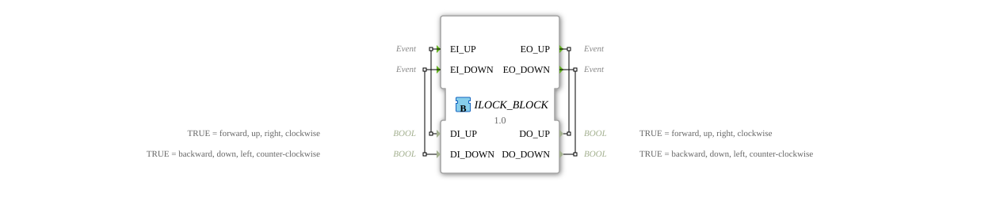

# ILOCK_BLOCK

* * * * * * * * * *
## Introduction
The function block **ILOCK_BLOCK** implements an interlock between two opposing signals. It prioritizes the first arriving active signal and ignores all subsequent conflicting signals until the initial signal is released. This ensures that two opposing actions (e.g., Up/Down, Right/Left) are never activated simultaneously.
## Interface Structure
### **Event Inputs**

| Event | With Variable | Description |
|----------|---------------|--------------|
| `EI_UP` | `DI_UP` | Event to Set UP Direction |
| `EI_DOWN` | `DI_DOWN` | Event to set the DOWN direction |

### **Event Outputs**

| Event | With Variable | Description |
|-----------|--------------|--------------|
| `EO_UP` | `DO_UP` | Triggered when the UP direction is activated or deactivated |
| `EO_DOWN` | `DO_DOWN` | Triggered when the DOWN direction is activated or deactivated |

### **Data Inputs**

| Variable | Type | Comment |
| Variable | Type | Comment |
| |------------|------|-----------|
| `DI_UP` | BOOL | TRUE = forward, upward, right, clockwise |
| `DI_DOWN` | BOOL | TRUE = backward, downward, left, counterclockwise |

### **Data Outputs**

| Variable | Type | Comment |
|------------|------|-----------|
| `DO_UP` | BOOL | TRUE = forward, upward, right, clockwise |
| `DO_DOWN` | BOOL | TRUE = backward, downward, left, counterclockwise |

### **Adapter**
None.

## Functionality
The module has two activation states (UP, DOWN) and two intermediate states (UP_STOP, DOWN_STOP) for deactivation. Control is achieved exclusively via the event inputs in conjunction with the data inputs.

- **In the idle state (STOP)**, both outputs are set to FALSE.
- **UP activation:** When the event `EI_UP` with `DI_UP = TRUE` arrives, the state changes to **UP**. In this state, `DO_UP = TRUE` and `DO_DOWN = FALSE` are set, and `EO_UP` is output.
- **DOWN Activation:** When the event `EI_DOWN` with `DI_DOWN = TRUE` occurs, the state changes to **DOWN**. `DO_UP = FALSE` and `DO_DOWN = TRUE` are set, and `EO_DOWN` is output.
- **Deactivation of an Active State:**
- In the UP state, another `EI_UP` with `DI_UP = FALSE` is expected (release). The state then immediately changes back to STOP via **UP_STOP**; `EO_UP` is triggered once more (signaling the stop).
- Similarly, in the DOWN state, a new `EI_DOWN` followed by `DI_DOWN = FALSE` is required to return to STOP via **DOWN_STOP**; this outputs `EO_DOWN`.
- **Ignoring Conflicting Signals:** As long as the function block is active (UP or DOWN), events in the opposite direction are completely ignored (no state change). This preserves the priority of the first signal.

## Technical Features
- State transitions are event-driven and instantaneous (no delays).
- Unlike a simple set/reset function block, the second input direction is not accepted during the interlock; the interlock can only be released by the original event itself.
- All outputs are set back to FALSE after a stop.

## State Overview

| State | Description |
|--------------|------------------------------------------------------------------------------------------------------------------------------------------------|
| **STOP** | Idle state. Both outputs FALSE. Waiting for activation. |
| **UP** | UP direction active. DO_UP = TRUE, DO_DOWN = FALSE. Waiting for release by `EI_UP` with `DI_UP = FALSE`. |
| **DOWN** | DOWN direction active. DO_UP = FALSE, DO_DOWN = TRUE. Waiting for release by `EI_DOWN` with `DI_DOWN = FALSE`. |
| **UP_STOP** | Intermediate state after release of UP. Immediately executes the STOP algorithm, sends `EO_UP`, and switches back to STOP. |
| **DOWN_STOP** | Intermediate state after releasing DOWN. Immediately executes the STOP algorithm, sends `EO_DOWN`, and switches back to STOP.

DOWN_STOP **Transition Matrix (Simplified):**

- `STOP → UP` : `EI_UP` & `DI_UP = TRUE`
- `STOP → DOWN` : `EI_DOWN` & `DI_DOWN = TRUE`
- `UP → UP_STOP` : `EI_UP` & `DI_UP = FALSE`
- `DOWN → DOWN_STOP` : `EI_DOWN` & `DI_DOWN = FALSE`
- `UP_STOP → STOP` : always (immediately)
- `DOWN_STOP → STOP`: always (immediately)

## Application Scenarios
- **Motor control (e.g., lifting platform, crane):** Prevents simultaneous travel in opposite directions.
- **Valve control:** Protects against the simultaneous opening and closing of a process valve.
- **Directional interlock in conveyor systems:** Ensures that a belt only activates one direction of rotation at a time.
- **Safety-critical controls:** Enforces a clear, prioritized signal sequence.

## Comparison with similar function blocks
- **Set/Reset (SR/R-SR):** Allows the simultaneous setting of both directions, which can lead to undefined states. The ILOCK_BLOCK prevents this through strict interlocking.
- **State timer (e.g., with multiple states):** Offers more flexibility but requires manual implementation of the prioritization logic. The ILOCK_BLOCK directly encapsulates this logic.
- **Simple Interlock via AND Gate:** Pure signal processing ignores the temporal sequence. The ILOCK_BLOCK reacts event-driven to the first valid activation.

## Conclusion
The **ILOCK_BLOCK** is a specialized function block for interlock applications with prioritization of the first active input. Due to its clear state machine and event-driven processing, it is particularly suitable for time-critical and safety-related control systems where conflicting signals must be strictly excluded. It offers a robust alternative to classic set/reset logic and significantly reduces implementation effort.
