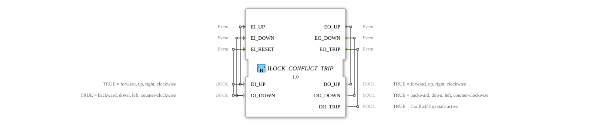

# ILOCK_CONFLICT_TRIP

* * * * * * * * * *
## Introduction
The **ILOCK_CONFLICT_TRIP** function block is used for **prioritized interlocking** with **conflict detection**. It evaluates two opposing binary signals (e.g., "Forward" and "Reverse") and only actively passes on one of the two commands as long as they are not present simultaneously. If both inputs are active at the same time, a **trip state** (error/lock) is triggered, which can only be cleared by an explicit reset (with inactive inputs). This function block is specifically designed for safety-critical applications where conflicting control commands must be reliably detected.
## Interface Structure

### **Event Inputs**

| Event | Description |
|----------|--------------|
| **EI_UP** | Event for processing an "up" request (with data `DI_UP`) |
| **EI_DOWN** | Event for processing a "down" request (with data `DI_DOWN`) |
| **EI_RESET** | Event for resetting the trip state (reads both data inputs) |

### **Event Outputs**

| Event | Description |
|----------|---------------|
| **EO_UP** | Acknowledges the output of the "up" command (when the UP state is active) |
| **EO_DOWN** | Acknowledges the output of the "down" command (when the DOWN state is active) |
| **EO_TRIP** | Indicates that a trip state exists (when TRIP is active) |

### **Data Inputs**

| Name | Type | Description |
|----------|--------|--------------|
| **DI_UP** | BOOL | TRUE = forward, up, right, clockwise |
| **DI_DOWN** | BOOL | TRUE = backward, down, left, counterclockwise |

### **Data Outputs**

| Name | Type | Description |
|-----------|--------|--------------|
| **DO_UP** | BOOL | TRUE = "Up" output active |
| **DO_DOWN** | BOOL | TRUE = Output "Down" active |
| **DO_TRIP** | BOOL | TRUE = Conflict/Trip state active |

#### **Adapters**

No adapters available.

## Functionality

The function block has four operating states: **STOP**, **UP**, **DOWN**, and **TRIP**.

- **STOP (Idle State):** Both data outputs are FALSE.
- With `EI_UP` with `DI_UP = TRUE` and `DI_DOWN = FALSE`, the block switches to the **UP** state.
- With `EI_DOWN` with `DI_DOWN = TRUE` and `DI_UP = FALSE`, it switches to **DOWN**.
- If `EI_UP` or `EI_DOWN`, and both data inputs are TRUE, it switches directly to **TRIP** (conflict).
- **UP (upward active):** `DO_UP = TRUE`, `DO_DOWN = FALSE`, `DO_TRIP = FALSE`.
- If `EI_UP` is encountered again, and `DI_UP = FALSE` is encountered again, it switches back to **STOP** (deactivation).
- If `EI_DOWN` is encountered, and `DI_DOWN = TRUE` is encountered, it switches to **TRIP** (an opposing request is detected during operation).
- **DOWN (Active Downward):** `DO_DOWN = TRUE`, `DO_UP = FALSE`, `DO_TRIP = FALSE`.
- On `EI_DOWN`, when `DI_DOWN = FALSE` occurs again, it switches to **STOP**.
- On `EI_UP`, when `DI_UP = TRUE` occurs, it switches to **TRIP**.
- **TRIP (Error/Lock):** `DO_TRIP = TRUE`, both direction outputs FALSE.
- **Only way to exit the trip:** A `EI_RESET` event where `DI_UP = FALSE` and `DI_DOWN = FALSE` are present. Then it returns to **STOP**.

**Prioritization mechanism:** The first valid input received is served until it is withdrawn or a conflict with the other input occurs. Simultaneous TRUE values on both data inputs immediately lead to the trip state.

## Technical features
- **Reset only allowed in trip:** The function block can only be reset from the TRIP state to the STOP state by `EI_RESET`. A reset during normal states (UP/DOWN/STOP) has no effect.
- **Conditions for Trip Transitions:**
- From STOP: `(EI_UP UND DI_UP UND DI_DOWN)` OR `(EI_DOWN UND DI_UP UND DI_DOWN)`
- From UP: `(EI_DOWN UND DI_DOWN)`
- From DOWN: `(EI_UP UND DI_UP)`
- **Event Acknowledgment:** The event outputs are **always** output together with the data outputs (see `With` links), so the caller can immediately access the new state.
- **Use of 4diac (IEC 61499):** The FB is implemented as a Basic Function Block with its own ECC (Execution Control Chart).

## State Overview

| State | DO_UP | DO_DOWN | DO_TRIP | Description |
|---------|-------|---------|---------|-------------|
**STOP** | FALSE | FALSE | FALSE | Idle state, no direction active |
**UP** | TRUE | FALSE | FALSE | Upward direction active |
**DOWN** | FALSE | TRUE | FALSE | Downward direction active |
**TRIP** | FALSE | FALSE | TRUE | Conflict/lock active |

## Application Scenarios
- **Motor control for linear units or rotary actuators:** Prevents simultaneous forward/reverse commands.
- **Hydraulic valve control:** Protection against conflicting switching commands (e.g., raising and lowering simultaneously).
- **Safety Interlock in Automation:** Detection of operator errors and triggering of a safe stop.
- **PLC Replication in Distributed Systems:** As part of a control logic that must avoid conflicting states.

## Comparison with Similar Function Blocks
- **SR Latch / Flip-Flop:** A simple SR latch stores a state but does not detect conflicts with simultaneous "Set" and "Reset" signals. ILOCK_CONFLICT_TRIP enters the trip state instead of creating an undefined state.
- **F_TRIG / R_TRIG (Edge Detection):** These function blocks only detect signal edges but do not have any interlock logic.
- **Standard Interlock Function Blocks (e.g., from IEC 61131-3):** Many offer simple mutual interlocking (e.g., motor interlocking) but no dedicated trip state with a reset requirement. The ILOCK_CONFLICT_TRIP is more robust in fault situations.

## Conclusion

The **ILOCK_CONFLICT_TRIP** is a compact, safety-oriented function block for the robust interlocking of two opposing control signals. It offers clear prioritization of the first activated input, detects conflicts through simultaneous activity, and forces an explicit reset after a fault. Its state machine is easy to understand and is ideally suited for applications where conflicting control commands must be reliably intercepted—for example, in machine or vehicle control.

---

### 🌐 Related topic subpages on ms-muc-docs.de
* [🌐 Eclipse 4diac IDE & color reference on ms-muc-docs.de](https://www.ms-muc-docs.de/iec-61499/eclipse-4diac/)

]
