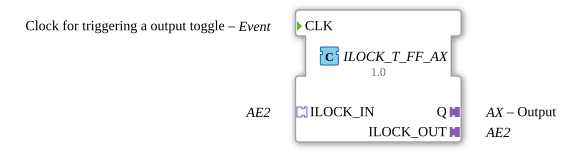

# ILOCK_T_FF_AX

* * * * * * * * * *
## Introduction

The function block `ILOCK_T_FF_AX` is a composite function block that implements a lockable toggle flip-flop. It features an AE2 adapter interface for connecting to a higher-level interlocking logic and outputs the current switching state via a unidirectional AX adapter. The function block is designed for use in safety-related or interlocked control applications where the switching of an output must be influenced by external conditions.
## Interface Structure

### **Event Inputs**

| Event | Type | Description |
|----------|--------|-----------------------------------------------|
| `CLK` | Event | Clock signal that triggers a state change (toggle). |

### **Event Outputs**

This function block does not have its own event outputs. Events are passed through the adapter interfaces.

### **Data Inputs**

No direct data inputs.

### **Data Outputs**

No direct data outputs. The current state is provided via the AX adapter.

### **Adapters**

| Adapter | Type | Direction | Description |
|--------------|------------------------------------------------------|--------------|------------------------------------------------------------------------------|
| `Q` | `adapter::types::unidirectional::AX` | Plug/Output | Unidirectional output adapter that provides the current state (Boolean value) as data and outputs an event upon a state change. |
| `ILOCK_IN` | `adapter::types::bidirectional::AE2` | Socket | Bidirectional adapter (input) for receiving locking signals. |
| `ILOCK_OUT` | `adapter::types::bidirectional::AE2` | Plug | Bidirectional adapter (output) for forwarding locking events to the higher-level logic. |

The AE2 adapters each have two event pairs (`EI1/EO1`, `EI2/EO2`) and two associated data ports. Only the first two ports (`EI1/EO1`) are used in this module.

## Functionality

The internal structure consists of two IEC 61499 standard components: `E_SR` (set-reset flip-flop) and `E_SWITCH` (event switch). The toggle behavior is implemented as follows:

1. An incoming `CLK` event is fed to the event switch `E_SWITCH`.
2. The switch input `G` is connected to the output `Q` of the SR flip-flop.

If `G = false` is present, the event is forwarded to the output `EO0` (set path).

- If `G = true` is present, the event is forwarded to output `EO1` (reset path).
3. The set path (`EO0`) sets the SR flip-flop (`E_SR.S`) and simultaneously generates an event on `ILOCK_OUT.EO1` and `ILOCK_IN.EI1` to inform the adapters of the locking mechanism.
4. The reset path (`EO1`) resets the SR flip-flop (`E_SR.R`). This reset can also be triggered externally via `ILOCK_IN.EO1` or `ILOCK_OUT.EI1`, enabling a **latched reset**.
5. The output of the SR flip-flop (`E_SR.Q`) is written to the AX adapter `Q.D1`, and the event `Q.E1` is triggered with each state change.
6. Additionally, events between `ILOCK_IN` and `ILOCK_OUT` are passed through in both directions to allow communication with neighboring devices in the same latching array.

The device thus implements an edge-triggered toggle flip-flop that can be reset by external latching signals (via the AE2 adapters).

## Technical Features

- **Composite Implementation:** The function block is built as a network of standard FBs (`E_SR` and `E_SWITCH`) and can therefore be easily adapted or integrated into other projects.
- **Bidirectional Interlocking Interface:** The AE2 adapters allow both the reception and transmission of interlocking events, enabling modular cascading of multiple function blocks.
- **Unidirectional AX Output:** The state is output as a clean Boolean signal with event provisioning; no additional data conversion is required on the receiver side.
- **Use of Only the First AE2 Ports:** The second ports of the AE2 adapters remain unused and can be added in a derived version if needed.

## State Overview

The internal state of the flip-flop is binary:

| State | Description |
|---------|----------------------------------------------------------------------|
| `0` (false) | Output `Q` is inactive. The block will be set on the next `CLK` event. |
| `1` (true) | Output `Q` is active. The block will be reset on the next `CLK` event. |

State transitions occur exclusively on a `CLK` event (Toggle) or on a lock reset via `ILOCK_IN.EO1` or `ILOCK_OUT.EI1`. Simultaneous setting and resetting are resolved by the logic of the SR flip-flop (reset takes priority if both events occur).

## Application Scenarios

- **Interlocked Output Control:** In machine controls where an output may only be switched under specific safety conditions. The interlock signals (e.g., from emergency stop circuits or light curtains) are read via `ILOCK_IN` and suppress the toggle.
- **Cascaded Interlock Chains:** Multiple `ILOCK_T_FF_AX` blocks can be connected via the AE2 adapters to create a tiered interlock hierarchy.
- **Clock Synchronous Switching State Management:** This block is suitable for applications requiring clocked state changes, e.g., in step sequencers or sequential control systems.

## Comparison with Similar Components

- **Standard Toggle Flip-Flop (e.g., our own IEC 61499 component `E_TOGGLE`):** A simple toggle flip-flop has no external latching interface and cannot be reset by external conditions. `ILOCK_T_FF_AX` extends this basic principle with bidirectional AE2 communication.
- **Set-Reset Flip-Flop (e.g., `E_SR`)):** An SR flip-flop has separate set and reset inputs, but no toggle mechanism. This component combines toggle and SR behavior with interlock logic.
- **Components with AX output:** The AX adapter is a common standard for unidirectional Boolean outputs. Other components often use separate data ports, whereas this one uses an encapsulated adapter interface.

## Conclusion

ILOCK_T_FF_AX` offers a compact, standards-compliant solution for a interlockable toggle flip-flop in the IEC 61499 environment. Its use of AE2 adapter interfaces allows for seamless integration into modern, modular automation architectures. The composite design facilitates maintenance and customization, while the clear separation of event and data flows simplifies troubleshooting. The component is specifically optimized for safety-related or interlock-dependent switching tasks and provides a solid basis for the development of more complex control logics.
