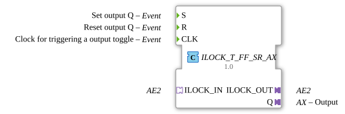

# ILOCK_T_FF_SR_AX

* * * * * * * * * *

## Introduction

The function block **ILOCK_T_FF_SR_AX** is a composite function block (FB) for a latching toggle flip-flop with set/reset functionality and an AE2 adapter interface. It enables the targeted setting, resetting, and clocking of an output signal, taking into account latching states that are read and output via bidirectional adapters.

## Interface Structure

### **Event Inputs**

| Name | Type | Comment |
| ------ | ----- | ------------ |
| S | Event | Sets output Q (if not latched) |
| R | Event | Resets output Q |
| CLK | Event | Clock input for toggling the output |

### **Event Outputs**

This function block does not have explicit event outputs. Output is provided via adapters.

### **Data Inputs**

There are no direct data inputs. The interlock information is exchanged via the adapters `ILOCK_IN` and `ILOCK_OUT`.

### **Data Outputs**

| Name | Type | Comment |
|------|-----|-----------|
| Q | Adapter AX (unidirectional) | Output signal of the internal SR flip-flop |

### **Adapters**

| Direction | Name | Type | Comment |
| ---------- | ------ | ----- | ----------- |
| Socket | ILOCK_IN | AE2 (bidirectional) | Receives lock signals from external components |
| Plug | ILOCK_OUT | AE2 (bidirectional) | Sends lock signals to external components |
| Plug | Q | AX (unidirectional) | Outputs the current state of the flip-flop |

## Functionality

This component implements an SR flip-flop with a toggle function and a lock mechanism.

- **Set (S)**: An event at `S` causes the internal SR flip-flop `E_SR` to be set via a merge (E_MERGE_2). Output Q is set to `true` unless a locking reset occurs at `ILOCK_IN` or `ILOCK_OUT`.
- **Reset (R)**: An event at `R` sets output Q to `false`. Additionally, both input adapter `ILOCK_IN` and output adapter `ILOCK_OUT` can also trigger a reset – this serves as an interlock.
- **Toggle (CLK)**: The current state of Q is evaluated on each clock event at `CLK`. A switch (E_SWITCH) is used to:
- Generate a set pulse when Q = `false` (Q → `true`).
- Generate a reset pulse when Q = `true` (Q → `false`).

Thus, the output toggles with every CLK event, unless a latch prevents this.

The latch is implemented using the bidirectional AE2 protocol: The signals from `ILOCK_IN` and `ILOCK_OUT` are passed through each other and can both reset the internal flip-flop and be exchanged with each other. This allows for a secure lock (e.g., mutual exclusion).

## Technical Features

- **Composite Architecture**: The function block consists of the embedded functions `E_SR`, `E_SWITCH`, and `E_MERGE_2`, which are logically linked.
- **Bidirectional Interlocking**: The adapters `ILOCK_IN` and `ILOCK_OUT` are of type AE2, which enables bidirectional exchange of events and data. This allows for interlocking with other function blocks.
- **Toggle Only on State Change**: The toggle mechanism evaluates the output Q, so a toggle only occurs if the flip-flop has not already been set by S or R.
- **No Direct Data Inputs**: Control is achieved exclusively via events and adapters, which facilitates integration into event-driven systems.
-

## State Overview

The internal state of the flip-flop can take the values `false` (0) or `true` (1). The possible transitions are:

| Current | Event | New State | Conditions |
| --------- | ---------- | --------------- | ------------- |
| 0 | S | 1 | No locking via ILOCK |
| 0 | R | 0 | – |
| 0 | CLK | 1 | No locking |
| 0 | ILOCK_IN/ILOCK_OUT | 0 | – |
| 1 | S | 1 | – |
| 1 | R | 0 | No locking (R takes precedence) |
| 1 | CLK | 0 | No Interlock |
| 1 | ILOCK_IN/ILOCK_OUT | 0 | – |

## Application Scenarios

- **Machine Control**: Switching an output (e.g., valve or motor) at a specific time, where a higher-level safety controller can lock the output in case of danger.
- **Mutual Interlock**: Multiple `ILOCK_T_FF_SR_AX` function blocks can be interconnected via bidirectional adapters so that only one of its outputs is active at any given time (e.g., in turnout or drive control).
- **Clock-Controlled Signal Generation**: Generating a periodic square wave signal by applying a clock signal to `CLK`, where setting and resetting can be controlled externally.

## Comparison with Similar Function Blocks

- **Simple SR Flip-Flop**: Has no toggle function and no interlock adapters.
- **TcFF (Toggle Flip-Flop)**: Allows toggling only on a clock event, but has no separate set/reset inputs and no interlock interface.
- **Standard Interlock Devices**: Often limited to binary signals, while `ILOCK_T_FF_SR_AX` combines toggle, SR, and bidirectional interlock functionality in a single device.

## Conclusion

The `ILOCK_T_FF_SR_AX` function block offers a flexible and safe way to control an output that can be switched on a clock signal and influenced via separate set/reset inputs as well as an expandable interlock interface. The combination of SR flip-flop and toggle logic makes it particularly suitable for safety-critical applications in automation technology.
