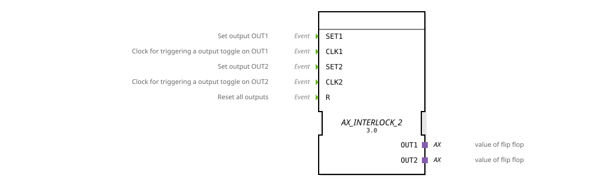

# AX_INTERLOCK_2

* * * * * * * * * *
## Introduction
The function block `AX_INTERLOCK_2` is an event-driven, bistable function block with toggle functionality and a dual interlock mechanism. It controls two independent, but mutually exclusive, outputs. The block combines set, reset, and toggle functions for two channels and ensures that only one of the two outputs can be active at any given time.

## Interface Structure
### **Event Inputs**
* **SET1**: Sets output OUT1.
* **CLK1**: Serves as a clock signal and triggers a toggle switch for output OUT1 upon an event.
* **SET2**: Sets output OUT2.
* **CLK2**: Serves as a clock signal and triggers a toggle switch for output OUT2 upon an event.
* **R**: Resets all outputs.

### **Event Outputs**
* No direct event outputs are available. Output is provided via adapters.

### **Data Inputs**
* No data inputs are available.

### **Data Outputs**
* No direct data outputs are available. Data output is provided via adapters.

### **Adapters**
* **OUT1**: Unidirectional adapter of type `adapter::types::unidirectional::AX`. Transmits the state of the first flip-flop (TRUE/FALSE).
* **OUT2**: Unidirectional adapter of type `adapter::types::unidirectional::AX`. Transmits the state of the second flip-flop (TRUE/FALSE).

## Functionality
The `AX_INTERLOCK_2` is implemented as a Basic Function Block (BFB) and has an Execution Control Chart (ECC) with four states: `START`, `SET1`, `SET2`, and `RESET`.

* **Output state (`START`)**: Both outputs are inactive (FALSE).
* **Setting/Toggling an output**: Upon a `SET1` or `CLK1` event, the ECC switches to the `SET1` state. Here, the algorithm `SET1` is executed, which sets `OUT1.D1` to TRUE. Simultaneously, the algorithm `RESET2` is executed, which sets `OUT2.D1` to FALSE. This ensures mutual interlocking. The same process applies analogously to `SET2`/`CLK2` with the state `SET2`.
* **Reset**: A `R` event, regardless of the current state, results in the `RESET` state. Here, both outputs (`OUT1.D1` and `OUT2.D1`) are set to FALSE using the algorithms `RESET1` and `RESET2`.
* **Return to the initial state**: After the actions in the states `SET1`, `SET2`, or `RESET` are executed, an automatic transition (Condition=`1`, i.e., always true) back to the `START` state occurs. The function block is then ready for the next input event.
* The toggle function is implemented using the `CLK1` and `CLK2` inputs. A `CLK1` event in the `START` state leads to the `SET1` state and thus activates `OUT1` (if it was previously off). If the function block was already in the `SET1` state, another `CLK1` event (after returning to `START`) would again lead to `SET1`, but this does not change the state because `OUT1` is already TRUE. The actual toggle logic (switching between TRUE/FALSE) must be implemented by the external logic that generates the `CLKx` events, depending on the current output state.

## Technical Features
* **Dual Interlock**: The mutual exclusivity of the outputs is hard-coded at the state transition. In state `SET1`, `RESET2` is always called, and vice versa.
* **Priority**: A global reset event (`R`) takes precedence and resets both outputs, regardless of other pending events or the current state.
* **Adapter-Based Output**: The output values are not provided via classic data output pins, but via unidirectional adapters. This enables a clean, typed interface for connecting other components.
* ## State Transition
1. **START** (both outputs FALSE)

* For `SET1` or `CLK1` -> **SET1** (OUT1=TRUE, OUT2=FALSE)
* For `SET2` or `CLK2` -> **SET2** (OUT1=FALSE, OUT2=TRUE)
* For `R` -> **RESET** (OUT1=FALSE, OUT2=FALSE)

2. **SET1** (OUT1=TRUE, OUT2=FALSE)

* Automatic transition -> **START**

3. **SET2** (OUT1=FALSE, OUT2=TRUE)

* Automatic transition -> **START**

4. **RESET** (both outputs FALSE)

* Automatic transition -> **START**

## Application Scenarios
* **Control of opposing actuators**: Ideal for controlling two actuators that must never be active simultaneously, such as "Valve open" / "Valve close" or "Forward" / "Reverse" in a drive.
* **Operating mode switching**: Switching between two different operating modes of a machine (e.g., "Automatic" / "Manual"), ensuring that only one is active at a time.
* **Toggle function with safety**: Provides a toggle function (e.g., for a manual/off switch) combined with mutual interlocking.

## ⚖️ Comparison with similar components
* **E_RS / E_SR (Bistable Flip-Flops)**: These classic components provide set/reset functionality for a single output. The `AX_INTERLOCK_2` extends this concept with a second channel featuring integrated mutual interlocking and separate toggle inputs.
* **E_TOGGLE**: Provides a simple toggle function for a single output. The `AX_INTERLOCK_2` offers toggle functionality for two channels, but with the crucial addition of mandatory mutual exclusivity (interlock).
* **E_D_FF (D Flip-Flop)**: Accepts a data value in a clock-driven manner. The `AX_INTERLOCK_2` has no data inputs; its state is determined solely by the event inputs.

## Conclusion
The `AX_INTERLOCK_2` is a specialized control module for applications where two mutually exclusive states must be reliably managed. By combining bistable set/reset functions, toggle capabilities, and hard-wired mutual interlocking, it reduces programming effort and increases the reliability of the control logic. The use of output adapters promotes a modular and well-structured application architecture.