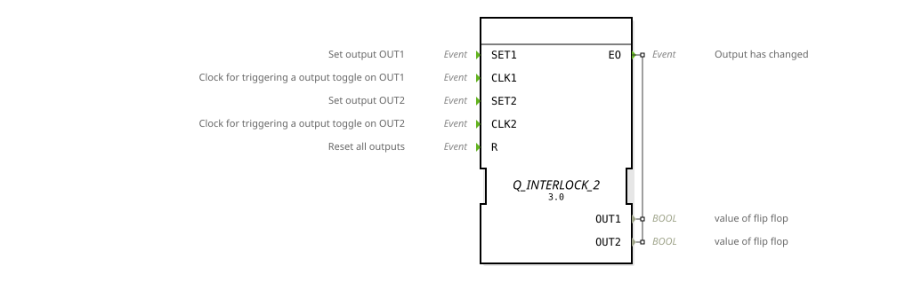

# Q_INTERLOCK_2

* * * * * * * * * *
## Introduction
The function block `Q_INTERLOCK_2` is an event-driven, bistable memory with toggle functionality and dual interlocking. It controls two mutually exclusive outputs (`OUT1` and `OUT2`). The block can be controlled via direct set events as well as clock events (for a toggle function) and ensures that only one of the two outputs can be active at any given time. A common reset event resets both outputs.

## Interface Structure

### **Event Inputs**
* **SET1**: Sets the output `OUT1` to `TRUE` and `OUT2` to `FALSE`.
* **CLK1**: Acts as a clock signal and toggles the output `OUT1` on each event (from `FALSE` to `TRUE` and from `TRUE` to `FALSE`). Simultaneously, `OUT2` is set to `FALSE`. * **SET2**: Sets the output `OUT2` to `TRUE` and `OUT1` to `FALSE`.
* **CLK2**: Acts as a clock and toggles the output `OUT2` on each event. Simultaneously, `OUT1` is set to `FALSE`.
* **R**: Sets both outputs (`OUT1` and `OUT2`) to `FALSE`.

### **Event Outputs**
* **EO**: Triggered on every state change of one of the outputs (`OUT1` or `OUT2`). This event always occurs when one of the algorithms `SET1`, `SET2`, or `RESET` is executed.

### **Data Inputs**
* This function block has no data inputs.

### **Data Outputs**
* **OUT1**: Boolean value of the first flip-flop.
* **OUT2**: Boolean value of the second flip-flop.

### **Adapters**
* This function block does not use adapters.

#
## ## Functionality
The `Q_INTERLOCK_2` is implemented as a Basic Function Block (BFB) and has an Execution Control Chart (ECC) with four states: `START`, `SET1`, `SET2`, and `RESET`.

1. **Initial State (`START`)**: Both outputs are `FALSE`.

2. **State Transitions**: Upon the occurrence of an event, the corresponding transition is evaluated in the ECC.

* `SET1` or `CLK1` result in state `SET1`.
* `SET2` or `CLK2` lead to state `SET2`.
* `R` leads to state `RESET`.

3. **Algorithm Execution**: In the target state, the corresponding algorithm is executed, setting the output variables.

* `SET2` or `CLK2` leads to state `SET2`.
* `R` leads to state `RESET`.

**Algorithm Execution**: In the target state, the corresponding algorithm is executed, setting the output variables.

* * **Algorithm `SET1`**: `OUT1 := TRUE; OUT2 := FALSE;`
* **Algorithm `SET2`**: `OUT1 := FALSE; OUT2 := TRUE;`
* **Algorithm `RESET`**: `OUT1 := FALSE; OUT2 := FALSE;`

4. **Event Output**: After the algorithm executes, the output event `EO` is triggered to inform subsequent blocks of the change.

5. **Return**: After the algorithm executes and `EO` is sent, the ECC always returns to the `START` state.

The **toggle function** is implemented through the events `CLK1` and `CLK2`. A `CLK1` event always triggers the execution of `SET1`. If `OUT1` was already `TRUE`, this results in no visible change (it remains `TRUE`). However, if `OUT1` was `FALSE`, it is set to `TRUE`. The behavior for `CLK2` is analogous. Mutual interlock is hard-coded in the algorithms `SET1` and `SET2`: If one output is set, the other is always explicitly reset.

## Technical Features
* **Dual Interlock**: Outputs `OUT1` and `OUT2` are strictly mutually exclusive. The algorithms guarantee that both can never be `TRUE` simultaneously.
* **Combined Set/Toggle Inputs**: The module offers both a direct set and a toggle input for each output, increasing flexibility.
* **Global Reset**: The `R` event takes precedence over all set or toggle operations in the same cycle and resets both outputs.
* **Event-Driven**: Every change to the outputs is triggered by an incoming event and is itself acknowledged by an output event (`EO`).

## State Overview
The ECC consists of four states:

1. **START**: Waiting state; outputs correspond to the last stored value.

2. **SET1**: Active state in which algorithm `SET1` is executed.

3. **SET2**: Active state in which algorithm `SET2` is executed.

4. **RESET**: Active state in which algorithm `RESET` is executed.

After exiting the active states (`SET1`, `SET2`, `RESET`), an automatic, unconditional transition back to state `START` occurs.

## Application Scenarios
* **Control of mutually exclusive actuators**: E.g., selecting between "heating" and "cooling" in an air conditioning system, where both functions must never be active simultaneously.
* **Operating mode switching**: Switching between two different machine or system states (e.g., "automatic" vs. "manual operation"), with a change occurring only upon explicit request.
* **Priority Toggle Switch**: Pressing one button (`CLK1`/`CLK2`) enables one function; pressing the other button disables the first and enables the second. An emergency stop (`R`) disables everything.

## ⚖️ Comparison with Similar Components
* **E_SR (Set-Reset)**: The classic SR flip-flop has separate `S1`/`S2` and `R1`/`R2` inputs. `Q_INTERLOCK_2` combines this with toggle functionality (`CLK1`/`CLK2`) and enforces mutual exclusivity internally. With `E_SR`, setting both inputs simultaneously could result in an undefined state, which is prevented by the interlock.
* **E_RS (Reset-Set)**: Similar to `E_SR`, but with a prioritized reset. `Q_INTERLOCK_2` has a global reset `R` with the highest priority, but the set inputs are equal to each other (the last triggered set or toggle event takes precedence).
* **E_RS (Reset-Set)**: Similar to `E_SR`, but with a prioritized reset. `Q_INTERLOCK_2` has a global reset `R` with the highest priority, but the set inputs are equal (the last triggered set or toggle event takes precedence).
* * **E_T (T-Flip-flop)**: A pure toggle block without a set function and without a second, locked output. `Q_INTERLOCK_2` extends this with the dual, latched structure.

## Conclusion
The `Q_INTERLOCK_2`This is a versatile and robust function block for control tasks where two states need to be interlocked. The combination of direct set and toggle functionality, along with a global reset, makes it suitable for a wide range of applications. The internal implementation of the interlock eliminates the user's need for the error-prone external implementation of this logic. It is ideal for clear, state-based control systems with mutual exclusion.
