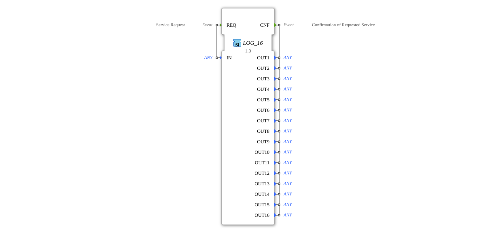

# LOG_16

* * * * * * * * * *
## Introduction
The function block `LOG_16` is a ring logger designed for the cyclic recording of data of any type (`ANY`). It serves to hold incoming values in a buffer with 16 memory locations, overwriting older entries on new calls (ring buffer principle). This block is particularly suitable for logging process data or states in real-time controllers.

## Interface Structure

### **Event Inputs**
* **REQ (Service Request)**: Triggers a logging operation. When this event occurs, the current value at data input `IN` is written to the ring buffer.

### **Event Outputs**
* **CNF (Confirmation of Requested Service)**: Triggered after successful processing of the `REQ` event. This event confirms the logging operation and simultaneously makes all 16 stored values available at the data outputs.

### **Data Inputs**
* **IN (ANY)**: The data value to be written to the ring buffer upon a `REQ` event. The data type is arbitrary (`ANY`).

### **Data Outputs**
* **OUT1 to OUT16 (ANY)**: The 16 outputs that represent the entire current contents of the ring buffer. `OUT1` contains the most recent entry (the last logged entry, `IN`), and `OUT16` contains the oldest. With each new log operation (`REQ`), all values in the buffer are shifted by one position.

### **Adapter**
This function block has no adapter interfaces.

## Functionality
`LOG_16` implements a fixed-size, first-in-first-out (FIFO) ring buffer with 16 elements. Upon each incoming `REQ` event, the following algorithm is executed:

1. The current value at input `IN` is stored as the newest entry.

2. All previously stored values are shifted one position backward (toward `OUT16`).

3. The value that was previously at position 16 (`OUT16`) is discarded.

4. The confirmation event `CNF` is triggered.

5. The new 16 buffer contents are output at outputs `OUT1` (newest) to `OUT16` (oldest).

## Technical Features
* **Generic Data Type**: The use of the `ANY` data type for inputs and outputs makes the function block extremely flexible. It can be instantiated and used with any data type (e.g., `BOOL`, `INT`, `REAL`, `STRING`, or even structured types).
* **Fixed Buffer Size**: The buffer size is fixed at 16 entries and is not configurable.
* **Immediate Output**: During each logging operation, the entire buffer content is updated at the outputs and confirmed with the `CNF` event.
*
## State Overview
The function block does not possess a persistent internal state in the sense of a state machine, apart from the ring buffer itself. Its behavior is purely reactive: A `REQ` event is always followed by a buffer update and the output of `CNF` with the current data.

## Application Scenarios
* **Process Value Logging**: Short-term recording of sensor data (e.g., temperature profile of the last 16 cycles).
* **Error History**: Storage of the last 16 error codes or alarm messages.
* **Data Preprocessing**: Provision of a sliding window of the last 16 values for subsequent calculations (e.g., in another function block).
* **Debugging**: Easy monitoring of variable behavior during development and commissioning.
*
## ⚖️ Comparison with similar modules
* **`E_DELAY` / Delay Modules**: These modules output an input value only after a defined delay. The `LOG_16`, on the other hand, stores a history of multiple values and outputs them immediately, but in order of recency.
* **`FIFO` Modules**: Classic FIFO (First-In-First-Out) storage devices often have variable lengths and a separate read/write interface. The `LOG_16` is a special fixed-length FIFO (16) that automatically outputs and overwrites its entire contents with each write operation.
* **Simple `LOG` Modules**: Simple loggers without a buffer typically write only a single value. The strength of `LOG_16` lies in its circular history.

## 🛠️ Related Exercises
* [Exercise_122](../../../../../Uebungen/test_B/Uebungen_doc/Uebung_122.md)]
* [Exercise_122b](../../../../../Uebungen/test_B/Uebungen_doc/Uebung_122b.md)]

## Conclusion
`LOG_16` is a useful and generic function block for basic logging and buffering tasks in 4diac FORTE applications. Its strengths lie in its simplicity, generic type support, and deterministic behavior. The fixed buffer size of 16 is sufficient for many monitoring tasks; however, applications requiring a different buffer depth or selective reading will need adapted or extended blocks.

---

### 🌐 Related topic subpages on ms-muc-docs.de
* [🌐 Eclipse 4diac IDE & Color Reference on ms-muc-docs.de](https://www.ms-muc-docs.de/iec-61499/eclipse-4diac/)
