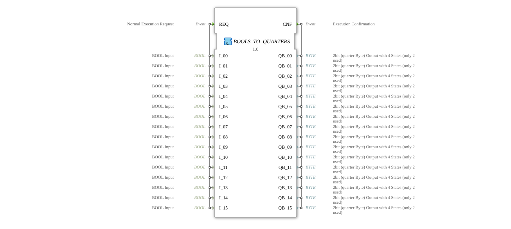

# BOOLS_TO_QUARTERS

## 🎧 Podcast

- [QUARTER](https://podcasters.spotify.com/pod/show/iec-61499-grundkurs-de/episodes/QUARTER-e36741d)

----

* * * * * * * * * *
The function block `BOOLS_TO_QUARTERS` is a composite function block (FB) that converts 16 individual Boolean input signals into a special 2-bit format called "Quarter Byte." It serves as a bundle and serial execution point for several basic conversion functions and is intended for applications where many binary states need to be converted into a compact, multi-valued control format.

- **REQ (Normal Execution Request):** Starts the processing chain. Upon receiving a REQ event, all associated data inputs (`I_00` to `I_15`) are read and the conversion is initiated.
- **CNF (Execution Confirmation):** This event is output after all 16 internal conversions are complete. It confirms the completion of the operation and provides the calculated quarter-byte values (`QB_00` to `QB_15`) to the downstream application.
- **I_00 to I_15 (BOOL Input):** 16 independent Boolean inputs (`BOOL`). Each represents a binary switching state (TRUE/FALSE). The initial value of all inputs is `FALSE`.
- **QB_00 to QB_15 (2-bit (quarter byte) output):** 16 outputs of type `BYTE`. Each output encodes the result of converting the corresponding Boolean input into a quarter byte. A quarter byte uses only the lower two bits of a byte and can theoretically represent four states. In this implementation, two states are primarily used, defined by the constants `quarter::COMMAND_DISABLE` and its counterpart. The initial value of all outputs is `quarter::COMMAND_DISABLE`.

### Data Outputs

### Data Inputs

### Event Outputs

### Event Inputs

## Interface Structure

## Introduction

### **Adapters**

This function block does not use any adapter interfaces.

BOOLS_TO_QUARTERS` is a composite function block (FB) internally composed of 16 instances of a basic function block `BOOL_TO_QUARTER`. Each instance is responsible for converting a single Boolean value.

The functionality follows a serial chain principle:

1. The incoming `REQ` event triggers the first internal instance, `BOOL_TO_QUARTER_00`.
2. This instance reads its assigned data input, `I_00`, performs the conversion, and sets its output, `QB_00`.
3. After completing its operation, `BOOL_TO_QUARTER_00` generates a `CNF` event, which is directly passed on as a `REQ` event to the next instance (`BOOL_TO_QUARTER_01`).
4. This process cascades through all 16 instances.
5. The last instance (`BOOL_TO_QUARTER_15`) passes its final `CNF` event to the `CNF` output of the enclosing `BOOLS_TO_QUARTERS` block. At this point, all 16 quarter-byte outputs (`QB_00` to `QB_15`) are available with their new values.

The data paths are organized in parallel: Each Boolean input `I_xx` is directly connected to the corresponding `I` input of the internal instance, and each `QB` output of an instance is directly connected to the corresponding `QB_xx` output of the composite FB.

- **Serial Execution:** The 16 conversions are executed sequentially, not in parallel. This results in a defined, but not simultaneous, update of the outputs. The total cycle time is the sum of the execution times of all 16 internal blocks.
- **Composite Structure:** This block primarily serves to consolidate and simplify the wiring in higher-level applications. The actual logic resides in the embedded `BOOL_TO_QUARTER` function blocks.

As a composite function block without its own explicit state machine, `BOOLS_TO_QUARTERS` does not possess an internal state in the strict sense. Its behavior is entirely determined by the cascade of its subordinate blocks and their states. The block can be in one of two macroscopic states:

1. **Idle:** Waiting for a `REQ` event. All outputs retain their last value.
2. **Processing:** A `REQ` event passes through the cascade of the 16 internal blocks. During this phase, the outputs are updated sequentially.

- **Control of compact value-added actuators:** For actuators or drivers that expect control commands not as simple on/off signals, but as 2-bit commands (e.g., on/off/error reset/emergency stop).
- **Data compression for bus communication:** Before transmission via fieldbuses, where many binary signals must be packed into a space-saving byte- or word-oriented protocol.
- **Interface to legacy systems:** As an adapter between modern IEC 61499 controllers and older systems that expect or deliver data in a special quarter-byte format.
-

- **Compared to `BOOL_TO_QUARTER`:** `BOOLS_TO_QUARTERS` is essentially an array of 16 `BOOL_TO_QUARTER` blocks with a hard-wired serial event chain. While `BOOL_TO_QUARTER` performs a single conversion, `BOOLS_TO_QUARTERS` aggregates many such conversions into a reusable building block.
- **Compared to Generic Pack Blocks (e.g., `BOOLx_TO_BYTE`):** Blocks like `BOOL8_TO_BYTE` pack multiple BOOL values into the bits of a single byte. In contrast, `BOOLS_TO_QUARTERS` generates a separate (albeit only partially used) byte for each input. There is no bit packing into a shared byte, but rather a one-to-one mapping to a special encoding format.
- [Exercise_060](../../../../../Uebungen/test_B/Uebungen_doc/Uebung_060.md)

The `BOOLS_TO_QUARTERS`The function block offers a convenient and pre-configured solution for serially converting a large number of Boolean signals to the quarter-byte format. Its composite nature makes it easy to understand and use, as it abstracts the wiring of 16 individual blocks and their event logic. Serial processing is a crucial feature that must be considered for real-time applications. The block is ideal for specific applications requiring the quarter-byte format, but less suitable for general bit packing or unpacking operations.

## Functionality

## Application Scenarios

## State Overview

## Technical Features

## ⚖️ Vergleich mit ähnlichen Bausteinen

## 🛠️ Zugehörige Übungen

## Conclusion
