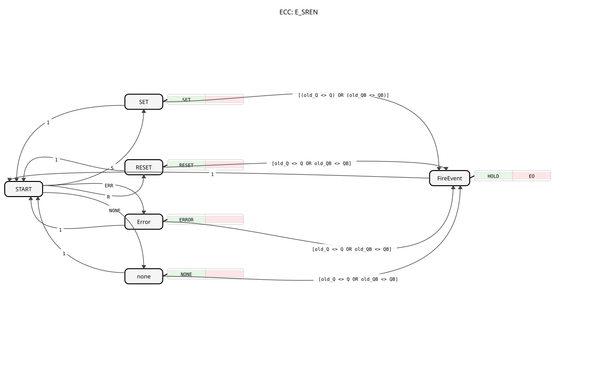

# E_SREN

* * * * * * * * * *
## Introduction

The E_SREN (Event-driven quad-state) is an event-driven function block that controls an output with four defined states. It reacts to various input events and sets its output accordingly to one of the four states: Enabled (`SET`), Disabled (`RESET`), Error (`ERROR`), or No Action (`NONE`). This function block is particularly suitable for applications where a signal must represent multiple operating states, such as in monitoring or control systems.

## Interface Structure

### **Event Inputs**

* **S (Set):** Sets the output `Q` to `TRUE` and `QB` to the state `COMMAND_ENABLE`.
* **R (Reset):** Sets the output `Q` to `FALSE` and `QB` to the state `COMMAND_DISABLE`.
* **ERR (Error):** Sets the output `Q` to `FALSE` and `QB` to the state `STATUS_ERROR`.
* **NONE:** Sets the output `QB` to the state `COMMAND_NO_ACTION`. The output `Q` remains unchanged.

### **Event Outputs**

* **EO (Event Output):** Triggered when one of the output values (`Q` or `QB`) has changed. This event is always sent along with the current values of the data outputs `Q` and `QB`.

### **Data Inputs**

* This function block has no data inputs.

### **Data Outputs**

* **Q (BOOL):** Simple Boolean output. It is only `TRUE` when the `S` event occurs. It is `FALSE` for the `R` and `ERR` events and remains unchanged for `NONE`.
* **QB (BYTE):** A byte output specifically used to encode four states (2 bits). The specific values (e.g., `COMMAND_ENABLE`) are obtained from the imported library `quarter::const::quarter`.

### **Adapters**

* This function block does not use any adapters.

## Functionality

The E_SREN function block is implemented as a Basic function block and has an internal state machine (ECC). The output state is `START`. Upon receiving an input event (`S`, `R`, `ERR`, `NONE`), the automaton transitions to the corresponding state (`SET`, `RESET`, `Error`, `none`). In these states, the associated algorithm is executed, which calculates the values for `Q` and `QB`.

... A condition then checks whether the new value of `Q` or `QB` has changed compared to the last stored value (`old_Q`, `old_QB`). If so, the automaton transitions to state `FireEvent`. Here, the algorithm `HOLD` is executed, which stores the current output values in the internal variables and simultaneously triggers the output event `EO`. Afterward, the automaton always returns to state `START`. If the initial values have not changed, a direct transition occurs from states `SET`, `RESET`, `Error`, or `none` back to state `START`, without triggering `EO`.

## Technical Features

* **State Detection:** The function block stores the previous initial state in the internal variables `old_Q` and `old_QB`. The output event `EO` is only generated when an actual state change occurs, thus preventing redundant event outputs.
* **State Detection:** The function block stores the previous initial state in the internal variables `old_Q` and `old_QB`. The output event `EO` is only generated when an actual state change occurs, preventing redundant event outputs.
* **Library Dependency:** The specific byte values for the `QB` output are imported from the constant library `logiBUS::utils::quarter::const::quarter`. Correct functionality requires the availability of this library.
* **Four-State Logic:** The logic of the `NONE` event is special: While `QB` is set to `COMMAND_NO_ACTION`, the Boolean output `Q` remains explicitly unchanged.

## State Overview

The ECC (Execution Control Chart) consists of six states:

1. **START:** Initial and idle state.
2. **SET:** Activated by the `S` event. 3. **RESET:** Activated on event `Q=TRUE`, `QB=COMMAND_ENABLE`.
4. **Error:** Activated on event `R`. Sets `Q=FALSE`, `QB=COMMAND_DISABLE`.
5. **none:** Activated on event `ERR`. Sets `Q=FALSE`, `QB=STATUS_ERROR`.
6. **none:** Activated on event `NONE`. Sets `QB=COMMAND_NO_ACTION`. `Q` remains unchanged.
6. **FireEvent:** This event is only triggered if `Q` or `QB` has changed. It saves the new values and triggers `EO`.

## Application Scenarios

* **Actuator Control:** Controlling a drive using the commands "On" (`S`), "Off" (`R`), "Fault" (`ERR`), and "Manually/Externally Controlled" (`NONE`).
* **Message Systems:** Displaying the status of a machine: "In Operation," "Stopped," "Error," "Maintenance."
* **Safety-Related Controllers:** Clear separation of normal operating (`S`/`R`), fault (`ERR`), and maintenance/override (`NONE`) states.

## ⚖️ Comparison with Similar Function Blocks

* **E_SR (Bistable Function):** The classic set-reset flip-flop only has two stable states (`TRUE`/`FALSE`). The E_SREN extends this concept to include two additional states (`ERROR`, `NO_ACTION`), which are encoded via a dedicated byte (`QB`).
* **E_D_FF (D-Flip-Flop):** Assumes a data value on a clock event. The E_SREN is event-driven (four different events) and has no separate data input. The "data" is implicitly contained in the triggering events.

## Conclusion

The E_SREN is a specialized, event-driven function block for applications requiring more than two discrete states. By combining a simple Boolean signal (`Q`) with a multi-valued byte signal (`QB`) and intelligent, change-based event output (`EO`), it offers an efficient and clear solution for complex state control. Its strength lies in the clear semantics of the four input events and the reliable avoidance of redundant output events.
