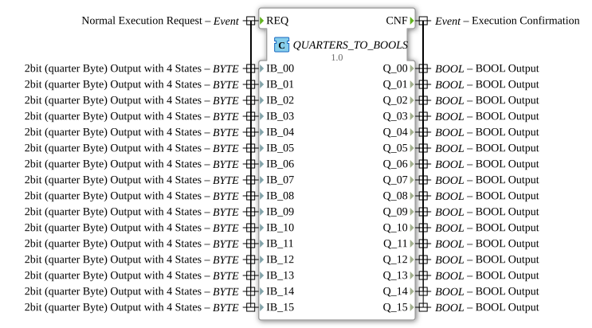

# QUARTERS_TO_BOOLS

## 🎧 Podcast

- [QUARTER](https://podcasters.spotify.com/pod/show/iec-61499-grundkurs-de/episodes/QUARTER-e36741d)
----

* * * * * * * * * *
## Introduction

The function block `QUARTERS_TO_BOOLS` is a composite function block that converts 16 separate 2-bit input values (so-called "quarter bytes") in parallel into corresponding Boolean output signals. It acts as a wrapper and simplifies handling by combining a multitude of individual conversion blocks into a single, easily manageable block. This block is particularly useful in control systems where compact data formats (such as 2-bit states in a byte) need to be converted into simple binary control signals for actuators or status indicators.

## Interface Structure

### **Event Inputs**

- **REQ**: Starts processing. Upon arrival of this event, all 16 input values (`IB_00` to `IB_15`) are read and processed.

### **Event Outputs**

- **CNF**: Signals successful completion of processing. This event is output after all 16 internal conversions are complete and the output data (`Q_00` to `Q_15`) has been updated.

### **Data Inputs**

- **IB_00** to **IB_15** (Type: `BYTE`): 16 inputs for 2-bit data (quarter bytes). Each input can represent one of four defined states (e.g., `quarter::COMMAND_DISABLE`). The default initial value for all inputs is `quarter::COMMAND_DISABLE`.

### **Data Outputs**

- **Q_00** to **Q_15** (Type: `BOOL`): 16 Boolean outputs that reflect the converted state of the respective quarter-byte input. The initial value for all outputs is `FALSE`.

### **Adapters**

This function block does not use any adapter interfaces.

## Functionality

QUARTERS_TO_BOOLS` is a composite function block that internally consists of 16 instances of the base function block `QUARTER_TO_BOOL`. Each of these instances is responsible for converting a specific input (`IB_xx`).

1. **Triggering**: The arrival of the event `REQ` triggers the processing chain.
2. **Parallel Data Distribution**: The byte values present at inputs `IB_00` to `IB_15` are forwarded in parallel to the corresponding inputs (`IB`) of the 16 internal `QUARTER_TO_BOOL` blocks.
3. **Serial Event Processing**: The `REQ` event is propagated serially through the chain of internal blocks. It starts at `QUARTER_TO_BOOL_00` and is passed sequentially from one block to the next (`CNF` -> `REQ`) until the last block (`QUARTER_TO_BOOL_15`) completes its processing.
4. **Conversion**: Each internal `QUARTER_TO_BOOL` block interprets its byte input value according to a defined logic (presumably based on the two least significant bits) and converts it to a Boolean value (`TRUE` or `FALSE`).
5. **Result Output**: The Boolean results (`Q`) of the internal blocks are routed to the corresponding outputs `Q_00` to `Q_15` of the composite block.
6. **Completion**: Once the last internal block is complete, the composite block triggers its `CNF` event to signal the completion of the entire conversion cycle for all 16 channels.

## Technical Features

- **Initialization**: All inputs are preset with the specific value `quarter::COMMAND_DISABLE`, and all outputs start with `FALSE`. This ensures a defined, inactive output state.
- **Processing Order**: While data inputs are distributed in parallel, event processing occurs strictly sequentially from index 00 to 15. This results in a deterministic, though not simultaneous, update of the outputs.
- **Composite Design**: The block encapsulates the complexity of 16 individual conversions and offers a clean, unified interface, which increases reusability and readability in higher-level applications.

## State Overview

As a Composite Function Block, `QUARTERS_TO_BOOLS` does not have its own complex state machine in the conventional sense. Its behavior is defined by the network of internal blocks. In simplified terms, the overall state can be viewed as **Idle** (waiting for `REQ`) and **Processing** (event passing through the internal chain). The `CNF` output marks the transition back to the Idle state.

## Application Scenarios

- **Compact PLC Connection**: Conversion of compact 32-bit data words (containing 16 2-bit states) into 16 individual binary control signals for valves, lamps, or relays.
- **Status Decoding**: Decoding of device status information transmitted in a "quarter byte" format into individual, easily processed error or operating state bits.
- **Simplifying Function Plans**: Replaces 16 separate `QUARTER_TO_BOOL` blocks and their wiring in a function plan with a single, clear block, simplifying project maintenance.

## ⚖️ Comparison with Similar Blocks

- **`QUARTER_TO_BOOL`**: This is the basic block that converts a single 2-bit input. `QUARTERS_TO_BOOLS` combines 16 instances of this block into a single unit. Using the composite block is more efficient for handling multiple channels, while the single block offers maximum flexibility in individual placement and wiring.
- **`BYTE_TO_BOOL` blocks**: Conventional blocks that split an entire byte into 8 individual bits. `QUARTERS_TO_BOOLS` is more specialized, as it assumes that each byte is already divided into four independent 2-bit units that must be interpreted separately.
*
## 🛠️ Related Exercises

- [Exercise_060](../../../../../Uebungen/test_B/Uebungen_doc/Uebung_060.md)

## Conclusion

The `QUARTERS_TO_BOOLS` function block is a practical and time-saving tool for IEC 61499 programming when multiple 2-bit data channels frequently need to be converted into Boolean signals. By encapsulating 16 conversions in a single block, it significantly reduces wiring effort in higher-level applications and improves clarity. Its deterministic, serial event processing ensures reliable behavior that is well-suited for control tasks.
