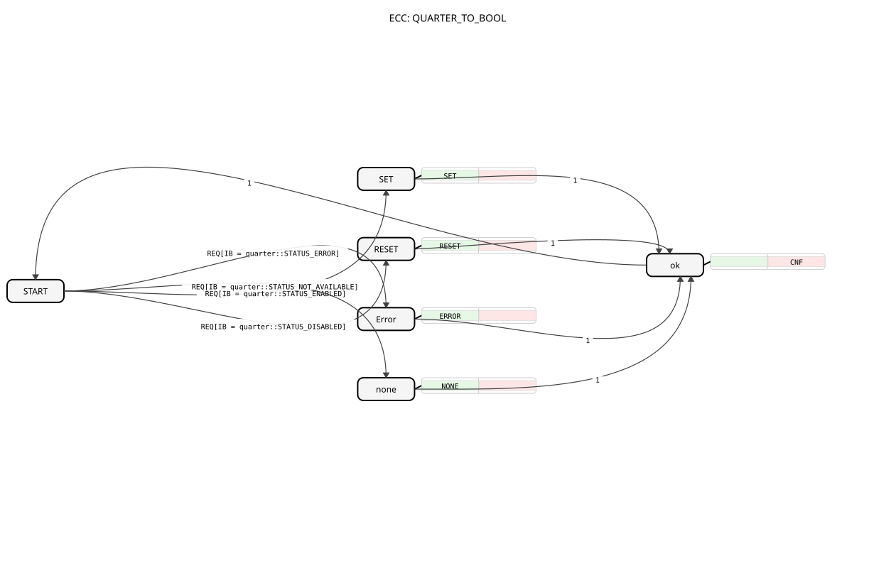

# QUARTER_TO_BOOL

## 🎧 Podcast

- [QUARTER](https://podcasters.spotify.com/pod/show/iec-61499-grundkurs-de/episodes/QUARTER-e36741d)
----

* * * * * * * * * *
## Introduction

The function block `QUARTER_TO_BOOL` converts a quad-state signal, encoded in the lower two bits of a byte value, into a simple BOOL signal. It is particularly useful for connecting to systems that provide status information with more than two states, which should be further processed using simple binary logic.

## Interface Structure

### **Event Inputs**

- **REQ**: Starts the conversion. This event evaluates the incoming input value `IB`.

### **Event Outputs**

- **CNF**: Signals the completion of the conversion. This event is always output after processing a `REQ` event.

### **Data Inputs**

- **IB** (BYTE): Contains the 4-state value to be converted in its lower two bits. The initial value is `quarter::COMMAND_DISABLE`. The expected values are specific constants from the `quarter` namespace.

### **Data Outputs**

- **Q** (BOOL): The result of the conversion. The initial value is `FALSE`.

### **Adapters**

This function block does not use adapters.

## Functionality

When triggered by a `REQ` event, the function block reads the value at the data input `IB`. This value is then compared with predefined constants to determine the corresponding internal state. Depending on the state, a specific algorithm is executed, which either sets the BOOL output `Q` or leaves it unchanged. After the algorithm has finished executing, the `CNF` event is triggered, and the function block returns to its initial state.

The specific mapping of the input values to the output logic is as follows:

- `quarter::STATUS_ENABLED` → Algorithm `SET` → `Q := TRUE`
- `quarter::STATUS_DISABLED` → Algorithm `RESET` → `Q := FALSE`
- `quarter::STATUS_ERROR` → Algorithm `ERROR` → `Q := FALSE`
- `quarter::STATUS_NOT_AVAILABLE` → Algorithm `NONE` → `Q` remains unchanged

## Technical Features

- **State Handling**: The function block is implemented as a Basic Function Block and It has an explicit state machine (ECC). The states `SET`, `RESET`, `ERROR`, and `none` are pure algorithm states, while the state `ok` is responsible for outputting the acknowledgment event.
- **Value Preservation**: In the case of state `STATUS_NOT_AVAILABLE`, the algorithm `NONE` is executed, which explicitly does not modify the current value of the output `Q`. This enables "don't care" or "hold" behavior.
- * **Initialization**: The data output `Q` is initialized to `FALSE` at startup.

## State Overview

The ECC (Execution Control Chart) consists of six states:

1. **START**: Initial and wait state. Upon receiving `REQ`, a transition to `SET`, `RESET`, `Error`, or `none` occurs, depending on the value of `IB`.

2. **SET**: Executes the algorithm `SET` (sets `Q` to TRUE).

3. **RESET**: Executes the algorithm `RESET` (sets `Q` to FALSE).
4. **Error**: Executes the algorithm `ERROR` (sets `Q` to FALSE).
5. **none**: Executes the algorithm `NONE` (leaves `Q` unchanged).
6. **OK**: Triggers the `CNF` output event and then switches back to the `START` state.

## Application Scenarios

- **Connecting Field Devices**: Many sensors or actuators report statuses such as "Ready," "Faulty," "Maintenance," or "Not Connected." This function block can convert such messages into a simple "On/Off" or "OK/Not OK" signal for higher-level control logic.
- **Simplifying Logic**: In controllers that only require binary decisions (e.g., "Release Process" yes/no), this function block can reduce more complex status messages to the essential binary information.
- **Error Handling**: Consistent handling of error states (`STATUS_ERROR`) by setting the output to `FALSE`.

## ⚖️ Comparison with Similar Building Blocks

- **Standard Converters (e.g., `BYTE_TO_BOOL`)**: A simple `BYTE_TO_BOOL` converter would typically use a threshold (e.g., anything >0 becomes TRUE). `QUARTER_TO_BOOL`, on the other hand, interprets specific, named states and provides defined behavior for each one, including the option to leave the output unchanged for a given state.
- **`E_SELECT` or `E_DEMUX` Building Blocks**: These could be used to activate different event paths based on an input value. `QUARTER_TO_BOOL` encapsulates this logic specifically for converting 4-state signals and directly returns the Boolean result.
*
## 🛠️ Related Exercises

- [Exercise_055](../../../../../Uebungen/test_B/Uebungen_doc/Uebung_055.md)
- [Exercise_056](../../../../../Uebungen/test_B/Uebungen_doc/Uebung_056.md)

## Conclusion

The `QUARTER_TO_BOOL` function block is a specialized and useful converter for applications where compact status information with four discrete states needs to be integrated into simple binary logic. Its clear definition of the behavior for each state, especially the retention of the output value in the "Not Available" case, makes it robust and highly predictable. It is ideally suited for the interface between more complex fieldbus systems and basic binary control logic.
