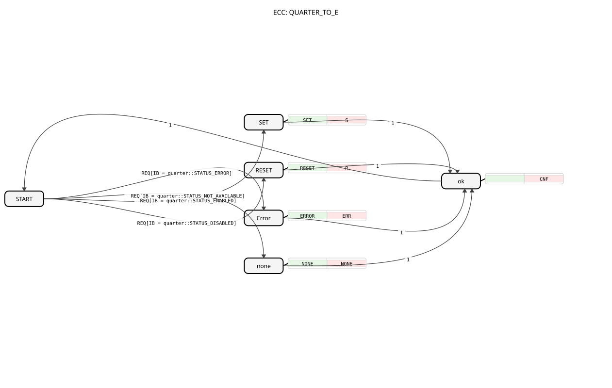

# QUARTER_TO_E
## 🎧 Podcast

* [QUARTER](https://podcasters.spotify.com/pod/show/iec-61499-grundkurs-de/episodes/QUARTER-e36741d)
----

* * * * * * * * * *
## Introduction
The function block `QUARTER_TO_E` is used to translate a 2-bit state value (a so-called "quarter byte") into four different, unique events. It is an auxiliary block frequently used in conjunction with blocks that report more than the usual two states (ON/OFF), such as status messages from devices that can also indicate error or unavailability states.

## Interface Structure

### **Event Inputs**
* **REQ**: Starts processing. This event evaluates the current value at data input `IB`.

### **Event Outputs**
* **CNF**: Signals successful completion of processing, regardless of the detected state. It is always generated after the output of one of the specific events.
* **S** (Enabled): Triggered when the "enabled" or "switched on" state is detected.
* **R** (Disabled): Triggered when the "disabled" or "switched off" state is detected.
* **ERR** (Error): Triggered when an error state is detected.
* **NONE** (Not available): Triggered when the "not available" or "not installed" state is detected.

### **Data Inputs**
* **IB** (BYTE): Contains the 2-bit state value to be interpreted. The initial value is set to `quarter::COMMAND_DISABLE`. The actual interpretation is performed using the defined constants from the `quarter` package.

### **Data Outputs**
* **Q** (BOOL): A Boolean output whose value is set depending on the detected state. It serves as a simple, binary representation of the main state (enabled/disabled).

### **Adapters**
This function block does not use adapters.

## Functionality
The `QUARTER_TO_E` is a Basic Function Block with an internal state machine (ECC). Upon the arrival of the `REQ` event, the value at input `IB` is compared with predefined constants. Depending on the comparison, the automaton jumps to one of four states: `SET`, `RESET`, `Error`, or `none`. In each of these states, a corresponding algorithm is executed, which sets (or leaves unchanged) the Boolean output `Q` and triggers the associated specific event (`S`, `R`, `ERR`, `NONE`). The automaton then transitions to state `ok`, from where the confirmation event `CNF` is issued, before returning to the initial state `START` and waiting for the next `REQ`.

## Technical Details
* This block uses constants from the package `logiBUS::utils::quarter::const::quarter` (`STATUS_ENABLED`, `STATUS_DISABLED`, `STATUS_ERROR`, `STATUS_NOT_AVAILABLE`). These must be available in the project.
* The output `Q` is only modified in the states `SET` (TRUE), `RESET` (FALSE), and `ERROR` (FALSE). In the state `NONE`, `Q` is explicitly not modified ("Don't care").
* The output of the `CNF` event always occurs, regardless of which specific state was detected. This enables consistent process control within the application.

## State Overview

1. **START**: Waiting state. At `REQ`, `IB` is evaluated, and the process transitions to a processing state.

2. **SET**: Reached at `IB = STATUS_ENABLED`. Sets `Q:=TRUE` and triggers `S`.

3. **RESET**: Reached at `IB = STATUS_DISABLED`. Sets `Q:=FALSE` and triggers `R`.

4. **Error**: Reached at `IB = STATUS_ERROR`. Sets `Q:=FALSE` and triggers `ERR`.

5. **none**: Reached at `IB = STATUS_NOT_AVAILABLE`. Triggers `NONE` (Q remains unchanged). 6. **ok**: Intermediate state that triggers the `CNF` event and returns to the `START` state.

## Application Scenarios
* **Interpretation of Device Status**: A drive reports its status not only as ON/OFF, but also as "Error" or "Not Ready". This block converts the device status into separate, easily processed events.
* **Simplification of Logic**: Instead of constantly having to query the byte value in subsequent blocks, you can react directly to the specific events (`S`, `R`, `ERR`).
* **Abstraction**: Serves as an adapter between blocks that provide a quarter-byte status and logic that works with classic event/boolean signals.

## ⚖️ Comparison with similar blocks
* **E_DEMUX / E_SELECT**: These blocks forward an input event based on a control value to one of several outputs. `QUARTER_TO_E` is more specialized: It not only translates a specific data value (`IB`) into a selection, but also triggers different *content-related* events and additionally calculates a boolean value (`Q`).
* **BYTE_TO_E**: A generic block that could convert each bit of a byte into a separate event. `QUARTER_TO_E` is semantically richer because it recognizes and outputs specific, predefined states (Enabled, Disabled, Error, None) and their meanings.

## Conclusion
The `QUARTER_TO_E` is a useful and specialized component for the structured processing of four-state signals. It relieves the application logic by handling raw data interpretation and providing clear, semantic events as well as a simplified Boolean status. Its strength lies in the combination of data processing and event-based output according to IEC 61499.