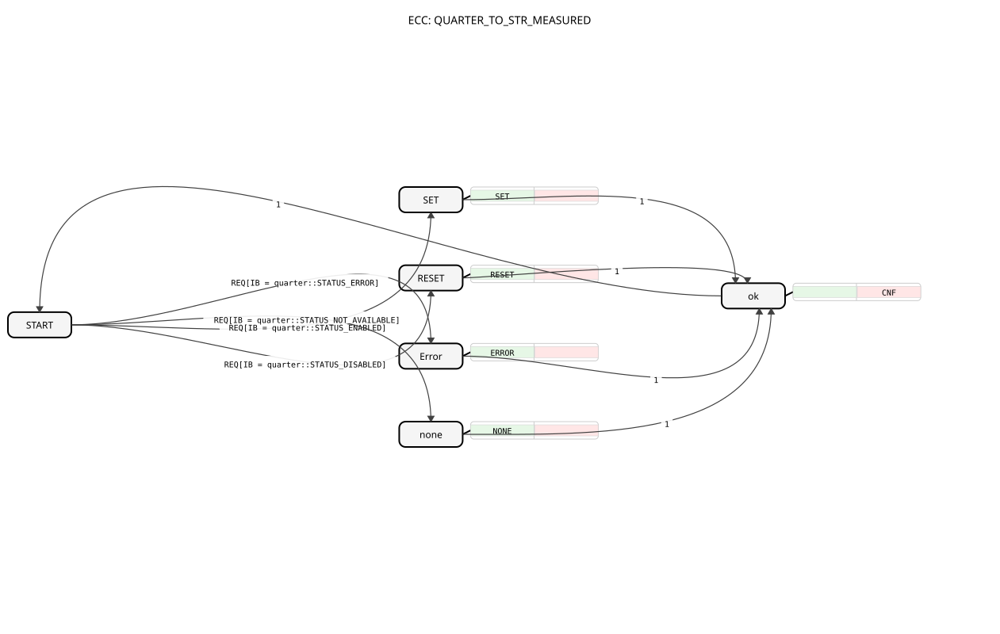

# QUARTER_TO_STR_MEASURED
## 🎧 Podcast

* [QUARTER](https://podcasters.spotify.com/pod/show/iec-61499-grundkurs-de/episodes/QUARTER-e36741d)
----

* * * * * * * * * *
## Introduction
The function block `QUARTER_TO_STR_MEASURED` converts a 4-state signal (encoded in the lower two bits of a BYTE value) into a human-readable text string (STRING). It is particularly suitable for displaying or logging status information in control systems, where discrete states such as "On," "Off," "Error," or "Not Available" need to be converted into textual form.

## Interface Structure

### **Event Inputs**
* **REQ**: Starts the normal execution of the function block. Upon this event, the value at data input `IB` is evaluated, and the corresponding conversion is performed.

### **Event Outputs**
* **CNF**: Signals the completion of the conversion and the availability of the result at data output `STR`.

### **Data Inputs**
* **IB** (BYTE): The input for the quad-state value to be converted. Only the lower two bits (LSB) are evaluated. The block expects specific, predefined constant values (e.g., `quarter::STATUS_ENABLED`). The initial value is `quarter::STATUS_DISABLED`.

### **Data Outputs**
* **STR** (STRING): The output where the converted text string is provided. The initial value is the text constant for the "Disabled" status (`quarter::STATUS_DISABLED_msg`).

### **Adapters**
This function block has no adapter interfaces.

## Operation
The `QUARTER_TO_STR_MEASURED` is a Basic Function Block (BFB) with an internal Execution Control Graph (ECC). Upon the arrival of the `REQ` event, the value at the input `IB` is compared with predefined constants from the library `logiBUS::utils::quarter::const::quarter`. Depending on the matching value, the controller branches to one of four states (`SET`, `RESET`, `Error`, `none`). In each of these states, a specific algorithm is executed, assigning the corresponding text constant (e.g., `quarter::STATUS_ENABLED_msg`) to the output `STR`. The block then transitions to state `ok`, from which the output event `CNF` is triggered, before the block returns to its initial state `START` and waits for the next `REQ`.

...
## Technical Features
* **Typed Constants:** The block uses strongly typed constants for both the input values (`quarter::STATUS_...`) and the output strings (`quarter::STATUS_..._msg`). This increases the type safety and maintainability of the code.
* **Basic FB:** The implementation as a Basic FB with ECC enables clear and comprehensible state logic.
* **Initial Values:** Both the data input `IB` and the data output `STR` are pre-populated with meaningful initial values (disabled state).

## State Overview
The ECC of the function block consists of six states:

1. **START:** The initial wait state. At `REQ`, a branch is triggered based on the value of `IB`.

2. **SET:** Activated at `IB = quarter::STATUS_ENABLED`. Executes the algorithm `SET`.

3. **RESET:** Activated at `IB = quarter::STATUS_DISABLED`. Executes the algorithm `RESET`.

4. **Error:** Activated at `IB = quarter::STATUS_ERROR`. Executes the algorithm `ERROR`.

5. **none:** Activated at `IB = quarter::STATUS_NOT_AVAILABLE`. Executes the algorithm `NONE`.

6. **ok:** Common state that is traversed after each successful conversion. Triggers the `CNF` event and returns to the `START` state.

## Application Scenarios
* **HMI/SCADA Integration:** Conversion of internal control status values into readable text for display on operator panels or in visualization systems.
* **Logging and Diagnostics:** Generation of plain-text log entries for error or status messages, which are easier to analyze than numeric codes.
* **Interface to Higher-Level Systems:** Preparation of status information for transmission to MES or ERP systems that expect string data.

## ⚖️ Comparison with Similar Building Blocks
* **`BYTE_TO_STRING`:** A general-purpose converter that transforms any byte value into its decimal string representation. `QUARTER_TO_STR_MEASURED` is more specialized and converts specific, semantically meaningful values into predefined, meaningful texts, not numeric strings.
* **`E_SR` or `E_RS` (Flip-Flops):** These blocks represent binary states (SET/RESET) using Boolean signals. `QUARTER_TO_STR_MEASURED` extends this concept to four states and additionally offers textual representation.

## Conclusion

The `QUARTER_TO_STR_MEASURED` is a specialized and robust function block for the semantic conversion of 4-state signals. By using library constants for inputs and outputs, it ensures high code quality and simplifies maintenance. It is the ideal choice when discrete status information from the control plane needs to be converted into textual form for display, logging, or interface purposes.
