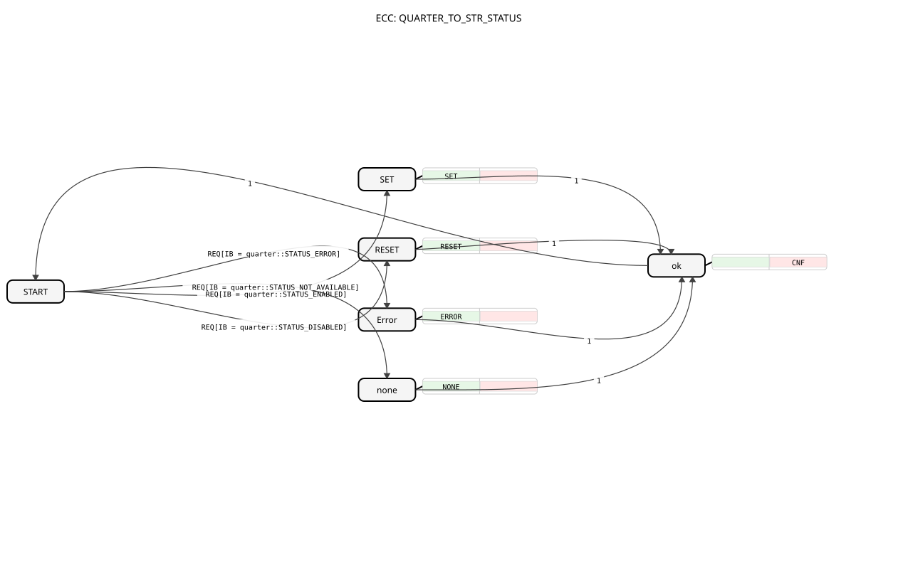

# QUARTER_TO_STR_STATUS
## 🎧 Podcast

* [QUARTER](https://podcasters.spotify.com/pod/show/iec-61499-grundkurs-de/episodes/QUARTER-e36741d)
----

* * * * * * * * * *
## Introduction
The function block `QUARTER_TO_STR_STATUS` converts a 2-bit status value (also known as a "quarter byte") into a human-readable text string. It is part of the `logiBUS::utils::quarter` library and is typically used to convert compact status information from controllers or devices into an understandable text format for display, logging, or diagnostic purposes.

## Interface Structure

### **Event Inputs**
* **REQ**: Starts processing. Upon arrival of this event, the value at data input `IB` is read and the corresponding conversion is performed.

### **Event Outputs**
* **CNF**: Signals the completion of the conversion. This event, along with the converted string, is output at data output `STR`.

### **Data Inputs**
* **IB** (BYTE): The input for the 2-bit status value. Only the least significant two bits (bits 0 and 1) are evaluated. This block expects specific, predefined constants from the `quarter` library. The initial value is `quarter::COMMAND_DISABLE`.

### **Data Outputs**
* **STR** (STRING): The output that provides the text string corresponding to the status value. The initial value is `quarter::COMMAND_DISABLE_msg`.

### **Adapters**
This function block has no adapter interfaces.

## Functionality
The `QUARTER_TO_STR_STATUS` is a Basic Function Block (BFB) with a defined Execution Control Chart (ECC). Upon an incoming `REQ` event, the value at `IB` is compared to predefined constants. Depending on this comparison, the controller branches to one of four possible states (`SET`, `RESET`, `Error`, `none`). In each of these states, a specific algorithm is executed that sets the initial `STR` to a corresponding text string. After the algorithm has finished executing, the block transitions to state `ok`, from which the `CNF` event is triggered. The block then returns to the initial `START` state and is ready for the next request.

In each of these states, a specific algorithm is executed that sets the initial `STR` to a corresponding text string. The specific string values are loaded from the `quarter` constant library (`logiBUS::utils::quarter::const::quarter`). The expected input values and their corresponding output strings are:

* `quarter::STATUS_ENABLED` → `quarter::COMMAND_ENABLE_msg`
* `quarter::STATUS_DISABLED` → `quarter::COMMAND_DISABLE_msg`
* `quarter::STATUS_ERROR` → `quarter::COMMAND_RESERVED_msg`
* `quarter::STATUS_NOT_AVAILABLE` → `quarter::COMMAND_NO_ACTION_msg`

## Technical Features
* **Type Safety:** The block uses strongly typed constants from a dedicated library, which reduces the susceptibility to errors compared to the direct use of raw values (e.g., 0, 1, 2, 3).
* **2-Bit Processing:** Although the input is declared as `BYTE`, only one quarter (2 bits) of this byte is effectively used. The semantics of the four possible states are defined by the constant library used.

****Deterministic Behavior:** The state transitions depend solely on the input value at `REQ`. There is no internal memory or hysteresis effects.

## State Overview
The ECC consists of six states:

1. **START:** Initial, waiting state. It waits for the `REQ` event.

2. **SET:** Activated at `IB = quarter::STATUS_ENABLED`. Executes algorithm `SET`.

3. **RESET:** Activated at `IB = quarter::STATUS_DISABLED`. Executes algorithm `RESET`.

4. **Error:** Activated at `IB = quarter::STATUS_ERROR`. Executes algorithm `ERROR`.

5. **none:** Activated at `IB = quarter::STATUS_NOT_AVAILABLE`. Executes algorithm `NONE`.

6. **ok:** Common state after every successful conversion. Triggers the `CNF` exit event and returns to the `START` state.

## Application Scenarios
* **HMI/SCADA Integration:** Conversion of internal device states (e.g., "enabled," "faulty") into strings for display on operator panels or in visualization software.
* **Logging and Diagnostics:** Conversion of status codes into readable text for log files or diagnostic tools to facilitate fault analysis.
* **Interface to Text-Based Systems:** Preparation of status information for further processing in systems that work with string messages (e.g., MQTT topics, CSV export).

## ⚖️ Comparison with Similar Function Blocks
* **`E_SR` or `E_RS` (Flip-Flops):** These blocks store a binary state (SET/RESET). `QUARTER_TO_STR_STATUS`, on the other hand, only converts an existing 4-state value into a string; it has no dedicated memory.
* **`E_SELECT` or `E_MUX`:** These can also choose between different paths/values, but are more generic and not specifically designed for converting to strings with predefined quarter-state values.
* **Simple `STRING` assignment:** A direct assignment in ST code could achieve something similar, but the `QUARTER_TO_STR_STATUS` block encapsulates the logic, promotes reusability, and enforces the use of standardized constants, thus increasing consistency across the entire project.

**`STRING` assignment:** A direct assignment in ST code could accomplish something similar, but the `QUARTER_TO_STR_STATUS` block encapsulates the logic, promotes reusability, and enforces the use of standardized constants, increasing consistency throughout the project.
## 🛠️ Related Exercises

* [Exercise_055](../../../../../Uebungen/test_B/Uebungen_doc/Uebung_055.md)]
* [Exercise_056](../../../../../Uebungen/test_B/Uebungen_doc/Uebung_056.md)]

## Conclusion
The `QUARTER_TO_STR_STATUS` is a specialized and useful function block for applications that work with the specific 4-state status model (Quarter Byte). By using a constant library and clearly separating logic and interface, it contributes to the robustness and maintainability of IEC 61499 applications. It is the ideal choice when compact status information needs to be reliably and consistently translated into a human-readable format.
