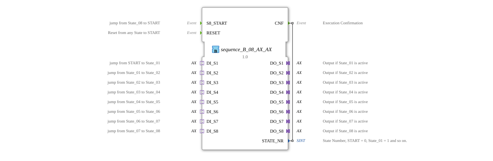

# sequence_B_08_AX_AX

* * * * * * * * * *
## Introduction
The function block **sequence_B_08_AX_AX** implements a sequential control system with eight outputs. State transitions are level-controlled via BOOL signals provided by an AX adapter. The block is designed for fail-safe applications and allows for the restoration of the current state after a power failure. It is particularly suitable for sequence control systems in automation technology where multiple switching operations must be executed sequentially.
## Interface Structure

### **Event Inputs**

| Name | Description |

|------|--------------|

| `S8_START` | Event that triggers a jump from state 8 back to the start state. |

| `RESET` | Event that triggers an immediate reset from any active state. |

### **Event Outputs**

| Name | Description |

|------|--------------|

| `CNF` | Acknowledge event that outputs the current state number after each state change. (With `STATE_NR`) |

### **Data Inputs**

The FB has no direct data inputs. The transition conditions are read exclusively via the socket adapters.

### **Data Outputs**

| Name | Type | Description |

|------|-----|---------------|

| `STATE_NR` | SINT | Current state number: 0 = Start, 1…8 = State_01…State_08, 9 = State_00 (End). |

### **Adapter**

**Plugs (Outputs – Type `adapter::types::unidirectional::AX`)**

| Name | Description |

|------|--------------|

| `DO_S1` | Output active when state 1 is active. |

| `DO_S2` | Output active when state 2 is active. |

| `DO_S3` | Output active when state 3 is active. |

| `DO_S4` | Output active when state 4 is active. |

`DO_S5` | Output active when state 5 is active. |

`DO_S6` | Output active when state 6 is active. |

`DO_S7` | Output active when state 7 is active. |

`DO_S8` | Output active when state 8 is active. |

**Sockets (Inputs – Type `adapter::types::unidirectional::AX`)**

| Name | Description |

|------|--------------|

`DI_S1` | Signal for transition from start state to state 1. |

`DI_S2` | Signal for transition from state 1 to state 2. |

| `DI_S3` | Signal for transition from state 2 to state 3. |

`DI_S4` | Signal for transition from state 3 to state 4. |

`DI_S5` | Signal for transition from state 4 to state 5. |

`DI_S6` | Signal for transition from state 5 to state 6. |

`DI_S7` | Signal for transition from state 6 to state 7. |

`DI_S8` | Signal for transition from state 7 to state 8. |

## Functionality

The function block operates on the basis of an event-driven state machine (ECM). At startup, it is in state `xSTART`. From there, the input signals `DI_S1` to `DI_S8` (each corresponding to the adapter's attribute `.D1`) are checked for their BOOL value. If a signal matches (TRUE), the machine transitions to the corresponding state (`sState_01` … `sState_08`). If no signal is present, the state `sState_00` is reached (end of sequence).

Each state performs the following actions upon entry:

1. **Deactivate the previous output**: The output adapter of the previous state is set to `FALSE` (algorithm `State_n_X`).

2. **Update the state number**: `STATE_NR` is set to the constant of the current state (e.g., `sequence::State_01`).

3. **Activate the new output**: The value of the corresponding input (`DI_Sn.D1`) is transferred to the output (`DO_Sn.D1`) (algorithm `State_n_E`).

4. **Output the confirmation event**: `CNF` is triggered.

From state 8, the event `S8_START` returns to the start state (`xSTART`). The event `RESET` can force an immediate return from any active state (1…8) to state `sState_00` – setting all outputs to `FALSE`.

After a reset (`RESET`), the machine briefly enters state `sRESET`, which deactivates all outputs, and then immediately jumps to state `sState_00`.

## Technical Features
- **Level-Controlled Transitions**: The transitions are triggered by the applied BOOL value of the respective input (not edge-triggered). This allows for easy recovery after a power failure, as the state can be directly detected and resumed upon power-up.
- **Use of AX Adapters**: The interfaces are implemented as unidirectional AX adapters, allowing for loose coupling and easy reuse of the inputs/outputs.
- **Configurable Constants**: The state numbers are derived from the constant `sequence::State_nn` in the package `logiBUS::utils::sequence::const::sequence` – this allows them to be defined and modified centrally.
- **Type Safety**: All outputs are explicitly set to `FALSE` when a state is exited and receive the value of the corresponding input when entering a new state. This prevents logic errors caused by hanging values.

## State Overview

| State (ECC) | State Number | Output Active | Transition Condition (to the Next State) |

|--------------|----------------|---------------|-------------------------------------------|

| `xSTART` | 0 | – | `DI_S1.D1` → sState_01 `DI_S2.D1` → sState_02 … `DI_S8.D1` → sState_08  otherwise → sState_00 |

| `sState_01` | 1 | `DO_S1` | `DI_S2.D1` → sState_02 `RESET` → sState_00 |
| `sState_02` | 2 | `DO_S2` | `DI_S3.D1` → sState_03 `RESET` → sState_00 |
| `sState_03` | 3 | `DO_S3` | `DI_S4.D1` → sState_04 `RESET` → sState_00 |
| `sState_04` | 4 | `DO_S4` | `DI_S5.D1` → sState_05 `RESET` → sState_00 |
| `sState_05` | 5 | `DO_S5` | `DI_S6.D1` → sState_06 `RESET` → sState_00 |
| `sState_06` | 6 | `DO_S6` | `DI_S7.D1` → sState_07 `RESET` → sState_00 |
| `sState_07` | 7 | `DO_S7` | `DI_S8.D1` → sState_08 `RESET` → sState_00 |

| `sState_08` | 8 | `DO_S8` | `S8_START` → xSTART `RESET` → sState_00 |

| `sState_00` | 9 | – | `DI_S1.D1` → sState_01 (Sequence restart) |

*Note: The state `sRESET`This function is used solely for clearing all outputs and exits automatically.*

## Application Scenarios
- **Sequence Control in Agricultural Machinery**: For example, the sequential switching on and off of eight hydraulic valves or lighting units.
- **Conveyor Belt Control**: Activation of belt sections sequentially, with transitions triggered by level sensors (BOOL).
- **Laboratory Automation**: Stepwise release of reagent dosing units, controlled by level signals from flow sensors.
- **End-of-Life Processes**: Since the state can be restored after a power failure using the input signals, this function block is suitable for safety-critical processes.

## Comparison with Similar Function Blocks
- **Timer-Based Sequencers**: Transitions are triggered by time sequences rather than levels. In contrast, `sequence_B_08_AX_AX` reacts directly to external signals and is suitable for event-driven processes.
- **Edge-triggered sequencers**: These would only react to rising edges. In contrast, the function block presented here recognizes sustained levels, which improves its restart capability.
- **Adapterless blocks**: Many standard function blocks use simple BOOL inputs. The use of AX adapters achieves greater modularity and interchangeability of signal sources/sinks.

## Conclusion

The `sequence_B_08_AX_AX` function block offers a robust and flexible way to implement an eight-stage sequence control with level-controlled transitions. The use of unidirectional AX adapters simplifies integration into complex automation systems, while explicit state management and reset behavior ensure high operational reliability. Thanks to its ability to recover after power outages, it is particularly suitable for applications in agricultural technology and industrial manufacturing.