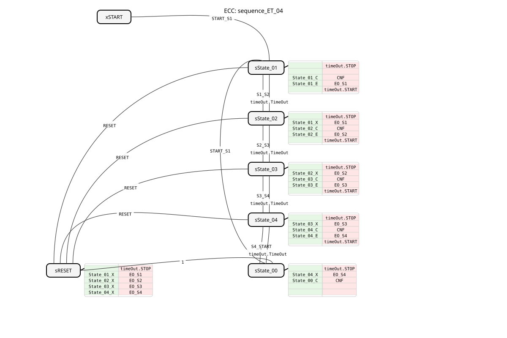

# sequence_ET_04

* * * * * * * * * *
## Introduction
The function block `sequence_ET_04` is a sequencer with four output states. It enables the control of a cyclic sequence of four steps (State_01 to State_04), where the transition between states can occur either through an external event or after an adjustable time. This function block is designed for applications where process steps must be executed sequentially with time-based or event-driven flexibility.

## Interface Structure

### **Event Inputs**
* **`START_S1`**: Transitions from `START` or `State_00` to the first state, `State_01`. Transmits the time parameters for all state transitions (`DT_S1_S2`, `DT_S2_S3`, `DT_S3_S4`, `DT_S4_START`).
* **`S1_S2`**: Manual transition from `State_01` to `State_02`.

**`S1_S2`**: Manual transition from `State_01` to `State_02`. * **`S2_S3`**: Manual transition from `State_02` to `State_03`.

* **`S3_S4`**: Manual transition from `State_03` to `State_04`.
* **`S4_START`**: Manual transition from `State_04` back to the `START` state (via `State_00`).
* **`RESET`**: Instantly resets the block from any state to the `START` state.

### **Event Outputs**
* **`CNF`**: Execution confirmation. Triggered on every state change and returns the new state number (`STATE_NR`).
* **`EO_S1`**: Triggered upon entering `State_01` and returns the output value `DO_S1`.
* **`EO_S2`**: Triggered upon entering `State_02` and returns the output value `DO_S2`.
* **`EO_S3`**: Triggered upon entering `State_03` and returns the output value `DO_S3`. * **`EO_S4`**: Triggered upon entering `State_04` and returns the output value `DO_S4`.

### **Data Inputs**
* **`DT_S1_S2`** (Type: `TIME`): Time for the automatic transition from `State_01` to `State_02`. The value `NO_TIME` disables the time transition for this step.
* **`DT_S2_S3`** (Type: `TIME`): Time for the automatic transition from `State_02` to `State_03`. The value `NO_TIME` disables the time transition for this step.
* **`DT_S3_S4`** (Type: `TIME`): Time for the automatic transition from `State_03` to `State_04`. The value `NO_TIME` disables the time transition for this step.
* **`DT_S4_START`** (Type: `TIME`): Time for the automatic transition from `State_04` back to the `START` state. The value `NO_TIME` disables the time transition for this step.

### **Data Outputs**
* **`STATE_NR`** (Type: `SINT`): Current state number according to the constant `sequence::State_XX` (START = 0, State_01 = 1, State_02 = 2, State_03 = 3, State_04 = 4).

### Data Outputs * **`DO_S1`** (Type: `BOOL`): Is `TRUE` when `State_01` is active.
* **`DO_S2`** (Type: `BOOL`): Is `TRUE` when `State_02` is active.
* **`DO_S3`** (Type: `BOOL`): Is `TRUE` when `State_03` is active.
* **`DO_S4`** (Type: `BOOL`): Is `TRUE` when `State_04` is active.

### **Adapter**
* **`timeOut`** (Type: `ATimeOut`): A connector (`Plug`) for a timeout adapter. This adapter is used internally to implement timed state transitions.

## Functionality

The module implements a finite state automaton (ECC) with the states `START`, `State_01` to `State_04`, `State_00`, and `RESET`. The cycle begins in state `START`. An event `START_S1` starts the sequence and transitions to `State_01`.

In each active state (State_01 to State_04), the following actions are executed:

1. The internal timer (`timeOut`) is stopped.

2. The output of the previous state is deactivated (Exit algorithm `State_XX_X`).

3. Confirmation `CNF` with the new state number is sent, and the time for the next possible automatic transition is passed to the timer (Confirmation algorithm `State_XX_C`).

4. The output of the current state is activated (Entry algorithm `State_XX_E`).

5. The internal timer is started with the time configured for this state (`DT_...`).

A state change can occur in two ways:

* **Event-driven**: Through the corresponding input event (e.g., `S1_S2`).
* **Time-controlled**: By a `TimeOut` event of the adapter, provided the time `DT_...` is not set to `NO_TIME`.

After `State_04`, the block switches to the `State_00` state (from where the sequence can be restarted with `START_S1`) or directly back to the `START` state via `RESET`. A `RESET` event immediately deactivates all active outputs and returns the block to its initial state.
...
## Technical Features

* **Hybrid Transitions**: Each state transition can be individually configured as purely event-driven, purely time-driven, or a combination of both. A time-driven transition takes precedence unless the time is `NO_TIME`.
* **Initial Values**: All time inputs (`DT_...`) are pre-set to `NO_TIME` by default, meaning that the sequence initially runs purely event-driven after startup.
* **Adapter Usage**: Time control is handled entirely via the coupled `ATimeOut` adapter, enabling a clear separation of functionality and potential reusability.
* **State Feedback**: The output `STATE_NR` provides a simple way to monitor or visualize the current step externally.

## State Overview

1. **`START`**: Initial, inactive state. All outputs are `FALSE`.

2. **`State_01`**: First sequence step. `DO_S1` is `TRUE`. Transition to `State_02` via the `S1_S2` event or after a certain time, `DT_S1_S2`.

3. **`State_02`**: Second sequence step. `DO_S2` is `TRUE`. Transition to `State_03` via the `S2_S3` event or after a certain time, `DT_S2_S3`.

4. **`State_03`**: Third sequence step. `DO_S3` becomes `TRUE`. Transition to `State_04` via the `S3_S4` event or after a certain time, `DT_S3_S4`.

5. **`State_04`**: Fourth sequence step. `DO_S4` becomes `TRUE`. Transition to `State_00` via`S4_START` event or after a certain time, `DT_S4_START`.

6. **`State_00`**: Waiting state after sequence completion. All outputs are `FALSE`. A new sequence can be started from here with `START_S1`.

7. **`sRESET`**: Transition state for reset. Deactivates all outputs and automatically switches to `State_00`.

## Application Scenarios
* **Batch Process Control**: Sequential activation of valves, pumps, or heaters in a chemical or process engineering process.
* **Automated Handling Devices**: Control of the individual steps of a pick-and-place robot (gripping, moving, positioning, and placing).
* **Packaging Machines**: Coordination of processes such as product feeding, packaging, labeling, and ejection.
* **Test Stands**: Automated sequence of testing and measurement steps on a component.

**Automated sequence of testing and measurement steps on a component.## ⚖️ Comparison with similar building blocks
Unlike simple timer blocks (`TON`) or pure state machines (`E_SR`), `sequence_ET_04` combines both in a single, specialized block. It offers a predefined, four-stage structure with dedicated outputs for each step, simplifying and improving the clarity of programming compared to manually linking multiple individual blocks. Blocks like `E_CYCLE` offer cyclic event triggering but lack individual, state-dependent data outputs or hybrid triggers.

## 🛠️ Related Exercises
* [Exercise_035](../../../../../../Uebungen/test_B/Uebungen_doc/Uebung_035.md)]
* [Exercise_035b](../../../../../../Uebungen/test_B/Uebungen_doc/Uebung_035b.md)]
* [Exercise_035c](../../../../../../Uebungen/test_B/Uebungen_doc/Uebung_035c.md)]
* [Exercise_036](../../../../../../Uebungen/test_B/Uebungen_doc/Uebung_036.md)]

## Conclusion
The `sequence_ET_04` is a practical and flexible function block for all applications requiring a clear, cyclic sequence of steps. The combination of event-driven and time-controlled transitions, along with the clear interface featuring separate outputs for each state, makes it particularly easy to maintain and integrate into higher-level controllers. The use of a standard adapter for the timer function keeps the block lean and compatible.
